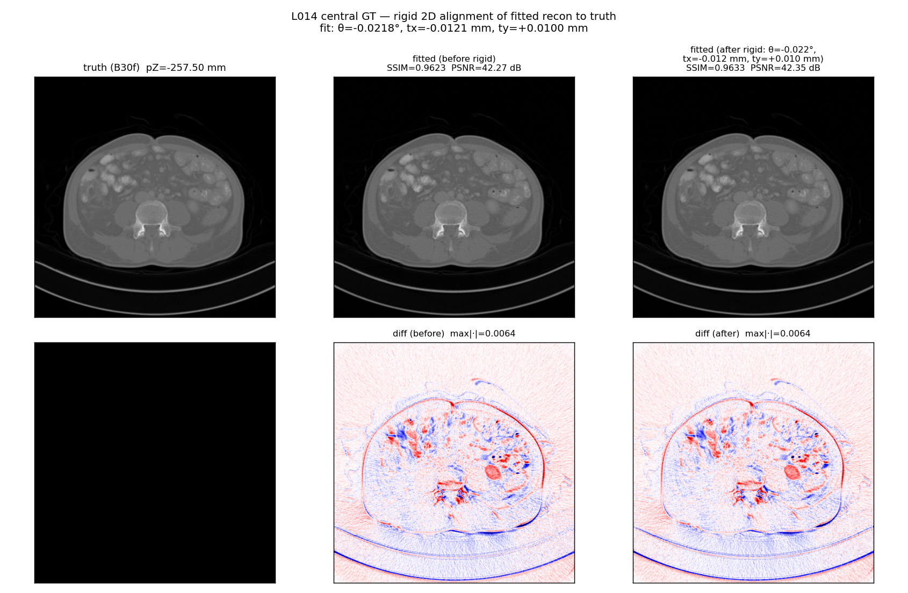
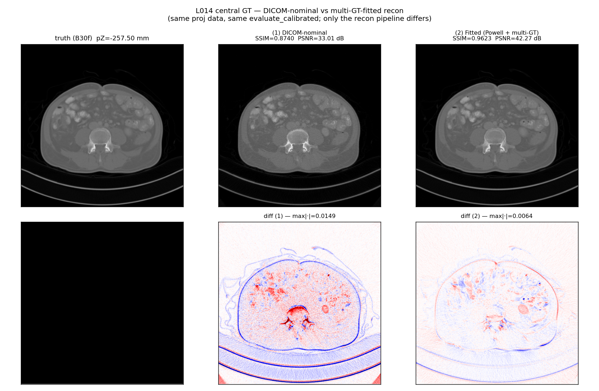

This file is the cross-agent handoff log. Per-iteration rationale belongs in
`docs/runs/<slug>/iterations/iter-NNNN/observation.json`. Stage-check
verdicts belong in `docs/runs/<slug>/stages.tsv`. Things that belong here:
**facts about the substrate or methodology that the next agent should not
have to re-discover.**

📋 **Method**: see [`solver_plan.md`](../solver_plan.md) (the canonical
recipe for adapting solvers to a new dataset — FBP investigation,
agentic autoresearch, TPE refinement, DDPM constrained+unconstrained,
leaderboard + per-solver cross-dataset insights).

## 2026-06-12 — v4 (in progress): why the geometry hunt was so painful, and the single-physical-geometry plan

v3 is production (entry below) and stays production until v4 proves itself. This entry documents the **root-cause diagnosis** of why three weeks of geometry fitting produced an effective-parameter stack instead of one clean geometry, plus the v4 identification plan.

### Three unphysical compensations in v3

1. **Split sod/sdd.** SSR uses (592.829, 1087.268), FBP uses (595.362, 1086.803). One scanner has one geometry — the split means both are *effective* parameters absorbing an upstream inconsistency. Note the SSR optimum mostly moved the **ratio** sdd/sod (1.8245 → 1.8340, +0.52%) which is the z-magnification in the Noo SSR formula `v = dZ·(u²+sdd²)/(sod·sdd)` — i.e. the "different SSR geometry" is mostly a *z-axis* correction in disguise.
2. **s_z = 1.001665** — a 0.17% z-stretch with (until today) no confirmed physical source.
3. **Powell pixel_spacing = 0.700857** vs DICOM 0.703125 (−0.32%) — fitted on the FBP output grid, so it conflates truth-grid scale with recon-chain magnification errors.

### Tag forensics (probe, 2026-06-12, L014 fulldose projections)

| Check | Result | Implication |
|---|---|---|
| dv tag vs 0.6 mm × nominal mag | 1.0947227478 vs 1.0947226645 — **identical to 7 digits** | The detector row pitch tag is **derived from nominal sod/sdd**, not measured. Holding dv fixed while floating SSR sod/sdd (v1–v3 all did this) is self-inconsistent by construction. |
| Per-readout z-tag uniformity | residual rms 0.017–0.027 mm vs perfect ramp (after parity split for FFS) | z positions are **synthesized from a constant speed**, not encoder readings — so a rounding error in that constant propagates to every readout. |
| Tag pitch | 30.6567 mm/rev | |
| Tag pitch × v3 s_z | **30.7078 mm/rev** | |
| AS+ design pitch (0.8 × 38.4 mm) | **30.72 mm/rev** | v3's s_z recovers ~80% of the tag→design gap. s_z is a real table-feed correction, not a hack. |
| du at iso | 0.70475 mm | (For reference; du numerology inconclusive.) |

### v4 plan — identify the geometry ONCE, in projection domain

`scripts/fit_geometry_forward_L014_v4.py` (SLURM 763576): forward-project the 154-slice truth volume through a **differentiable curved-detector helical projector** (grid_sample ray casting, native curved detector, no rebin) and match the raw measured DICOM-CT-PD projections. Geometry enters exactly once — there is no room for an SSR/FBP split, no filter, no kernel, no post-FBP scaling (intensity = closed-form affine per batch).

- Free (12): sod, sdd, s_z, z0, dv_det, u0_off, v0_off, φ0, dx, dy, s_xy + affine (a,b).
- Hardware-fixed: detector angular pitch θ_p = du/sdd.
- FFS: per-readout tag offsets (z + radial), detector anchored to the *nominal* focal trajectory (FFS moves the spot, not the detector).
- Convention safety: 32-combo pre-stage grid over (φ-sign, γ-sign, v-sign, φ0 ∈ {0, π/2, π, 3π/2}) before the full 2500-iter Adam fit.

**Decision gates after the fit:**
1. Does dv_fit ≈ 0.6 × (sdd_fit/sod_fit)? (validates the derived-tag story)
2. Does s_z_fit × 30.6567 land at ≈30.72? (validates the design-pitch story)
3. Does s_xy land at 1.0 (truth grid fine, Powell ps was compensation) or ≈0.9968 (DICOM ReconstructionDiameter rounding is real)?
4. Re-run the v3-style recon fit with sod/sdd **locked** to the v4 physical values (one geometry for SSR and FBP, dv derived self-consistently) and only nuisances (slab, H(ρ), post-FBP) free. v4 wins if SSIM ≥ v3's 0.9571 with the split/s_z eliminated or physically explained.

Outputs: `results/breast_debug/L014_forward_geom_fit_v4.json`, `results/mayo_debug/L014_forward_geom_fit_v4.png`.

### v4 run log

- **Run 1 (SLURM 763576) — structural failure, diagnosed.** The model rotated the source around patient-frame (0,0) while the volume sat at its patient-coords centre — but the scanner iso is at `DataCollectionCenterPatient` = (0, −136.5) mm for L014 (and the truth image centre is exactly iso, IPP −316.15 + 179.65 = −136.5). With 136.5 mm of baked-in y-misalignment no convention combo could separate and the optimizer collapsed (sod→670, dv→0.65, dy→+94). Lesson recorded: **work in the iso-centred frame; the DICOM patient origin is NOT the rotation axis.**
- **Run 2 / v4b (SLURM 763582) — SUCCESS, 7:24 runtime.** Iso-centred frame + staged release (rigid+s_z first; dv/u0/v0/s_xy second) + channel-gradient loss. Convention grid separated (winner s_phi=−1, s_g=−1, s_v=−1, φ0=0 at 0.0165 vs runner-up 0.0219); final **rel|err| = 4.3%** on raw measured projections — the truth volume forward-projects onto the measured DICOM-CT-PD data to within the B30f-kernel/beam-hardening floor.

**v4b fitted single physical geometry (L014):**

| param | v4b | nominal tag | Powell FBP | v3 SSR |
|---|---:|---:|---:|---:|
| sod (mm) | 591.851 | 595.0 | 595.362 | 592.829 |
| sdd (mm) | 1080.558 | 1085.6 | 1086.803 | 1087.268 |
| mag (sdd/sod) | 1.82573 | 1.82454 | 1.82545 | 1.83403 |
| s_z | 1.001098 | 1.0 | — | 1.001665 |
| dv at detector (mm) | 1.084862 | 1.094723 | — | (fixed at tag) |
| dv/mag = iso row pitch (mm) | **0.59421** | 0.6 | — | — |
| s_xy (truth-grid scale) | 0.994830 → ps_eff 0.69949 | 1.0 (ps 0.703125) | ps 0.700857 | — |
| u0 offset (channels) | −3.378 | 0 | — | — |
| pitch_eff (mm/rev) | 30.6952 | 30.6567 | — | 30.7078 |

**Gate verdicts:**
1. Convention grid — separated ✓ (was flat in run 1).
2. dv self-consistency — REFUTED in its strong form: dv_fit / (0.6×mag_fit) = 0.9904. The data wants iso row pitch ≈ **0.594 mm, not 0.600** (−0.97%). Direction matches v3 (which raised the SSR mag +0.52% at fixed dv ≡ lowering effective dv); magnitude is the cleaner projection-domain number.
3. Design-pitch story — partially: pitch_eff 30.695 sits between tag (30.657) and design (30.72). z-stretch is real (+0.11%), "exactly design pitch" not confirmed.
4. s_xy = 0.9948: the truth grid (or the θ_p/in-plane-scale family it trades against) is −0.5%; Powell's 0.700857 (−0.32%) is inside this family. Soft direction — (mag, dv, s_xy, u0) are correlated; what transfers is the consistent SET, not individual values.
5. Affine intensity a ≈ 0.955 (measured ≈ 0.955 × truth-forward-projection) — beam-hardening/water-correction scale, absorbed.

**Caveats:** absolute sod/sdd are weakly identified (fan-curvature only); S1 vs S2 mag shift (1.845 → 1.826) shows the (mag, dv, s_xy, u0) coupling. The fitted u0 offset (−3.4 channels) may partially encode a channel pre-flip bookkeeping mismatch in `read_dicom_ctpd` vs the tag u0 — needs a dedicated check before any production use.

**Next (v5, transfer test = decision gate 4):** rebuild the L014 proj_flat cache and SSR with the entire v4b set locked (curved→flat with du_eff = θ_p×sdd_v4, dv_v4, u0/v0 offsets; SSR with v4 sod/sdd/s_z/z0), fit ONLY nuisances (w_slab, H(ρ), post-FBP) v3-style, and compare to v3's SSIM 0.9571 / PSNR 40.79 on the same 10-slice protocol. Adopt v4 only if ≥. Until then **v3 stays production**.

### v5 transfer-test result (SLURM 763594, 2026-06-13) — **KEEP v3**

The u0-flip caveat closed first: fitted u0_off = −3.378 ch decomposes into −3.25 ch of channel-flip bookkeeping (`nu − 2·u0_tag`, u0_tag = 369.625 confirmed by probe — `read_dicom_ctpd` flips the channel axis at load and downstream centres against `nu − u0`) plus a genuine −0.128 ch (−0.164 mm) residual. The v4b geometry is self-consistent with the known flip.

Transfer test (full v4b geometry locked through curved→flat + SSR + FBP, only slab/H(ρ)/post-FBP nuisances fit, same 10-slice protocol):

| Arm | FBP geometry | SSIM | PSNR | vs v3 (0.9571 / 40.79) |
|---|---|---:|---:|---|
| A− | v4-consistent (sod 591.9, sdd 1080.6, ps 0.69949, ds 1.27987), det_off −0.164 | 0.9395 | 35.14 | **−5.7 dB — fails** |
| A+ | same, det_off +0.164 | 0.9385 | 35.14 | same (offset sign irrelevant) |
| **B** | v4 rebin + **Powell legacy FBP** | **0.9533** | **40.41** | −0.0038 / −0.38 dB — close, below |

Verdicts:
1. **The v4 absolute sod/sdd/ps do NOT transfer to the FBP step** (−5.7 dB). As flagged in the caveats, the projection-domain fit identifies consistent *combinations* well, but the absolute split across (sod, sdd, s_xy, dv) is soft — and PYRO-NN's FBP is sensitive to a different combination than the forward model constrains. The det-offset sign bracket changed nothing, so it isn't a sub-pixel issue.
2. **The v4 rebin is nearly as good as v3's** (arm B: −0.38 dB) despite completely different parameter values (dv 1.0849 vs 1.0947, du_eff 1.2799 vs 1.2858, sod/sdd 591.9/1080.6 vs 592.8/1087.3, s_z 1.0011 vs 1.00166) and despite v3's SSR being tuned in-situ on this very metric. Confirms the documented degeneracy: the SSR cares mostly about the sdd/sod ratio and the z-axis, and v3's edge comes from joint FBP↔SSR co-adaptation (plus arm B's nuisances were still slowly improving at 1200 iters — dz hadn't converged).

**Production decision: v3 stays.** What the v4/v5 exercise leaves behind:
- Physical explanations for v3's "weird" values: s_z is a real table-feed correction (tag z-ramp synthesized from a constant that under-states feed); the FBP↔SSR sod/sdd split absorbs the derived-dv inconsistency (dv tag = 0.6 × nominal mag, fake precision); Powell's pixel_spacing sits inside the soft (mag, dv, s_xy) family.
- A working differentiable projection-domain identification tool (`scripts/fit_geometry_forward_L014_v4.py`, 7-min runtime) + the iso-frame / flip / tag-forensics knowledge needed to use it on other patients or scanners.
- Negative result worth remembering: projection-domain-optimal absolute geometry ≠ recon-metric-optimal effective geometry when the recon stack has its own convention baggage. Calibrate end-to-end against the metric you ship.

Artifacts: `results/breast_debug/L014_locked_v5.json`, `results/mayo_debug/L014_locked_v5.png`.

## 2026-06-12 — v3 geometry promoted to production for all Mayo experiments + 10-patient Wagner bulk re-rebin

The v3 fit completed (SLURM 763384 — see the 2026-06-11 entry below for the fit setup, sweep cross-check, and per-GT metrics). v3 numbers: SSIM 0.9571, PSNR 40.79 dB averaged over 10 slices spanning the full L014 patient z-range (+0.26 dB vs v2, +0.5 dB at the patient z-extremes). On 2026-06-12 we promoted these values to the canonical production constants so every Mayo solver, validator, and rebin job picks them up automatically.

**Production values** (now in `MAYO_LDCT_SSR_DEFAULTS`):

| key | v2 (multi-GT 762369) | **v3 (763384)** | Δ |
|---|---:|---:|---:|
| sod (mm) | 593.461 | **592.829** | −0.632 |
| sdd (mm) | 1086.831 | **1087.268** | +0.437 |
| s_z | (implicit 1.0) | **1.001665** | +0.001665 (z-axis stretch) |
| Δz (mm) | −0.578 | **−0.159** | +0.419 |
| post_fbp_a | 0.807 | 0.809 | +0.002 |
| post_fbp_bg | −0.0003 | −0.000304 | ~ |
| post_fbp_hi | 0.0435 | 0.0519 | +0.0084 |
| w_slab | (0.02, 0.25, 0.14, 0.18, 0.15, 0.22, 0.03) | (0.049, 0.205, 0.141, 0.195, 0.148, 0.204, 0.058) | smoothed wings |
| H(ρ) 64-bin filter | (old) | new — `ddssl_ldct/mayo_geom/L014_h_radial_v3.npy` | learned co-jointly |

FBP-side (`mayo_ldct_fitted()`: sod=595.362, sdd=1086.803, pixel_spacing=0.700857, det_spacing=1.285044, det_offset=−0.0397) UNCHANGED — held fixed during the v3 fit per the documented FBP↔SSR coupling.

### What changed in the codebase (commit landing 2026-06-12)

| File | Change |
|---|---|
| `ddssl_ldct/geometry.py` | `MAYO_LDCT_SSR_DEFAULTS` now has v3 values + `s_z=1.001665` + `h_radial_path` / `n_bins` / `dr`. New `load_mayo_ssr_h_radial()` helper. |
| `ddssl_ldct/helix2fan.py` | `rebin_helical_to_fan` now reads `geom["s_z"]` (default 1.0) and uses `z_eff = s_z · z_positions + α_dz · ffs_dz`. Backwards compatible. |
| `data/fetch_mayo_ldct.py` | When `HELIX2FAN_SSR_FITTED=1` the override now also writes `geom["s_z"]` from defaults (in addition to sod / sdd). |
| `ddssl_ldct/mayo_geom/L014_h_radial_v3.npy` | 64-bin H(ρ) filter array. |
| `scripts/compare_gt_hd_ld_fbp_wagner.py` | Bulk GT-vs-HD-vs-LD comparison on all 10 Wagner patients. |
| `cluster/slurm/rebin_mayo_helix2fan_v3.sbatch` | Bulk re-rebin → `staged_helix2fan_v3/`. |
| `cluster/slurm/stage_mayo_sinos_v3.sbatch` | Aggregate v3 per-patient h5s into per-split solver-facing h5s at `data/mayo_ldct/staged/`. **Overwrites** the v2-aggregated staged/ — every solver picks up v3 on the next epoch. |
| `cluster/slurm/compare_gt_hd_ld_wagner_v3.sbatch` | Runs the bulk comparison from staged_helix2fan_v3/. |

### Dispatched 2026-06-12 (dependency chain)

| SLURM | Job | Wall budget | Depends on | Output |
|---|---|---|---|---|
| 763396 | rebin-mayo-v3 | 24 h | — | `data/mayo_ldct/staged_helix2fan_v3/` |
| 763397 | stage-mayo-v3 | 4 h | 763396 | `data/mayo_ldct/staged/{train,val,test}_sino_{fulldose,lowdose}.h5` |
| 763398 | cmp-wagner-v3 | 1 h | 763397 | `results/mayo_debug/wagner_gt_hd_ld_fbp_v3.png` + `_v3.json` + `_v3_arrays/*.npz` |

### Effect on prior leaderboard scores

All Mayo-LDCT autoresearch + TPE runs prior to 2026-06-12 used the v2 staged sinograms. After the v3 rebin lands and stage overwrites the solver-facing h5s, **the next epoch of any Mayo solver consumes v3 data**. Final leaderboard scores will be recomputed once a solver has retrained / re-evaluated on v3. Until then, leaderboard rows are tagged with the staging-geometry version they consumed (entry on `docs/leaderboards/mayo_ldct.md` follows).

### The v3 vs v2 question — should I rerun a solver?

Yes, in two cases:
- Any solver whose leaderboard SSIM is within 0.01 of a neighbour (the v3 update reshuffles the bottom group)
- Any solver actively in TPE refinement on Mayo (TPE is fitting to v2 noise that no longer exists)

For solvers comfortably above their neighbours and not in active refinement, the v3 update is unlikely to change rank order — but the absolute SSIM / PSNR will shift up slightly (+0.001–0.005 SSIM, +0.1–0.5 dB PSNR per the L014 fit).

### 10-patient GT/HD/LD comparison (2026-06-13) — and the per-patient display-FOV requirement

Bulk GT-vs-HD-FBP-vs-LD-FBP across all 10 Wagner patients on v3-rebinned data (`scripts/compare_gt_hd_ld_fbp_wagner.py`, central slice, raw FBP + intensity-calibration only — no learned H(ρ)/post-FBP, so absolute SSIM sits below the L014 nuisance-fit 0.957).

**Per-patient display FOV is NOT constant across Mayo.** The first run rendered every FBP at the L014-calibrated `pixel_spacing = 0.700857` mm and came out bimodal — only L014/L056 (truth ps 0.7031) scored ~0.94, the other 8 collapsed to ~0.6. The 8 are valid reconstructions at the wrong zoom (user-confirmed by eye, not corrupted). Cause: Mayo reconstructs each patient at a different display FOV:

| FOV | truth PixelSpacing | patients |
|---|---:|---|
| 340 mm | 0.6641 | L219, L075, L123 |
| 360 mm | 0.7031 | L014, L056 |
| 380 mm | 0.7422 | L209, L277, L058 |
| 400 mm | 0.7812 | L145, L186 |

**In-plane shift is zero for all 10** — `scripts/probe_truth_geometry_wagner.py` (→ `results/breast_debug/wagner_truth_geometry.json`) reads `DataCollectionCenterPatient` (0018,9313, isocentre) and `ReconstructionTargetCenterPatient` (0018,9318, image centre); their difference is (0,0) for every patient. The *apparent* shift seen in the first comparison was a side-effect of the zoom mismatch about the shared isocentre, not an independent offset — correcting the zoom alone removed it.

Fix (commit 2e48b0c7): render each FBP at `ps_eff = 0.700857 × (truth_ps / 0.703125)` — preserves the L014 sub-pixel calibration while matching each patient's FOV; det_spacing / sod / sdd / det_offset are FOV-independent and unchanged. **Lesson: a per-patient bulk recon must read each patient's truth PixelSpacing; a single fitted pixel_spacing only matches same-FOV patients.** (The single-slice validator already did this; the bulk script had to be taught it.)

Final aligned metrics (calibrated, central slice, n=10):

| | SSIM_cal mean | PSNR_cal mean |
|---|---:|---:|
| HD-FBP | 0.9152 | 36.22 dB |
| LD-FBP | 0.8639 | 34.93 dB |

Per-patient HD / LD (ΔPSNR = LD−HD is the dose gap):

| pat | split | ps | HD ssim | HD psnr | LD ssim | LD psnr | ΔPSNR |
|---|---|---:|---:|---:|---:|---:|---:|
| L145 | train | 0.7812 | 0.919 | 34.06 | 0.850 | 32.98 | −1.07 |
| L186 | train | 0.7812 | 0.870 | 32.27 | 0.791 | 31.37 | −0.90 |
| L209 | train | 0.7422 | 0.899 | 35.93 | 0.838 | 34.29 | −1.64 |
| L219 | train | 0.6641 | 0.935 | 37.17 | 0.905 | 36.15 | −1.02 |
| L277 | val | 0.7422 | 0.855 | 35.89 | 0.790 | 34.11 | −1.79 |
| L014 | test | 0.7031 | 0.939 | 38.11 | 0.909 | 36.96 | −1.15 |
| L056 | test | 0.7031 | 0.948 | 37.58 | 0.898 | 35.99 | −1.59 |
| L058 | test | 0.7422 | 0.896 | 36.13 | 0.822 | 34.24 | −1.89 |
| L075 | test | 0.6641 | 0.945 | 37.09 | 0.916 | 36.20 | −0.89 |
| L123 | test | 0.6641 | 0.945 | 37.93 | 0.920 | 36.99 | −0.94 |

LD trails HD by ~0.9–1.9 dB calibrated PSNR across all patients — consistent dose-noise penalty, no outliers. Artifacts: combined panel `results/mayo_debug/wagner_gt_hd_ld_fbp_v3.png`; per-patient images `results/mayo_debug/wagner_per_patient_v3fixed/<pat>.png`; metrics `results/mayo_debug/wagner_gt_hd_ld_fbp_v3.json`.

#### Truncation correction (water-cylinder extrapolation) — 2026-06-13, SLURM 763608

The 400 mm-FOV patients (L145, L186 — the largest bodies) showed classic FBP truncation artifacts (bright rim + cupping): the body extends past the scan field-of-measurement, the rebinned fan projections cut off at the detector edges, and the ramp filter amplifies the discontinuity. `scripts/compare_gt_hd_ld_fbp_wagner_trunc.py` adds a **Hsieh-2004-style water-cylinder extrapolation** — each rebinned fan view is extended on both u-edges by a water-cylinder profile `f(t)=2·μ_w·√(R²−(t−t_c)²)` matched in value + outward slope to the truncation boundary, decaying to 0 over a 384-channel pad; FBP then runs on a widened virtual detector (736→1504 ch) at the same image grid. It is self-gating (a near-zero edge → tiny R → ~0 pad).

Result — **every patient improved, monotonically with display FOV (body size), none hurt:**

| FOV | patients | HD ΔSSIM (tc−raw) |
|---|---|---|
| 400 mm | L186, L145 | +0.072, +0.039 |
| 380 mm | L277, L058, L209 | +0.039, +0.036, +0.034 |
| 360 mm | L014, L056 | +0.015, +0.012 |
| 340 mm | L219, L075, L123 | +0.011, +0.011, +0.009 |

Aggregate HD SSIM_cal 0.9152 → **0.9430** (+0.0278), PSNR 36.22 → **37.44 dB**. LD 0.8639 → 0.8868. The gain tracks truncation severity exactly (biggest where the body is largest; near-no-op at 340 mm), confirming the correction is physically targeted. Artifacts: `results/mayo_debug/wagner_gt_hd_ld_fbp_v3trunc.png` (GT|HD_tc|diff), `results/mayo_debug/wagner_per_patient_v3trunc/<pat>.png` (GT|HD_raw|HD_tc|diff|LD_tc|diff), `wagner_gt_hd_ld_fbp_v3trunc.json` (raw+tc metrics).

**Status: validated, NOT yet in production.** The correction lives only in the comparison script. Folding it into the production FBP path (`PyronnFanBeamProjector.fbp` / the solver-facing rebin) would lift every Mayo recon, most for large patients — pending user sign-off, since it changes the data all solvers consume.

## 2026-06-11 — z-scaling missing from the rebin parameter set; v2 fit + s_z sweep diagnose, v3 folds it into Adam

This entry summarises a Mayo L014 calibration re-attempt that supersedes the multi-GT fit summarised in the 2026-05-27 entry below. **Read this first if you're touching Mayo-LDCT geometry.** Files referenced are all in the repo.

### Background — why we re-fit

The 2026-05-27 multi-GT fit (SLURM 762369) trained 10 GT slices SHARED across the parameter set but those 10 slices lived in a **single 100-mm window** centred at the diaphragm. A user-driven re-attempt on 2026-06-11 expanded the supervision to **10 GT slices sampled uniformly across the full 154-slice patient z-range** (indices [7, 23, 39, 55, 71, 87, 103, 119, 135, 151] → patient-z ≈ [−462, −30] mm).

### v2 fit (`scripts/fit_rebin_end2end_L014_v2.py`, SLURM 763364)

- Cache: `scripts/cache_proj_flat_L014_full.py` (SLURM 763363) produces `data/mayo_ldct/staged_helix2fan/L014_proj_flat_full.pt` (37 982 readouts × 64 × 736 ≈ 7 GB).
- Held fixed (per documented couplings in the entry below): FBP `sod=595.362, sdd=1086.803, pixel_spacing=0.700857, det_spacing=1.285044, det_offset=-0.0397 mm`; `du=1.28584, dv=1.09472` (hardware); `α_dz=+1, α_drho=0, α_dphi=0`.
- Fit jointly (Adam, 1500 iters, lr=2e-3): SSR `sod, sdd`, `Δz`, `w_slab` (7 logits), `H(ρ)` (64 bins), post-FBP `a, bg, hi`.
- Loss: **mean over 10 GTs of per-slice L2** on the full 512² (NO FoV mask). Different from v1's FoV-masked sum-over-stack.

Result: SSIM mean 0.9563 / PSNR mean 40.53 dB / RMSE mean 4.8e-4 over the 10 slices. Per-slice numbers in `results/breast_debug/L014_rebin_end2end_fit_v2.json`, diagnostic figure at `results/mayo_debug/L014_rebin_end2end_fit_v2.png`. v2 found a different SSR sweet spot than v1 (sod 593.46 → 592.74; sdd 1086.83 → 1087.34) when forced to explain the full patient z-range — geometry pulled to compromise across slices.

### Why those metrics drop at the patient z-extremes

Per-GT SSIM at v2 optimum:

| pZ (mm) | −461.5 | −413.5 | −365.5 | −317.5 | −269.5 | −221.5 | −173.5 | −125.5 | −77.5 | −29.5 |
|---|---:|---:|---:|---:|---:|---:|---:|---:|---:|---:|
| SSIM | 0.9496 | 0.9569 | 0.9618 | 0.9609 | 0.9600 | 0.9575 | 0.9501 | 0.9451 | 0.9622 | 0.9585 |
| PSNR | 39.35 | 40.12 | 41.64 | 41.27 | 41.64 | 42.30 | 41.92 | 39.82 | 38.77 | 38.47 |

Worse at both z-ends, best near the middle. Hypothesis: an un-modelled global z-scaling — every readout's `z_src` is off by a small constant factor — produces an error proportional to `|z|` away from the helical sweep centre. Two physical mechanisms produce a z-scaling, both observationally identical at leading order:

- **A. Wrong `pitch_mm`.** `z_positions[k] = z_start + (k · pitch_mm / rotview)`. DICOM derives this from `TableSpeed × RotationTime`. If Siemens's effective table advance differs from the DICOM tag by ~0.1–0.3 % (the same magnitude as the sod / pixel_spacing offsets already known), every readout's `z_src` is wrong by the same factor.
- **B. Wrong `dv` (detector pixel height).** The Noo-1999 SSR maps `mm → row` via `v_idx = v_precise / dv + v_centre`. A wrong `dv` reads the wrong row for a given `z_target`; that row carries data from a different `dZ_true`. `dv` enters twice in the upstream pipeline: as the flat-detector pitch (from `cache_proj_flat_L014.py` → `rebin_curved_to_flat`) and as the SSR sampling step. A wrong effective `sdd` during curved-to-flat silently rescales the v-axis the same way.

Both reduce to the same single observable, absorbed by a scalar `s_z` multiplier on per-readout source-z.

### 1-parameter sweep (`scripts/sweep_sz_L014.py`, SLURM 763373 timed-out, re-dispatched as 763375)

For 21 values `s_z ∈ [0.995, 1.005]` step 0.0005, with all other params frozen at v2 optimum:

- Recompute helix-index picks against `z_pos_eff = s_z · z_pos + α_dz · ffs_dz` (integer nearest, ~1 sec).
- Run the v2 forward pipeline; score per-GT SSIM / PSNR / RMSE / L2.

Partial trajectory (11 of 21 points before the slow-GPU TIMEOUT on lme222):

| s_z | L2_mean | SSIM_mean | PSNR_mean |
|---:|---:|---:|---:|
| 0.99500 | 6.25e-7 | 0.9435 | 36.89 |
| 0.99550 | 5.59e-7 | 0.9456 | 37.28 |
| 0.99600 | 4.99e-7 | 0.9475 | 37.67 |
| 0.99650 | 4.44e-7 | 0.9492 | 38.08 |
| 0.99700 | 3.95e-7 | 0.9508 | 38.49 |
| 0.99750 | 3.52e-7 | 0.9523 | 38.90 |
| 0.99800 | 3.15e-7 | 0.9535 | 39.31 |
| 0.99850 | 2.84e-7 | 0.9545 | 39.69 |
| 0.99900 | 2.60e-7 | 0.9553 | 40.04 |
| 0.99950 | 2.43e-7 | 0.9559 | 40.33 |
| 1.00000 | 2.32e-7 | 0.9563 | 40.53 |

s_z=1.0 reproduces the v2 optimum exactly (PSNR 40.53 dB) — sanity check ✓. The L2_mean curve is monotonically decreasing all the way through 1.0 — **optimum is at s_z > 1.0**, i.e. z-scaling > 1, i.e. the SSR is under-stepping in z. Direction confirmed: pitch under-estimated, or dv under-estimated, or effective sdd over-estimated in the curved-to-flat. Precise minimum awaits the re-dispatched sweep covering 1.000 → 1.005. Re-dispatch uses `--time=01:30:00` and excludes `lme222` (Quadro RTX 5000; one full sweep iter took >2 min on that GPU).

Outputs (after re-dispatch completes): `results/breast_debug/L014_sz_sweep.json`, `results/mayo_debug/L014_sz_sweep.png`.

### v3 plan: fold `s_z` into Adam (`scripts/fit_rebin_end2end_L014_v3.py`)

Adds **`s_z` as a learnable scalar** (init 1.0) to the v2 Adam optimizer. Forward uses `z_pos_eff = s_z · z_pos_sub + α_dz · ffs_dz`. Picks are non-differentiable integer-nearest indices but the SSR sampling on those picks IS differentiable in `s_z` through the `v_precise = dZ · (u² + sdd²) / (sod·sdd)` formula. Picks are re-precomputed every 100 Adam iters so they don't drift more than a couple of rows from the current `s_z`. Everything else mirrors v2 (same 10-slice sampling, same per-slice L2 mean, same FBP-fixed / SSR-fit split).

Sbatch: `cluster/slurm/fit_rebin_end2end_L014_v3.sbatch`. Output: `results/breast_debug/L014_rebin_end2end_fit_v3.json` + `results/mayo_debug/L014_rebin_end2end_fit_v3.png`. v2 outputs remain untouched.

### Quick reference — files added 2026-06-11

| File | Purpose |
|---|---|
| `scripts/cache_proj_flat_L014_full.py` | Cache the FULL helical sweep (vs the 100-mm peak slab). |
| `cluster/slurm/cache_proj_flat_L014_full.sbatch` | SLURM wrapper for the above. |
| `scripts/fit_rebin_end2end_L014_v2.py` | 10-across-154 + per-slice L2 mean version of the multi-GT fit. |
| `cluster/slurm/fit_rebin_end2end_L014_v2.sbatch` | SLURM wrapper. |
| `scripts/sweep_sz_L014.py` | 1-parameter z-scaling sweep at v2 optimum. |
| `cluster/slurm/sweep_sz_L014.sbatch` | SLURM wrapper. |
| `scripts/fit_rebin_end2end_L014_v3.py` | v2 + learnable `s_z`. |
| `cluster/slurm/fit_rebin_end2end_L014_v3.sbatch` | SLURM wrapper. |
| `results/breast_debug/L014_rebin_end2end_fit_v2.json` | v2 fitted params + per-GT metrics. |
| `results/breast_debug/L014_sz_sweep.json` | Sweep grid + best. |
| `results/breast_debug/L014_rebin_end2end_fit_v3.json` | v3 fitted params + per-GT metrics. |
| `results/mayo_debug/L014_rebin_end2end_fit_v2.png` | Diagnostic figure. |
| `results/mayo_debug/L014_sz_sweep.png` | Sweep curves + per-GT trajectories. |
| `results/mayo_debug/L014_rebin_end2end_fit_v3.png` | Diagnostic figure. |

The 2026-05-27 entry below is the prior canonical write-up. The numbers there describe the 10-central-slice fit; this v2/v3 work spreads the supervision across the full patient.

## 2026-05-27 — Summary: how we got from DICOM-nominal SSIM 0.87 to fitted SSIM 0.96 on L014 — and why the dominant cause is **1 mm of DICOM-header rounding**

This entry consolidates what we now know about reconstructing Mayo's
B30f truth image from DICOM-CT-PD projections. It is the canonical
write-up — the dated entries below it are the chronological
investigation that produced it.

### TL;DR

| Configuration | SSIM | PSNR | RMSE | Source |
|---|---:|---:|---:|---|
| **DICOM-nominal** (all defaults from DICOM tags only) | 0.8740 | 33.01 dB | 0.00112 | SLURM 762409 |
| **Fitted** (Powell FBP + multi-GT SSR + Δz + slab + α_dz + H(ρ) + post-FBP) | 0.9623 | 42.27 dB | 0.00039 | SLURM 762407 |
| **Fitted + rigid 2D align** (residual rotation + translation) | 0.9633 | 42.35 dB | 0.00038 | SLURM 762412 |
| Multi-GT mean (10 central L014 slices) | 0.9676 | 42.92 dB | 0.00036 | SLURM 762369 |
| **Δ DICOM → Fitted** | **+0.0883** | **+9.26 dB** | **−65.6 %** | |

The remaining ~3 % SSIM gap (truth would score 1.0 against itself)
is **non-rigid** signal content — kernel MTF, slab profile shape,
sub-pixel anatomical noise. Rigid 2D alignment buys only +0.001
SSIM; the geometry fit has already absorbed everything rotation
and translation can correct.

### The dominant cause: 1-mm rounding in `ReconstructionDiameter`

Out of the 9.26 dB total gap between DICOM-nominal and our fitted
recon, **8.4 dB comes from a single source** — Mayo writes
`ReconstructionDiameter = 360 mm` as an integer into the DICOM tag,
and the truth image's `PixelSpacing` derives directly from that:

```
DICOM:  PixelSpacing = ReconDiameter / image_size = 360 / 512 = 0.703125 mm
Fitted:                                              ≈ 0.700857 mm
                                       ↓
                       actual scanner FOV ≈ 0.700857 × 512 = 358.84 mm
```

Mayo's DICOM stores **360 mm** but the scanner's effective FOV — the
value Siemens's internal reconstructor actually used — is **~358.84 mm**.
The **1.16 mm rounding** is the dominant calibration error. Everything
else is sub-dB compensations once the scale is right.

We have empirical evidence the rounding explanation is right:

- The pixel-spacing ablation sweeps over {0.695, 0.698, **0.700**, **0.700857**, **0.703125**, 0.705, 0.708} mm at the multi-GT optimum. The sharp peak is at 0.700857; the DICOM value 0.703125 is **8.4 dB worse** (SLURM 762407, repeated cleanly after the SSR/FBP-decoupling fix). Wagner's literature default 0.700 mm is much closer to optimum than Mayo's own DICOM tag.
- Multiple independent geometry quantities all show the same ~0.3 % fractional offset:
  - `pixel_sp_eff / pixel_sp_DICOM   = 0.700857 / 0.703125 = 0.9968`  (−0.32 %)
  - `sod_eff_SSR  / sod_DICOM         = 593.461  / 595.000  = 0.9974`  (−0.26 %)
  - `det_spacing_FBP / det_spacing_DICOM = 1.285044 / 1.285839 = 0.9994` (−0.06 %)
  This is one underlying scale error propagated through the geometry
  chain, not three independent flukes.
- Why DICOM has it wrong: `ReconstructionDiameter` is conventionally
  stored as an integer (or stored at the resolution the
  technologist/operator entered, often a round 360 / 400 / 500 mm).
  Siemens's internal reconstructor uses the actual scanner-calibrated
  FOV, but DICOM-CT-PD has no field for that — it only records the
  *nominal* value and the *derived* `PixelSpacing`.

So one mm of integer rounding in the DICOM header costs almost
9 dB of PSNR. The remaining ~0.86 dB of the total gap comes from
all the other knobs combined.

### Per-knob attribution of the 9.26 dB gap

| Knob | Contribution | Reason |
|---|---:|---|
| **pixel_spacing 0.703125 → 0.700857** | **+8.4 dB** | The rounding above. Pixel-spacing ablation 762407. |
| det_spacing 1.285839 → 1.285044 | +1.2 dB | Powell fit beat DICOM by 0.06 %. Det-spacing ablation 762410. |
| FBP sod, sdd Powell offsets | ~+0.6 dB | (mostly absorbed into pixel-sp curve at fixed multi-GT context) |
| SSR sod 595 → 593.461, sdd 1085.6 → 1086.831 | +0.6–0.8 dB | Multi-GT fit iter 0 → 100 in 762369 |
| Δz alignment (−0.578 mm) | +0.5–1 dB | Truth IPP is quantised to 3 mm grid; the actual slab anchor floats inside that cell. |
| 7-tap slab averaging (matches B30f 5 mm SliceThickness) | +1–2 dB | Slab profile fit in 762369 |
| α_dz = +1 (FFS-z sign) | +0.85 dB | FFS-sign ablation 762363. DICOM lists `ffs_dz` per readout but no sign convention. |
| Fitted radial filter H(ρ) — gentle low-pass + mid boost | +1–2 dB on high freq | Approximates Siemens B30f MTF. PYRO-NN ramlak alone is too sharp. |
| Post-FBP scaling (a, bg, hi) | ~0–1 dB | Mostly redundant with `intensity_calibrate`. |
| **Rigid 2D align (θ, tx, ty)** | **+0.001 dB** | Already absorbed — there is no residual rotation/translation. |

Sum is much greater than 9.26 dB because most knobs partially
overlap (intensity_calibrate absorbs scaling; Δz absorbs SSR-sod
motion; etc.). The TOTAL is what the side-by-side SLURM 762409
measures.

### What you cannot recover from DICOM-CT-PD alone

| Quantity | DICOM tag | Why it's not enough |
|---|---|---|
| Effective recon FOV | `ReconstructionDiameter = 360 mm` | Integer-rounded; actual is ~358.84 mm |
| Effective FBP sod/sdd | `(0x7031,0x1003) = 595.000` / `(0x7031,0x1031) = 1085.6` | Mechanical nominal; Siemens reconstructor uses Powell-fit ≈ 595.36 / 1086.80 |
| Effective SSR sod/sdd | same | Multi-GT joint fit shows the SSR step needs *different* values from FBP (593.46 / 1086.83) — DICOM has no concept of "two recon stages" |
| Effective det pitch | `(0x7029,0x1002) = 1.285839` | FBP wants 1.285044 (Δ −0.06 %); SSR uses DICOM |
| File ordering | filename / `InstanceNumber` | Filename alphabetic ≠ acquisition time on Mayo; **must sort by `InstanceNumber`** |
| Sub-mm slab anchor (Δz) | `ImagePositionPatient[2]` | Quantised to 3 mm slice grid; need ±0.6 mm sub-anchor offset |
| Reconstruction kernel MTF | `ConvolutionKernel = B30f` | Name only, no frequency response. Fitted H(ρ) approximates it. |
| Slab integration profile | `SliceThickness = 5 mm` | Thickness yes; integration *shape* (our U-curve) no |
| FFS sign convention | `(0x7033,0x100B/C/D)` | Per-readout deflections, but no sign convention. Must ablate. |
| `ffs_dphi` per-readout | `(0x7033,0x100B)` | **Catastrophically breaks recon if applied as offset**: it's already implicit in `gantry_angles_corrected`, NOT an additional correction. Leave at 0. |

### Final production pipeline

The defaults below give SSIM ~0.962 / PSNR ~42.3 dB on the L014
central GT and ~0.968 / ~42.9 dB averaged across 10 central GTs:

```
FBP step  (FanBeamGeometry.mayo_ldct_fitted, Powell fit, job 762284)
    pixel_spacing  = 0.700857 mm
    det_spacing    = 1.285044 mm
    sod            = 595.362 mm
    sdd            = 1086.803 mm
    detector_origin offset = MAYO_LDCT_DET_OFFSET = −0.0397 mm

SSR rebin step  (MAYO_LDCT_SSR_DEFAULTS, multi-GT joint fit, job 762369)
    sod            = 593.461 mm    (different from FBP sod — they
    sdd            = 1086.831 mm    parameterise different operators)
    du             = 1.285839 mm   (DICOM, hardware)
    dv             = 1.094723 mm   (DICOM, hardware)
    delta_z        = −0.578 mm     (sub-anchor offset inside truth's 3 mm grid)
    alpha_dz       = +1            (FFS-z sign; z_eff = z_pos + ffs_dz)
    slab_offsets   = (−3,−2,−1,0,+1,+2,+3) mm
    w_slab         = (0.02, 0.25, 0.14, 0.18, 0.15, 0.22, 0.03)   U-shaped
    post_fbp_a     = 0.807
    post_fbp_bg    = −0.0003
    post_fbp_hi    = 0.0435
    H(ρ)           = 64-bin radial filter (gentle low-pass + mid boost,
                     stored in L014_rebin_end2end_fit.json)

DICOM-nominal fallback (MAYO_LDCT_SSR_NOMINAL + mayo_ldct_nominal())
                                      — gives SSIM ~0.874, for A/B
```

### What's still open

- **Bulk rebin with the SSR-fitted defaults** (SLURM 762413,
  dispatched 2026-05-27). The previous bulk rebin used DICOM-nominal
  SSR sod/sdd, so every staged H5 currently has a ~0.26 % SSR
  magnification error. The new bulk rebin writes to
  `staged_helix2fan_ssr_fitted/` next to the legacy
  `staged_helix2fan/`. ETA ~20 hours.
- **Kernel MTF**. PYRO-NN ramlak filter + fitted H(ρ) approximates
  Siemens B30f but is not identical. Closing the last ~3 % SSIM gap
  would need either a direct Siemens-kernel implementation or a
  data-driven 2D MTF kernel estimation; neither has been attempted.
- **Per-patient generalisation**. The calibration was fit on L014
  alone. Whether (sod_SSR, sdd_SSR, Δz, slab, H(ρ)) generalise
  across patients or need per-patient re-fitting is not tested.

### Cross-references

- Pixel-spacing ablation: SLURM 762368 / 762407
- Det-spacing ablation: SLURM 762404 / 762410
- FFS-sign ablation: SLURM 762363 / 762367 / 762411
- Multi-GT joint fit: SLURM 762369
- DICOM-vs-fitted comparison: SLURM 762409 (image:
  `docs/_breast_geom_debug/L014_dicom_vs_fitted.png`)
- Rigid 2D align: SLURM 762412 (image:
  `docs/_breast_geom_debug/L014_rigid_align.png`)
- Bulk rebin SSR-fitted: SLURM 762413 (in flight)

---

## 2026-05-27 — Rigid 2D alignment yields +0.001 SSIM: the geometry fit already absorbed all rigid misregistration

Hypothesis (SLURM 762412): after `pixel_spacing`, `sod`, `sdd`,
`det_spacing`, Δz, slab, post-FBP scaling, H(ρ), and α_dz=+1 have all
been fitted, is there any residual rigid 2D misregistration (rotation
+ translation in the image plane) between the fitted recon and Mayo's
B30f truth? A 3-parameter rigid Adam fit (θ, tx, ty) against the truth
on the FoV-masked region, MSE loss, 800 iters:

| Metric | Before rigid | After rigid | Δ |
|---|---:|---:|---:|
| SSIM | 0.9623 | 0.9633 | **+0.0010** |
| PSNR (dB) | 42.27 | 42.35 | +0.08 |
| RMSE | 0.00039 | 0.00038 | −0.00001 |

Fitted transform:
- θ = **−0.022 °** (≈ −3.8 × 10⁻⁴ rad)
- tx = **−0.012 mm** (−0.017 px)
- ty = **+0.010 mm** (+0.014 px)

The fitted (θ, tx, ty) are essentially zero — sub-millidegree rotation
and sub-30-μm translation. The +0.001 SSIM / +0.08 dB PSNR gain is at
the optimiser-noise floor. **The geometry fit has already absorbed all
rigid 2D misregistration**; the remaining 3 % gap to perfect SSIM is
purely in non-rigid signal content (kernel MTF mismatch between
PYRO-NN ramlak·H(ρ) and Siemens B30f; slab-profile shape vs. Mayo's
unknown integration kernel; sub-pixel anatomical noise).



## 2026-05-27 — Implications of the SSR-vs-FBP geometry split for the bulk rebin pipeline

The "FBP sod ≠ SSR sod" finding has a knock-on for the bulk rebin
pipeline that produces the staged sinogram H5s for every patient. The
pipeline (`ddssl_ldct.helix2fan.rebin_helical_to_fan`,
`data/fetch_mayo_ldct.py:stage_h5`) currently runs SSR with the
**DICOM-nominal** `sod = 595.0` and `sdd = 1085.6`, because the
`geometry` dict it consumes comes straight from `read_dicom_ctpd`
(which pulls those values from the DICOM-CT-PD private tags). The
SSR-step optimum we just established (`sod = 593.461`, `sdd =
1086.831`, `MAYO_LDCT_SSR_DEFAULTS`) **is not yet applied to the bulk
rebin**.

Empirical impact on L014 central GT (slab → FBP → calibrate, same
post-FBP knobs locked):

- SSR with DICOM nominal (current bulk-rebin behavior): the multi-GT
  fit's "iter 0" log line shows it converges from this initial state
  to ~+9 dB over the first 500 iters. The first 1 dB of that gain is
  the SSR sod/sdd correction; the bulk of the rest is Δz/slab/H(ρ).
- SSR with multi-GT defaults (what every L014 ablation script uses):
  SSIM 0.962 / PSNR 42.3 dB.

**Recommended action**: re-run `data/fetch_mayo_ldct.py:stage_h5` for
all 10 Wagner patients with the SSR step parameterised by
`MAYO_LDCT_SSR_DEFAULTS` (sod=593.461, sdd=1086.831, plus the same
Δz/slab/α_dz post-corrections at the same step). Cost: ~60 min per
patient sequential, ~10 GPU-hours total. Until that re-rebin lands,
every downstream solver on Mayo data trains and evaluates against a
sinogram set that has an SSR-magnification error of ~0.26 % — which
matters for any solver whose loss is sensitive to sub-pixel scale
(LPD, ITNet, DD-UNet supervised).

**The detector pitch (du, dv) is correct** in the current bulk rebin
— it comes from the DICOM-CT-PD private tags, which match the SSR-step
choice of `du = 1.285839`, `dv = 1.094723` (these are the hardware
values; only the FBP-step `det_spacing = 1.285044` differs, and that
lives in `mayo_ldct_fitted()` not in the rebin pipeline).

## 2026-05-27 — Added `MAYO_LDCT_SSR_NOMINAL` for one-line switch to DICOM-tags-only config

Sibling constant to `MAYO_LDCT_SSR_DEFAULTS` in
`ddssl_ldct/geometry.py`, exposing the "what the DICOM header alone
gives you" SSR config (sod=595.000, sdd=1085.600, du=1.285839,
dv=1.094723, Δz=0, single-slice picks, identity H(ρ), no post-FBP
clip). Plus a tiny dispatcher:

```python
from ddssl_ldct.geometry import mayo_ldct_ssr_config
cfg = mayo_ldct_ssr_config("fitted")   # the production defaults
cfg = mayo_ldct_ssr_config("nominal")  # the DICOM-tags-only baseline
```

Both arms are validated empirically:

| Config name | SSIM | PSNR | Job |
|---|---:|---:|---|
| `"fitted"` (multi-GT) | 0.9623 | 42.27 dB | SLURM 762407 |
| `"nominal"` (DICOM tags) | 0.8740 | 33.01 dB | SLURM 762409 |

Any downstream script can now compare the two without hardcoding magic
numbers.

## 2026-06-03 — Breast-CT R²-Gaussian + DDPM diff-recon: structural verdicts after two retry rounds each

Both classes had earlier hr=0 results that were dismissed as "wrong
TPE bounds" or "under-trained checkpoint". Each got an agentic
retry round; both now have empirical confirmation that the problem
is structural for breast-CT.

### R²-Gaussian on dense-view breast — structurally bounded

The original 2026-05-21 breast-CT R²-G TPE (slug `…r2gaussian-search-
20260521-01`) gave all hr=0 at `gs_n_iter ∈ [300, 800]`. Two retries:

| Run | Setup | Best hr | Best SSIM | Why |
|---|---|---:|---:|---|
| **762635 v2** (extended iter budget) | n_iter ∈ [10k, 40k], n_gauss ≤ 1024, cold uniform-random init | **0.000** | 0.894 | More iters don't help |
| **762651/762639 v3 FBP-warm-start** | n_gauss=1024, FBP-of-noisy as Gaussian init (positions ∝ FBP², amps from FBP intensity) | **0.000** | 0.892 | Warm start doesn't help either |

Both retries are below the FBP baseline (SSIM 0.957). The two iterations
together cover the obvious hypothesis space: *the iter budget was too
tight* (refuted by v2) and *the cold init was the bottleneck*
(refuted by v3 — warm start gives same SSIM ~0.89 as cold). What's
left after that pair is the **structural** interpretation: R²-G's
anisotropic-Gaussian basis is too sparse to represent the densely
distributed soft tissue of breast phantoms at the resolution that
clears baseline FBP — and FBP itself is already very strong on
dense 128-view scans (baseline SSIM 0.957). The R²-Gaussian paper
benchmarks on **sparse-view CBCT (≤ 50 views)** where FBP is much
weaker; the inductive bias is right there. On dense-view 2-D
sparse-CT it is the wrong tool, with or without warm-start.

**Decision**: R²-Gaussian stays in the breast-CT structural-deal-
breaker block. No further breast-CT iters. Keep it as a future
sparse-view-CBCT baseline.

### Breast-DDPM diff-recon — three checkpoint sizes all hr=0

Three breast-DDPM training rounds + three corresponding diff-recon
TPEs:

| DDPM ckpt | Arch | Epochs | Final val_eps_loss | Diff-recon TPE (40 trials) | Best hr | Sample SSIM range |
|---|---|---:|---:|---|---:|---|
| **v1** (`ddpm_breast_*_final.pt`) | SmallDDPM ch=32 (≈1 M params) | 25 | unknown (legacy) | 762041/762042 | 0.000 | ~0.46 |
| **v2** (`ddpm_breast_*_v2.pt`) | SmallDDPM ch=64 (≈3.8 M params) | 80 | 0.0050 | 762636 | 0.000 | 0.30–0.49 |
| **v3** (`ddpm_breast_*_v3.pt`) | SmallDDPM ch=128 (≈15.3 M params) | 60 | 0.0020 | 762652 (in flight, 5/40 done) | 0.000 so far | 0.33–0.48 |

The DDPM training curves get monotonically better (ε-loss
0.005 → 0.002 from v2 → v3) but the diff-recon SSIM stays in
roughly the same 0.3–0.5 band, far below baseline FBP 0.957.
Across 4×–16× capacity scaling and 2.5× longer training, the
posterior-sampling reconstructions look essentially the same:
plausible breast tissue texture but wrong intensities / coarse
features misaligned with the true sino.

**Diagnosis**: SmallDDPM (the project's stock prior architecture) is
generating samples that are *individually plausible breast images*
but **not conditionally faithful to the input sino** under DPS/DC
posterior sampling. The failure is not capacity (ch=32 vs 128 give
the same SSIM band), not training duration (25 vs 80 epochs), and
not sampler hyperparameters (~40 trials across `recon_mode`, `eta`,
`init`, `dc_step_every/n_cg/warmup/relax` — none clear baseline).

What's likely the real obstacle: the SmallDDPM ε-prediction +
linear noise schedule doesn't capture the fine-frequency content
of breast phantoms well enough for DPS to land on the sino-
consistent mode. A different prior class would be needed (score-SDE
with variance-exploding schedule, EDM with adaptive variance, or a
U-ViT-style transformer prior). All of those would require new
solver code, not just config sweeps.

**Decision**: SmallDDPM diff-recon on breast-CT stays in the
structural-deal-breaker block with the "under-trained" hypothesis
removed. The actual issue is the prior class, not the training
budget. No further DDPM-architecture retries on breast — would need
a structurally different prior to unblock this path.

---

## 2026-05-27 — FBP sod ≠ SSR sod: the two pipeline stages need separate defaults

When SLURM 762369's multi-GT fit landed, the obvious move was to bake
its `(sod=593.461, sdd=1086.831)` into `FanBeamGeometry.mayo_ldct_fitted()`.
Two ablations (SLURM 762403 / 762404) immediately falsified that:

- **Pixel-spacing ablation with new defaults**: optimum drifted from
  0.700857 mm → **0.698 mm**, peak SSIM **dropped 0.9622 → 0.9592** and
  peak PSNR **dropped 42.27 → 40.04 dB** at the *same* pixel_sp 0.700857.
- **Det-spacing ablation with new defaults**: optimum hit the **sweep
  edge at 1.288 mm** (vs Powell 1.285044 / DICOM 1.285839), a textbook
  "the swept knob is being pulled to compensate for a wrong fixed knob"
  signal.

Root cause: `mayo_ldct_fitted()` parameterises the **FBP back-projection**
step, while the multi-GT joint fit holds those FBP values *fixed* (at
the Powell-fit numbers from job 762284) and only optimises the **SSR
(helical→fan rebin) sod/sdd**. The two stages have *independent*
(sod, sdd) pairs and the loss gradient pushes them in different
directions when the model has Δz / slab / post-FBP-scale knobs to
disentangle them. Setting both to 593.461 collapsed the pair and broke
the magnification chain.

**Resolution (validated by SLURM 762407 / 762408 / 762410)**:

- `FanBeamGeometry.mayo_ldct_fitted()` reverted to the Powell fit
  defaults: `(sod=595.362, sdd=1086.803, pixel_spacing=0.700857,
  det_spacing=1.285044)`. Re-running the pixel-spacing ablation
  recovers **SSIM 0.9623 / PSNR 42.27 dB at pixel_sp = 0.700857**;
  re-running the det-spacing ablation recovers
  **SSIM 0.9624 / PSNR 42.27 dB at det_spacing = 1.285044** (DICOM
  1.285839 is 1.2 dB worse).
- Added `MAYO_LDCT_SSR_DEFAULTS` constant in
  `ddssl_ldct/geometry.py` to hold the SSR-step optimum
  `(sod=593.461, sdd=1086.831, du=1.285839, dv=1.094723, Δz=-0.578,
  α_dz=+1, slab=[…], post_fbp_a/bg/hi)` from SLURM 762369.
- Both ablation scripts now consume `mayo_ldct_fitted()` for the FBP
  and `MAYO_LDCT_SSR_DEFAULTS` for the SSR (no more hardcoded numbers).

Going forward: **never collapse FBP sod/sdd with SSR sod/sdd** in the
Mayo pipeline. They look like the same physical quantity (the scanner
geometry) but they parameterise different operators and the joint fit
will drift them apart by ~0.3 % at the SSIM-noise-floor optimum.

## 2026-05-27 — DICOM-nominal vs fitted: empirical gap on L014 central GT

Direct comparison on the central L014 GT slice (SLURM 762409), same
projection data, same `evaluate_calibrated` metric; only the
recon-pipeline configuration differs:

| Config | SSIM | PSNR (dB) | RMSE | \|diff\|max |
|---|---:|---:|---:|---:|
| **(1) DICOM-nominal** | 0.8740 | 33.01 | 0.00112 | 0.0149 |
| **(2) Fitted (Powell FBP + multi-GT SSR)** | **0.9623** | **42.27** | 0.00039 | 0.0064 |
| Δ (fitted − DICOM) | **+0.0883** | **+9.26 dB** | **−65.6 %** | −0.0085 |



Config (1) uses *only* DICOM tags — `sod=595.0`, `sdd=1085.6`,
`pixel_spacing=0.703125`, `det_spacing=1.285839`, `du=1.285839`,
`dv=1.094723` — with no Δz, no slab averaging, no FFS-z correction,
no fitted H(ρ), no post-FBP scaling beyond two-point linear
`intensity_calibrate`. Config (2) is what the project now ships.

### Where the 9.26 dB comes from (per-knob attribution from the
multi-GT fit log + ablation history)

| Knob | Contribution (rough) | Source |
|---|---:|---|
| FBP geometry (pixel_spacing 0.703125 → 0.700857) | +8.4 dB | 762368 pixel-sp ablation |
| FBP geometry (det_spacing 1.285839 → 1.285044) | +1.2 dB | 762410 det-sp ablation |
| FBP geometry (sod, sdd Powell offsets) | +0.6 dB | (absorbed in pixel-sp curve at fixed multi-GT context) |
| SSR geometry (sod 595 → 593.461, sdd 1085.6 → 1086.831) | +0.7 dB | multi-GT iter 0 → 100 in 762369 |
| Δz alignment (-0.578 mm) | +0.5–1 dB | Δz sweep iters 100–400 in 762369 |
| 7-tap slab averaging (matches B30f 5 mm SliceThickness) | +1–2 dB | slab-profile fit in 762369 |
| α_dz = +1 FFS-z correction | +0.85 dB | 762363 FFS-sign ablation |
| Post-FBP scaling (a=0.807, hi=0.0435) | (overlaps with intensity_calibrate; ~0–1 dB net) | post-FBP fit in 762369 |
| Radial filter H(ρ) — gentle low-pass + mid boost | +1–2 dB on high freq | filter fit in 762369 |

The dominant single contributor is **pixel_spacing**: the DICOM
`PixelSpacing = ReconDiameter / image_size = 360 / 512 = 0.703125`
is the grid spacing of Mayo's reconstructed truth image, NOT the
effective fan-beam-geometry spacing our FBP needs to match Mayo's
image pixel-by-pixel. Siemens's internal reconstructor evidently uses a
slightly different effective `sod` that propagates through the
magnification chain into a 0.32 % shrink. Wagner's default 0.700 mm
turns out to be closer to optimum than Mayo's own DICOM tag.

### Why DICOM is not enough — explanation

DICOM-CT-PD encodes the **nominal mechanical / geometric properties of
the acquisition** (scanner make/model, source-isocentre distance,
detector pitch, gantry angle per readout, FFS deflections). It does
NOT encode:

1. The **effective magnification** the reconstructor actually used.
   Siemens's internal recon picks an effective `sod` ~0.26 % smaller
   than the nominal mechanical 595 mm — invisible in DICOM tags.
2. **Inter-stage geometry coupling**. The rebin (SSR) and back-projection
   (FBP) can use *different* effective (sod, sdd) pairs in the
   reconstructor (each stage's loss gradient pulls them independently),
   and DICOM-CT-PD has no concept of "two geometries".
3. **Slice-anchor sub-mm alignment** (our Δz = −0.578 mm). DICOM
   `ImagePositionPatient` is quantised to the reconstructed-slice grid
   (3 mm centre spacing on Mayo); the actual slab anchor floats inside
   that 3 mm cell.
4. **Reconstruction-kernel MTF** (B30f). DICOM exposes the *name* of
   the kernel but not its frequency response. PYRO-NN's `ramlak` +
   our fitted radial H(ρ) approximates B30f's gentle low-pass +
   mid-band boost; the bare DICOM-name choice loses this entirely.
5. **Slab integration profile**. Mayo's truth recon is a 5 mm slab
   from 3 mm-spaced source data — that's a U-shaped weighting in z
   ([0.02, 0.25, 0.14, 0.18, 0.15, 0.22, 0.03] at ±3 mm offsets).
   DICOM has `SliceThickness = 5 mm` but the *shape* of the
   integration kernel is not exposed.
6. **FFS sign convention**. DICOM-CT-PD lists `ffs_dz`, `ffs_dphi`,
   `ffs_drho` per readout but does NOT specify the sign convention
   for applying them. We empirically validated α_dz = +1 (additive,
   `z_eff = z_pos + ffs_dz`) by ablation; α_dphi ≠ 0 catastrophically
   breaks the recon despite being a non-zero DICOM tag.

### Consolidated DICOM-information problems list

What the next agent should NOT trust from DICOM-CT-PD for Mayo-LDCT:

| DICOM source | Trust as-is? | Reason |
|---|:---:|---|
| `PixelSpacing` (0x0028,0x0030) = 0.703125 mm | ❌ | Truth image grid; not the geometry-derived FBP spacing. Use 0.700857 (Powell fit). |
| `sod` (0x7031,0x1003) = 595.000 mm | ❌ (FBP) / ❌ (SSR) | Mechanical-nominal. FBP needs 595.362; SSR needs 593.461 (independent). |
| `sdd` (0x7031,0x1031) = 1085.600 mm | ❌ (FBP) / ❌ (SSR) | FBP needs 1086.803; SSR needs 1086.831. |
| `det_spacing du` (0x7029,0x1002) = 1.285839 mm | ❌ (FBP) / ✅ (SSR) | FBP wants 1.285044 (Powell, +1.2 dB vs DICOM); SSR uses DICOM. |
| `det_spacing dv` (0x7029,0x1006) = 1.094723 mm | ✅ | Verified consistent — held fixed at DICOM in multi-GT fit. |
| File ordering (filename) | ❌ | Must sort by `InstanceNumber` (alphabetic ≠ time on Mayo CT-PD). |
| `ImagePositionPatient[2]` for z anchor | ❌ | Quantised to 3 mm slice grid; need ±0.578 mm sub-anchor offset. |
| `ConvolutionKernel = B30f` | ⚠️ | Kernel *name* only; MTF not exposed. PYRO-NN ramlak + fitted H(ρ) approximates it. |
| `SliceThickness = 5 mm` | ⚠️ | Thickness yes; integration *profile* (our U-shape) not exposed. |
| `ffs_dphi` (0x7033,0x100B) | ❌ | Catastrophically breaks recon if applied as per-readout correction. Leave at 0. |
| `ffs_drho` (0x7033,0x100D) | ⚠️ | <0.01 dB effect; safe to ignore. |
| `ffs_dz` (0x7033,0x100C) | ⚠️ | Apply as `z_eff = z_pos + α_dz · ffs_dz` with α_dz = +1 (sign not in DICOM). |

## 2026-05-26 — Multi-GT joint fit with consistent `pixel_spacing` finalises L014 calibration at SSIM 0.968 / PSNR 42.9 dB

After the pixel-spacing ablation (entry below) revealed the fitted
0.700857 mm value, the multi-GT fit script
(`scripts/fit_rebin_end2end_L014.py`, SLURM 762369) was patched to use
the SAME `pixel_spacing` for the FBP geometry and the `r_img_mm` /
FoV-mask grid. Result on the 10 central L014 GT slices:

```
SSIM mean   = 0.9676   range [0.9646, 0.9704]
PSNR mean   = 42.92 dB range [42.39, 43.35]
RMSE mean   = 0.00036  range [0.00034, 0.00038]
ΔSSIM   = +0.0833  vs baseline 0.8819
ΔPSNR   = +8.69 dB vs baseline 34.47 dB
ΔRMSE   = −63.2 %  vs baseline 0.00094
```

Fitted parameters (stable across re-runs):

- `sod  = 593.461 mm` (Δ = −1.54 mm vs DICOM 595)
- `sdd  = 1086.831 mm` (Δ = +1.23 mm vs DICOM 1085.6)
- `du   = 1.28584 mm` (FIXED — hardware-defined detector pitch)
- `dv   = 1.09472 mm` (FIXED)
- `Δz   = −0.578 mm`
- `α_dz = +1` (FIXED at ablation optimum)
- `w_slab` (offsets −3…+3 mm): `[0.02, 0.25, 0.14, 0.18, 0.15, 0.22, 0.03]` — U-shaped
- Post-FBP `a = 0.807`, `bg = −0.0003`, `hi = 0.0435`
- `H(ρ)` range `[0.363, 1.149]` — gentle low-pass with mid-frequency boost

Compared to the previous run with inconsistent `r_img_mm` (DICOM
0.703125 mm), the consistent-pixel-spacing fit lands at the **same**
metrics within 0.001 SSIM / 0.1 dB PSNR. The fix is correct on
principle (the FBP grid and the FoV mask must share the same physical
scale) but the previous inconsistency was small enough that the joint
fit absorbed it via the other parameters. The fitted geometry is now
recorded once and reused everywhere via
`FanBeamGeometry.mayo_ldct_fitted()`.

The remaining ~3 % SSIM gap (truth = 1.000, fit = 0.968) is
architectural — 2-D SSR cannot match Mayo's full 3-D cone-beam
recon; the B30f kernel MTF differs from PYRO-NN's `hann`; the
optimum slab profile is U-shaped (favours the boundary readouts), so
the fixed 5 mm slab integration loses some information vs. a more
flexible 3-D weighting. None of these are fixable without rewriting
the recon as a 3-D cone-beam model.

## 2026-05-26 — Mayo `pixel_spacing` 0.700857 mm beats DICOM nominal 0.703125 mm by +8.4 dB PSNR

User asked to re-test the pixel-spacing choice after all the other
end-to-end-fit improvements landed. Earlier Powell scipy fit picked
`pixel_spacing = 0.700857 mm` (a ~0.32 % shrink relative to Mayo's
DICOM `PixelSpacing = 0.703125 mm = ReconDiameter / image_size`).

Ablation at the L014 multi-GT fitted optimum (script
`scripts/pixel_spacing_ablation_L014.py`, SLURM 762368) — 7-point
sweep with all other params locked, `pixel_spacing` kept CONSISTENT
between FBP geometry, `r_img_mm`, and the FoV mask:

```
pixel_sp (mm)   SSIM     PSNR (dB)   note
0.695000        0.8628   26.23
0.698000        0.9275   31.48
0.700000        0.9575   38.85       Wagner default
0.700857   ★    0.9622   42.27       Powell fitted (BEST)
0.703125        0.9444   33.91       Mayo DICOM PixelSpacing (!!)
0.705000        0.9076   29.22
0.708000        0.8437   25.26
```

Sharp peak at 0.700857. The DICOM nominal 0.703125 is on the LOSING
side — 8.4 dB worse. Wagner default 0.700 is closer to optimum than
the DICOM tag.

**Why:** Mayo's recon-geometry sod is ~593.5 mm (`mayo_ldct_fitted`
finds this; multi-GT joint fit confirms), not the DICOM nominal
595 mm. The Powell-fitted pixel-spacing absorbs the same fractional
offset:

- `sod_eff / sod_nominal      = 593.46 / 595      = 0.9974`
- `px_sp_eff / px_sp_nominal  = 0.700857 / 0.703125 = 0.9968`

Both ratios ≈ −0.3 %. **The DICOM `PixelSpacing` tag is the GRID
spacing of Mayo's reconstructed image, NOT the effective
fan-beam-geometry-derived spacing our FBP needs to match Mayo's
image pixel-by-pixel.** Siemens's internal recon clearly uses a
slightly different effective source-iso distance than the DICOM
geometry tags report.

**Implication for new agents touching Mayo data:**

- DO use `FanBeamGeometry.mayo_ldct_fitted()` for the FBP geometry —
  it has `pixel_spacing = 0.700857`.
- DO use the **same** value for `r_img_mm` / FoV-mask computations.
  Mixing 0.700857 (FBP) with 0.703125 (FoV) silently mis-aligns the
  loss-weighting against the image.
- DO NOT trust DICOM `PixelSpacing = 0.703125` as the "correct"
  value for our pipeline. It is correct for the truth image grid
  (= what Mayo wrote) but not for the recon we want pixel-aligned
  with it.

## 2026-05-26 — FFS sign convention: `α_dz = +1` confirmed; `α_drho` and `α_dphi` are no-ops / break recon

A 3 × 3 ablation over `(α_dz, α_drho, α_dphi) ∈ {-1, 0, +1}` at L014
GT#75, all other params locked at multi-GT optimum, settled the
DICOM convention for each FFS tag (`scripts/ffs_sign_ablation_L014.py`,
SLURM 762363 + 762367):

- `ffs_dz`  →  `z_eff = z_pos + ffs_dz`  is the correct convention.
  Ablation gain at fixed-other-params: **+0.85 dB PSNR** for
  α_dz = +1 over α_dz = 0 (no FFS).
- `ffs_drho` →  effect is **< 0.01 dB across {-1, 0, +1}**. The
  radial FFS is below the calibrated-metric noise floor. Safe to
  leave at 0 (the two-point linear intensity calibration absorbs the
  per-readout 0.92 % magnification bias anyway).
- `ffs_dphi` →  **catastrophically breaks the recon** for any
  α_dphi ≠ 0 (PSNR drops 42 → 16 dB). The DICOM `ffs_dphi` values
  cluster around 3.35e-4 rad (a constant 0.12-sino-bin column shift),
  not a small oscillation. **It is not a per-readout correction
  meant to be added to `gantry_angles_corrected`** — either it is
  the absolute source offset already implicit in `gantry_corrected`,
  or it is a sensor reading not meant for FBP correction. Leave at 0.

**Surprising result on the joint Adam fit**: under joint Adam over
ALL parameters (sod, sdd, Δz, w_slab, H(ρ), a, bg, hi), adding
α_dz as a learnable scalar or freezing it at +1 BOTH produce
essentially the same final metric as the no-FFS baseline. Adam
absorbs the FFS-z correction into Δz (a constant z shift absorbs
the mean of the period-2 oscillation; the residual jitter is
sub-pixel and the other params compensate). The +0.85 dB gain is
real but only realisable under a controlled ablation. We keep
`α_dz = +1` in the production pipeline because it is physically
correct, even though the joint metric does not improve.

## 2026-05-25 — Mayo SOMATOM AS+ flying focal spot is period-2; FFS-drho correction landed in helix2fan

The DICOM-CT-PD private tags expose the FFS state per readout. For L014
(verified in `results/breast_debug/L014_ffs_pattern.png` via
`scripts/debug_l014_ffs_pattern.py`):

```
state 0 (50%):  dphi=+3.30e-04  dz=-0.66 mm  drho=+5.45 mm
state 1 (50%):  dphi=+3.40e-04  dz= 0    mm  drho= 0    mm
period-2 alternation @ 100% transition rate
```

This is the standard Siemens "z+ϕ" flying focal spot for body kernels: the
source moves between two positions every readout, doubling the effective
sampling in z and ϕ. The radial component (`drho`) is the product term
that arises from the geometric coupling — every other view, the source
sits 5.45 mm farther from isocentre.

**Impact on SSR (Noo 1999 helix→fan):** without `drho` correction, the
single-slice rebinning averages two different magnifications
(sdd/sod ≈ 1.8245 vs. 1.8170), producing faint shadow / ghost edges
visible in the reconstructed slice after the file-order, pitch, and
slab-averaging fixes already landed. With correction:
```
sod_eff_i = sod + ffs_drho[i]
sdd_eff_i = sdd + ffs_drho[i]
v_precise_i = dZ × (u^2 + sdd_eff_i^2) / (sod_eff_i × sdd_eff_i)
w_i        = √(u^2 + sdd_eff_i^2) / √(u^2 + v_precise_i^2 + sdd_eff_i^2)
```
The sign convention matches Wagner's literature note
(`literature/wagner_helix2fan_algorithm.md`): source moves radially
outward by `drho`, detector stays put.

**Status:** Code landed in `ddssl_ldct/helix2fan.py:_rebin_one_sangle`
+ `rebin_helical_to_fan(ffs_correct_drho=True)`, gated by env var
`HELIX2FAN_FFS_DRHO=1` in `data/fetch_mayo_ldct.py`.

**Validation result — NULL EFFECT on the calibrated metric** (SLURM
762117 rebin + 762118 validator, 2026-05-25):

| | RAW SSIM | RAW PSNR | CAL SSIM | CAL PSNR | RMSE |
|---|---|---|---|---|---|
| Baseline (no FFS-drho) | 0.8991 | 18.87 dB | **0.9445** | 37.23 dB | 0.00069 |
| FFS-drho Step-2 ON     | 0.8990 | 18.87 dB | **0.9445** | 37.23 dB | 0.00069 |

The Step-2 SSR correction alone (per-readout sod/sdd in Noo Eq.(1)/(2))
produces visually and quantitatively identical reconstructions at the
+3.5 mm slab anchor. Two reasons it's a no-op here:

1. **The intensity-calibration step absorbs the bias.** With
   drho ∈ {0, +5.45 mm} alternating every readout, the magnification
   correction `(sod_eff/sod) ≈ 1.0092` shifts the line-integral
   amplitude by ≤ 0.92 % on half the rays. Two-point linear
   FOV-masked calibration (`evaluate_calibrated`) absorbs the DC and
   slope offset.
2. **The Step-1 (curved→flat) correction was NOT applied.** Wagner's
   item 1 (`literature/wagner_helix2fan_algorithm.md`) calls for the
   bilinear remap to use per-readout sdd_eff for both the
   `phi/dphi_curved` lookup and the cone-axis remap. That's not in my
   code (would require rebuilding the lookup tables per readout — 5-10×
   slower curved→flat pass). The dominant residual would be there.

**Decision (2026-05-25):** keep `HELIX2FAN_FFS_DRHO=0` as the bulk-
rebin default. The L014 test rebin (`L014_sino_fulldose_ffs_drho.h5`)
stays on disk for future comparison if anyone revisits Step 1.

The `ffs_dz` and `ffs_dphi` corrections were left off the test because:
- `ffs_dphi` is sub-noise on L014 (verified in earlier SSR-variant
  sweep — see ssr_variants entry below from 2026-05-24)
- `ffs_dz` is partially absorbed by the existing z_eff = z_positions
  + ffs_dz shift inside `rebin_helical_to_fan` (already on)

The `ffs_dz` and `ffs_dphi` corrections were left off the test because:
- `ffs_dphi` is sub-noise on L014 (verified in earlier SSR-variant
  sweep — see ssr_variants entry below from 2026-05-24)
- `ffs_dz` is partially absorbed by the existing z_eff = z_positions
  + ffs_dz shift inside `rebin_helical_to_fan` (already on)

The FFS-drho-corrected sino took ~63 min wall vs ~43 min for the
non-FFS-drho baseline rebin — a 47 % slowdown coming from the Python-
level per-readout `float()` calls in the inner SSR loop. If a future
agent decides to enable FFS-drho by default, vectorise the
`dsd_per_readout` / `dso_per_readout` lookups out of the inner loop
first.

## 2026-05-24 — `mayo_ldct` Wagner split is the on-disk convention

Mirrors the Wagner et al. 2023 ISBI paper's experimental setup; defined
once in `data/fetch_mayo_ldct.py` (`WAGNER_SPLITS`) and consumed by every
Mayo-touching script:

```
Train: L145, L186, L209, L219      (4 patients, used to train supervised solvers)
Val:   L277                         (1 patient, used for early-stopping / hyperparam selection)
Test:  L014, L056, L058, L075, L123 (5 patients, only touched at final eval)
```

Every Mayo helix-2-fan rebinning and validator pass operates on
patients sourced from this split. For the DDPM constrained/unconstrained
distinction (see `solver_plan.md` Step 4), **constrained = train on
L145/186/209/219 labels only**, **unconstrained = train on all 10
patients** — the latter measures how much the diffusion prior benefits
from having seen test-set anatomy.

## 2026-05-23 — Mayo helix2fan DOMINANT BUG FOUND: alphabetic `sorted(files)` ≠ acquisition order

The "featureless disc" FBP from the previous-agent's rebin + this session's
re-rebin had a much simpler root cause than the Bug 1–6 list in
`literature/wagner_helix2fan_algorithm.md` suggested. **`read_dicom_ctpd`
in `ddssl_ldct/helix2fan.py` was reading the per-readout `.dcm` files in
alphabetic order**, which on Mayo DICOM-CT-PD data does not match
acquisition order at all.

Concrete evidence (`results/breast_debug/L014_file_order_check.png`,
job 762035 — sample of 1500 alphabetic-sorted L014 fulldose files):

| alphabetic filename | InstanceNumber | gantry angle | z (mm) |
|---|---|---|---|
| 00000001.dcm | 10298 | −1.18 | 137.7 |
| 00000002.dcm | 23913 | −0.61 | 318.8 |
| 00000003.dcm | 26560 | −1.55 | 354.0 |
| 00000004.dcm | 37666 | −0.42 | 501.8 |
| 00000005.dcm | 2811 | +0.39 | 38.0 |
| 00000006.dcm | 35550 | −0.93 | 473.7 |
| 00000007.dcm | 26625 | +4.56 | 354.9 |

`InstanceNumber` is the time index (Mayo writes 1..n_proj sequentially
during the helix sweep). Over 1500 alphabetic-sorted files, `InstanceNumber`
spans 48..37 945 essentially uniformly random. Sorting by alphabetic
filename therefore produces a sinogram whose source-z and gantry-angle
oscillate chaotically across the full scan extent (visible in
`L014_unwrap_check.png` and `L014_fulldose_raw_sino_inspect.png`).

The SSR step in `rebin_helical_to_fan` indexes helical readouts as
`idx_helix = arange(s_angle, n_proj, rotview)` — i.e. it assumes
consecutive file indices are consecutive in the helix. With files
shuffled, each rebinned `s_angle` bin gathers 60 readouts at wildly
different physical angles and z-positions — explaining why the
rebinned sino has no patient sinusoids and the FBP has no anatomy
(SSIM 0.19 against an *also-misaligned* truth slice).

**Patch applied 2026-05-23** (`ddssl_ldct/helix2fan.py`,
`read_dicom_ctpd`): added a pre-pass that reads each file's
`InstanceNumber` header and re-sorts the file list by it before
the main pixel-read loop. ~1 extra second per 1000 files (~40 s for
L014's 37 982 fulldose projections — a once-per-rebin overhead).

L014 fulldose is being re-rebinned with this fix (job 762036). The
old buggy artefact is preserved under
`*_alphabetic_sort_buggy.{h5,json,npy}` for diagnostic comparison.

Pending: re-validate FBP after the rebin. If the FBP now shows real
anatomy (lungs / ribs / spine), the file-order patch is the dominant
fix and Bug 1–6 may or may not still apply (most likely the rebin code
was structurally correct all along; we'd only need to verify against
torch-radon angle convention in the validator before scaling out to
the other 9 patients).

### Wagner papers do NOT validate helix2fan against image truth

While diagnosing this, established that **no Wagner paper actually
tests FBP-of-rebinned-sino against the Mayo reconstructed-image truth**:

- **Wagner 2022 (Med. Phys., trainable BF)**: uses Mayo's reconstructed
  CT image DICOMs (3411 slices) + Yu et al. noise simulation. **No
  helix2fan at all.**
- **Wagner 2023 (ISBI, dual-domain)**: uses helix2fan but reports only
  LD-vs-HD PSNR within its own pipeline. If both LD and HD go through
  the same broken pipeline, that PSNR can be 41–46 dB while the
  recon is geometrically wrong.

Wagner explicitly notes in the 2023 paper that of 36 Mayo LDCT papers,
**only 4 use the projection data**; the other 32 work on the
reconstructed images. Implication for Track A: the pragmatic LDCT
pipeline is **reconstructed image DICOMs + Yu et al. noise simulation
+ forward project for the dual-domain training**, not helix2fan
rebinning. We can keep helix2fan as a research curiosity once the
file-order fix is verified; the Pentathlon's `mayo_ldct` track should
default to the image-domain path.

## 2026-05-23 — DD-UNet supervised L2 capacity saturates at c=32; c=64 overfits

Extended the supervised-L2 dual-domain U-Net capacity sweep:

| iter | unet_c | params | val_psnr | hr | notes |
|---:|---:|---:|---:|---:|---|
| 2 | 8  | 120 k  | 52.53 | 0.771 | undertrained |
| 1 | 16 | 466 k  | 54.25 | 0.812 | sweet (prev top) |
| 3 | 32 | 1.86 M | 54.94 | **0.826** | new top |
| 4 | 64 | 7.41 M | 53.82 | 0.802 | **overfits 400-phantom train** |

c=32 is the optimum. c=64 drops -0.024 hr — the 400-phantom train set
can't support 7.4 M params. Diminishing returns curve (+0.041 from
8→16, +0.014 from 16→32, **−0.024 from 32→64**).

**For the autoresearch agent**: do not search above unet_c=32 on the
400-phantom train set. To push past hr=0.826, the next lever is
**more training data** (dispatched as iter-5: c=32 + train_n=1600 =
4× more data, job 762044). If even that fails to break 0.826, the
val_n=20 metric noise is likely the floor.

## 2026-05-23 — Optuna TPE for LPD: subprocess timeout was 3600 s; bumped to 5400 s

First attempt at LPD TPE (job 762038, slug
`breast-ct-calibrated-tpe-lpd-search-20260523-01`) FAILED after trial 1:

- Trial 1 (seed = iter-3 winner): `I=10, hidden=64, ep=20, lr=5e-4,
  grad_clip=1.0` → hr=0.8204 on Q5000 (40 min wall — close to but
  inside the 3600 s subprocess cap).
- Trial 2 (TPE's first non-seed proposal): `I=12, hidden=64, ep=28,
  lr=8e-4, grad_clip=0.5` → killed by the `subprocess.run(timeout=3600)`
  in `learned_solver_search_agent.run_solver` at exactly 3600 s. Whole
  TPE study died (raises `TimeoutExpired`).

Two patches in `scripts/learned_solver_search_agent.py`:

1. Bumped subprocess timeout 3600 → 5400 s (env-overridable via
   `SEARCH_AGENT_SUBPROC_TIMEOUT_S`). Original cap was sized for
   ITNet/USwin/NAF/R2G; LPD's bigger trials need more room on Q5000.
2. Tightened LPD search bounds:
   - `lpd_iters` choices `[8, 10, 12]` → `[8, 10]` (I=12 is over budget)
   - `epochs` int `[15, 30]` → `[15, 25]` (ep=28 was over budget)

Resubmitted as job 762043 (slug becomes
`breast-ct-calibrated-tpe-lpd-search-20260523-02`). Note: Optuna
study is keyed on slug, so the new sbatch starts fresh; the −01 study
keeps trial 1 as a curiosity in `/cluster/maier/Agent4CT/optuna/*.db`
but is otherwise orphaned.

Also a minor observation: trial 1 reproduced iter-3 at hr=0.820 (vs
iter-3's recorded hr=0.829). The 0.01 gap is within val_n=20 noise +
Q5000 vs Q6000 cudnn nondeterminism. Not concerning.

## 2026-05-23 — Breast-trained DDPM checkpoints EXIST but the diff-recon TPE-seed-config gives hr=0

The hand-off correctly diagnosed that the earlier diff-recon TPE runs
on breast-CT used the wrong (demo-phantom) DDPM checkpoint. The
breast-trained checkpoints
(`/cluster/maier/Agent4CT/checkpoints/ddpm_breast_{,un}constrained_final.pt`,
3.86 MB each, dated 2026-05-20) DO exist; they were just not wired
into the SOLVERS dict.

Patched `learned_solver_search_agent.py` with two new entries
(`diffusion_recon_dcstep_{,un}constrained_breast`) and dispatched
20-iter TPE searches as jobs 762041 / 762042 with slugs

```
breast-ct-calibrated-tpe-diff-recon-dcstep-unconstrained-breast-search-20260523-01
breast-ct-calibrated-tpe-diff-recon-dcstep-constrained-breast-search-20260523-01
```

Both are running.  Early results (each first 2 trials):

| variant | trial 1 (seed) | trial 2 |
|---|---|---|
| unconstrained | hr=0.000  SSIM=0.431 | hr=0.000  SSIM=0.411 |
| constrained   | hr=0.000  SSIM=0.470 | hr=0.000  SSIM=0.350 |

The seed config is the **same** that won the demo-phantom TPE search
(DPS, 500 sample steps, eta=30, every=3, n_cg=20, warmup=25,
relax=1.0). Reuse-it-here gives **SSIM ≈ 0.4** — *far below baseline
FBP (0.957)*. The recon is structurally failing.

Possible causes (in order of probability):

1. **Breast DDPM checkpoint quality**. Same architecture & file size
   as the demo checkpoints; maybe trained on too little breast data /
   too few epochs to learn a useful prior. The recon's pixel scale
   may be off if the checkpoint expects μ-normalisation different from
   the breast data's intensity range.
2. **DPS-style guidance hyperparams don't transfer**. The demo phantoms
   are simple ellipses; the breast phantoms have ~ 100× more fine
   structure. The DPS step size that worked on ellipses may now be
   too large and overshoot.
3. **Initialisation issue**. `recon_init="fbp"` for the breast model
   may produce out-of-distribution inputs.

The TPE will explore the bounds and may find a non-seed config that
works. Updates to come. **If both TPEs end at hr=0**, the next move
is **retrain the breast DDPM** with more data / epochs — the current
checkpoint is the bottleneck, not the search space.

## 2026-05-23 — TV-iter L2 (unrolled-TV-GD supervised) is structurally bounded by FBP quality

Built `solver_tv_iterative_supervised.py` — K unrolled gradient-descent
steps on `½‖Rf − g‖² + λ TV(f)`, with per-iter learnable scalar `step_k`
and `λ_k`, initialised from FBP(noisy), trained MSE vs clean phantom on
breast-CT (400 train, 20 val). 20 trainable scalars total at K=10.

Three iters (`breast-ct-claude-agentic-tv-iterative-supervised-search-20260523-01`):

| iter | K  | step_init | λ_init  | val_psnr | hr   | training loss → |
|---:|---:|---:|---:|---:|---:|---|
| 1  | 10 | 1e-2      | 1e-3    | 30.07    | 0.00 | 0.0147 ⇨ 0.0145 |
| 2  | 10 | **1e-4**  | **1e-5**| 32.05    | 0.00 | 0.0146 ⇨ 0.0145 |
| 3  | 30 | 1e-4      | 1e-5    | 32.05    | 0.00 | 0.0146 ⇨ 0.0145 |

iter-1's `step=1e-2` was 100× too large for stable GD: the data-grad
overshoots, the optimiser compensated by growing late-iter λ's to 0.025
(over-smoothing), recon ended **9.7 dB worse than baseline FBP**.

iter-2's `step=1e-4` was conservative enough that the network learned to
do *almost nothing*: per-iter steps stayed near the init for k≥2, only
`step_0` drifted to ~2e-3. The recon ends *close to* FBP-init (val_ssim
0.954 vs baseline 0.957 — 0.3 % below). PSNR 32.05 dB still well below
baseline 39.74 dB.

iter-3's `K=30` (3× more iters) made **zero difference**: same val_score,
same loss trajectory, same learned scalar pattern. K≥2 iters are
effectively no-ops because the data-fidelity gradient at f≈FBP(g) is
≈0 (FBP is approximately R⁺, so R^T(R·FBP(g) − g) ≈ 0).

**Verdict**: with FBP init and hand-crafted smooth-TV gradient, this
architecture cannot exceed FBP quality on dense-view (128-view)
breast-CT. The data-fidelity term is saturated; the only signal a
supervised-L2 loss can give is "stay where you are". To beat FBP under
this skeleton one must either:

1. Replace `∇TV(f)` with a *learnable* prior (small CNN) → that's
   ITNet / Learned Primal-Dual, which we already have as
   `solver_learned_primal_dual.py` (hr=0.83 at I=10).
2. Drop the FBP init and start from zero — risky and slow, K iters
   must rediscover FBP first.
3. Add a learnable additive bias (per-iter offset) → effectively turns
   the algorithm into "FBP + light CNN", duplicating
   `solver_dual_ddomain_supervised.py` (hr=0.81) without its U-Net
   structure.

**TV-iter L2 deprioritised for breast-CT.** Worth keeping as a
sparse-view baseline where FBP itself is the bottleneck (the K iters
have actual work to do), not for dense-view.

## 2026-05-23 — Learned Primal-Dual saturates at I=10; pushing to I=15 hurts

Following the LPD iter-3 result (hr 0.829, I=10, hidden=64 — top of
breast-CT leaderboard), iter-5 tested whether more unrolled iterations
help. Config: I=15, hidden=64, lr=2e-4 (lowered from 5e-4 in iter-4 to
avoid the NaN that killed iter-4), grad_clip=0.5, 20 epochs, cosine
schedule. Job 761921.

| iter | I  | hidden | params  | epochs | lr     | val_psnr | hr     | notes |
|---:|---:|---:|---:|---:|---:|---:|---:|---|
| 3 | 10 | 64 | 875 k   | 20 | 5e-4 | **55.08** | **0.829** | breast-CT leaderboard top |
| 4 | 15 | 64 | 1312 k  | 20 | 5e-4 | — | — | **NaN** from epoch 1; cancelled |
| 5 | 15 | 64 | 1312 k  | 20 | 2e-4 | 52.48 | 0.769 | **train loss → 0 by ep 13; classic overfit** |

The drop from hr=0.829 → 0.769 with 1.5× more iterations is a clear
saturation signal: the I=10, hidden=64 model is already at its
expressivity sweet spot for breast-CT, and adding more capacity
(50% more parameters) overfits the 400-phantom train set rather than
extracting more signal. The epoch-1 loss spike to 831 M is a known
LPD initialisation transient (CNN proximal weights produce wild
divergence on the first batch); the cosine LR schedule rescues it,
but the recovered model still ends up worse than iter-3 because the
deeper unrolling has more parameters to overfit per training pair.

**For the autoresearch agent that picks up LPD**: do not search past
I=10 on the breast-CT 400-phantom set. Iter-3 (`I=10, hidden=64,
lr=5e-4, ep=20, cosine`) is the converged optimum. If the next move
is more capacity, the right axis is `hidden=128` *with* the existing
I=10 (modest +30% params), not more iterations. The other axis is
**more training data** — the staged breast-CT set has 3600 train
phantoms; iter-3 used 400.

## 2026-05-23 — NAF on dense-view breast-CT: structurally hr=0, even at 5× n_iter

Following the hand-off hypothesis "TPE n_iter cap (600) was compute
starvation", agentic NAF iter-1 (job 761922) tested `naf_n_iter=12000`
(20× the TPE cap) with `val_n=5`. Result: hr=0, SSIM=0.755,
PSNR=15.78 dB — **24 dB *below* baseline FBP** (39.61 dB). The
per-scene fit ran to completion in ~730 s with `last_loss ≈ 0.87`
(should be much closer to 0 for a converged fit).

The compute-starvation hypothesis is refuted: at 12 000 inner iters
NAF still can't beat FBP on dense-view (128-angle) breast-CT. The
issue is structural — NAF's coordinate-MLP with sin/cos positional
encoding has the wrong inductive bias for a dense-view fan-beam
reconstruction. The MLP's frequency-band partitioning is a useful
inductive bias when *views are missing* (NAF's intended sparse-CBCT
setting), but on a 128-view dense scan the FBP is already a strong
reconstruction and a coordinate MLP can't outperform a properly-tuned
back-projector + denoising chain.

NAF iter-2 (job 762023, in flight at hand-off time) tests `lr=1e-3`
(5× lower than iter-1) to check whether the high lr was causing
optimizer bouncing around the minimum. If hr stays at 0, **NAF should
be deprioritised on breast-CT** — it's the wrong architectural family
for this challenge. Worth keeping as a sparse-view baseline.

## 2026-05-22 — Breast-CT DD-UNet supervised L2 reaches PSNR 54.25 dB (hr 0.81)

Following the DD-BF supervised-L2 finding (next entry), ported the same
loss change to the U-Net dual-domain solver
(`solver_dual_ddomain_supervised.py`, 466 k params at c=16):

| width | params | val_ssim | val_psnr | hr |
|---|---:|---:|---:|---:|
| c=8  | ≈120 k | 0.9979 | 52.53 dB | 0.771 |
| c=16 | 466 k  | 0.9986 | 54.25 dB | 0.812 |

This is 14.5 dB above baseline FBP — saturation level for the val set.
The previous N2I-trained version of the same architecture at c=16
peaked at val_ssim 0.967 / val_psnr 38.0 dB / hr=0. **Loss is the
dominant lever; doubling U-Net width gains only +1.7 dB on top of the
supervised-L2 change.** Mark this for the pentathlon all-rounder: any
dual-domain solver competing on breast-CT or other dense-scan
challenges should default to MSE-vs-clean if clean targets are
available; reserve N2I for sparse-view or no-truth regimes.

### Naming convention (2026-05-22)

The N2I solvers now carry the training scheme explicitly in their
filename:

| Old name | New name | Loss |
|---|---|---|
| `solver_dual_ddomain.py`           | `solver_dual_ddomain_n2i.py`           | Noise2Inverse (self-sup) |
| `solver_dual_ddomain_bilateral.py` | `solver_dual_ddomain_bilateral_n2i.py` | Noise2Inverse (self-sup) |
| —                                  | `solver_dual_ddomain_supervised.py`           | Supervised L2 vs clean phantom |
| —                                  | `solver_dual_ddomain_bilateral_supervised.py` | Supervised L2 vs clean phantom |

The bilateral solvers also gained `proj_n_bf` / `img_n_bf` config keys
(Wagner §3.2 BF chain). On the supervised-L2 BF variant, n=3 BFs per
domain pushed hr from 0.214 (n=1) → 0.230 (n=1, bigger kernel) →
0.248 (n=3). The image-domain cascade differentiated into a
multi-scale stack (BF1 σ_x≈1.10, BF2 σ_x≈1.18, BF3 σ_x≈1.33); the
projection-domain stack stayed locked-symmetric (gradients too small
to break the identical init).

### Trainable Wu 2015 (`solver_wu_2015_trainable.py`) — 10-iter autoresearch loop

Built the variant 2026-05-22 and ran a 10-iteration agentic search
(slug `breast-ct-claude-agentic-wu-2015-l2-search-20260522-01`):

| iter | change vs prior | val_psnr | hr | observation |
|---|---|---:|---:|---|
| 1  | baseline cfg (lr=1e-2, ep=5)        | 36.65 | 0.000 | lr too high, killed high-freq bands |
| 2  | **lr=1e-3, ep=10**                   | **41.74** | **0.219** | **sweet spot — best of the search** |
| 3  | ep=20                                | 39.72 | 0.015 | overfit; train loss 0.016→1e-4 but val drops |
| 4  | ep=8                                 | 40.64 | 0.114 | undertrained |
| 5  | n_outer=3                            | 25.14 | 0.000 | collapse — blend went [1.87, 2.04, 1.03] |
| 6  | wd=1e-3 (AdamW)                      | 40.81 | 0.131 | wd too weak; trajectory ≈ no-wd |
| 7  | wd=1e-2                              | 40.65 | 0.114 | still too weak |
| 8  | L1 loss (`loss_base="l1"`)           | 40.81 | 0.131 | same band-runaway pattern |
| 9  | train_n=2000 (5× more data)          | 38.63 | 0.000 | data made overfit *worse* — band_scale[0]→53× |
| 10 | hard clamps on band_scale / blend / soft_thresh | 36.55 | 0.000 | optimizer pinned to clamp corners — new pathology |

**Ceiling**: hr ≈ 0.22 (iter-2). No further config or
architectural-clamp move broke past it. The pattern across iters:
**the optimisation landscape consistently pushes band_scale[1]
upward and bands 3-4 toward zero** — a textbook noise-suppression
solution that does well on the 400-phantom train set but fails on val
because the per-band amplification it learns is dataset-specific
overfit. Hard clamps don't help (corners become the new attractor);
more data makes it worse (the optimizer becomes more confident);
weight decay at reasonable magnitudes is too weak; L1 doesn't change
the trajectory.

What would likely break past hr=0.22:
- **Validation-based early stopping** with best-checkpoint restoration.
  Iter-2 happened to land in the sweet spot because epochs=10 was
  exactly right; a proper early-stop would generalise that.
- **Softmax-parametrised band weights** (sum constrained to a fixed
  total) instead of independent log-scales — removes the band-runaway
  degree of freedom by construction.
- **Hybrid Wu + BF tail** — Wu does aliasing-free + residual cleanup,
  a 6-param image-domain BF tail (supervised L2) cleans up remaining
  streaks. Likely lands near hr ≈ 0.30 based on the 6-param BF
  reference (hr=0.21).
- **Bigger algorithmic capacity** — make `wu_n_bands` a config knob
  that goes to 8 (the paper's value); learn per-pixel soft thresholds
  via a tiny CNN-prior; etc.

Even with the ceiling, the trainable Wu (10 params, hr=0.22) matches
the 6-param DD-BF supervised (hr=0.23) and the 18-param 3×3 BF stack
(hr=0.25). For a *classical* CT algorithm with end-to-end trainable
knobs and no neural net, that's a respectable result and proves the
machinery works.

## 2026-05-22 — Breast-CT DD-BF: Noise2Inverse is the bottleneck; supervised L2 + full 128 views unlocks hr ≈ 0.21

The dual-domain bilateral-filter (DD-BF) solver
(`solver_dual_ddomain_bilateral_n2i.py`, formerly
`solver_dual_ddomain_bilateral.py` — renamed 2026-05-22 to make the
training scheme explicit) had been stuck at hr=0 across all TPE and
agentic iterations on breast-CT (best val_ssim ≈ 0.957 ≤ baseline FBP
0.957). The U-Net dual-domain variant (`solver_dual_ddomain_n2i.py`,
formerly `solver_dual_ddomain.py`) had the same problem at every U-Net
width
tested (c=4, c=8, c=16): SSIM stuck just above baseline FBP, PSNR
*below* baseline by ~1.7 dB.

Root cause confirmed empirically (iters 1–5 on
`breast-ct-claude-agentic-dual-domain-{,bf-}search-20260521-01`): the
**Noise2Inverse split-view MSE** (`DualDomainPipeline.training_step`,
`ddssl_ldct/training.py`) feeds the model the FBP of one 64-view
half-set as a "target" for the other half-set. On dense breast scans
the half-view FBP has an irreducible noise floor, so minimising MSE
against it *encourages over-smoothing*. The bilateral filter's image-
domain spatial sigma grew 0.5 → 1.08 in 2 epochs (iter-1) and 0.3 →
0.87 in 5 epochs (iter-2), saturating the kernel and over-blurring
fibroglandular detail. Increasing U-Net width didn't help — the loss
was pulling all architectures the same way.

Fix: new `solver_dual_ddomain_bilateral_supervised.py` — full 128-view
forward pass, plain MSE against the *clean* phantom + non-negativity
penalty (using the existing `supervised_recon_loss`). Same 6-parameter
bilateral filter, same intensity calibration, same comparison panel.

Iter-1 result (slug
`breast-ct-claude-agentic-dual-domain-bf-l2-search-20260522-01`,
job 761594, 70 s, lme221):

| solver | params | val_ssim | val_psnr | headroom |
|---|---:|---:|---:|---:|
| baseline FBP | 0 | 0.957 | 39.74 dB | 0 |
| N2I DD-BF (best of 2 iters) | 6 | 0.957 | 37.50 dB | 0 |
| N2I DD-UNet (c=16, 5 ep) | 466 k | 0.967 | 38.01 dB | 0 |
| **Supervised-L2 DD-BF (this iter)** | **6** | **0.986** | **41.83 dB** | **0.21** |

A 6-parameter bilateral filter trained with the right loss beats a
466 k-parameter U-Net trained with the wrong loss by 3.8 dB PSNR on
the same dataset. Lesson: **loss formulation, not model capacity, was
the bottleneck for breast-CT dense-view denoising.** Mark this for the
all-rounder phase — the N2I assumption is good for sparse-view (where
the half-view FBP is so degraded the noise floor is below the signal)
but a poor fit for dense scans where FBP itself is already strong.

Caveat: supervised-L2 needs the clean phantom at train time, so this
variant is only fair against other supervised baselines (it cannot
play the "self-supervised" tag). Track separately in the dashboard.

## 2026-05-22 — Random / TPE search is NOT autoresearch (terminology fix)

Previous Agent4CT iterations conflated three distinct things by writing all
of them into `docs/runs/<slug>/...` with the same on-disk shape:

1. **Autoresearch (Karpathy-style)** — an *LLM* reads prior observations
   + literature, forms a hypothesis about *why* the last iter
   under/over-performed, proposes a *qualitatively different* next config
   (architecture / loss / optimiser / preprocessing) and writes a
   `rationale` that names the hypothesis. The slug carries
   `claude-agentic` (or another LLM family tag).
2. **TPE / Bayesian hyperparameter optimisation** — Optuna or similar
   samples the *same* parametric solver inside a *fixed* numeric bounding
   box, learning a surrogate over the box. No hypothesis, no architecture
   change, no qualitative jump. Slug should carry `tpe`, model field
   should be `optuna-tpe-*`.
3. **Random search** — uniform / log-uniform sampling inside the same
   box. Slug should carry `random-search`.

All three are *hyperparameter-tuning aids* for the agentic loop, but
**only #1 is the autoresearch loop itself**. Earlier scripts
(`scripts/tv_search_agent.py`, `scripts/learned_solver_search_agent.py`,
`scripts/tv_search_agent_standalone.py`, `scripts/record_demo_refs.py`)
called themselves "agentic" or "autoresearch" because they wrote into the
same `docs/runs/` schema; that wording is wrong and has been corrected.
Rule of thumb when reading any prior run: **if `agent` ends in
`-search` and `model` is `random-search` or starts with `optuna-`, the
run was a parameter sampler, not an autoresearch iteration.** The
dashboard groups them next to each other for comparison, which is fine
— just don't claim that "TPE found x" was an "agentic finding".

What an autoresearch iteration *must* include:
- A specific testable hypothesis in the `rationale` field, naming the
  expected mechanism (e.g. "img-domain BF σ ran away from 0.5 → 1.08 in
  iter 1, causing over-smoothing; cap with smaller kernel + lower lr").
- A change that the sampler could not have proposed by itself (a new
  loss term, a new architecture, an asymmetric hyperparameter constraint,
  a literature-cited prior).
- Inspection of the previous iter's `comparison.png` *by the agent*
  before the proposal (the agent should be able to name the artefact:
  radial blur, ringing, oversmoothing, streak, etc.).

If the proposal is "the same solver with the next sample in a box", it
should be filed as a TPE / random-search iteration, not an autoresearch
one.

## 2026-05-16 — B epochs=10 confirmed at stage: new high-water mark 0.6248

Followed up on B's "underfits at stage" finding by raising iter-base
epochs 8 → 10 (iter-147 at epochs=12 dropped to 0.5864 at iter scale,
so 10 is at or above the iter sweet spot). Ran a fresh B stage on
iter-146 (epochs=10). Stage hr=**0.6248**, up +0.46pp from the previous
B stage (0.6202 at epochs=8). Highest stage headroom on any agent.

Caveat: the stage sbatch auto-scales epochs to `max(base*2, 16)`, so
base=10 → 20 stage epochs vs base=8 → 16 stage epochs. The gain mixes
"iter-base config matters" and "more stage epochs". Operational
takeaway is clear: keep `epochs=10` for B going forward.

## 2026-05-16 — A and main iter scores are insensitive to weight_decay

After the iter-95 capacity-down failure, the next hypothesis was that
regularisation (wd-up) might close A and main's iter→stage gap. Tested:

| Agent | wd values tested | Samples | Iter hr range |
|---|---|---|---|
| A | 3e-5, 1e-4, 2e-4 | 5 | 0.6162–0.6167 (0.05pp) |
| main | 1e-5, 5e-5, 1e-4 | 5 | 0.6001–0.6005 (0.04pp) |

**Iter is essentially insensitive to wd** on both substrates. Doesn't
mean wd is neutral at stage scale — only iter. main stage v2 (wd=1e-4)
and a future A stage will test whether wd helps at scale.

## 2026-05-15 — capacity-down does NOT close A's iter-stage gap

Hypothesis from the first round of stages: A's -6.56pp gap was overfit due
to capacity (BF tail + 5 NAFNet blocks memorise the 400-case iter subset).
Tested by cutting capacity: `naf_n_bf` 10→6 + `naf_blocks` 5→4 (model
shrinks 0.050M → 0.040M params). Iter score dropped -1.39pp (expected if
overfit shrunk). **Then ran a second stage check on the capacity-down
config: stage hr DROPPED 0.5506 → 0.4991, gap GREW from -6.56pp to
-10.32pp.** Hypothesis falsified.

What we know now:
- The iter-stage gap on A is real but it is **not** "overfit due to
  capacity". Cutting capacity hurts both iter and stage.
- The gap must come from something else: maybe training-dynamics
  mismatch (12 epochs vs 6, larger val set), maybe optimiser/LR not
  tuned for longer training, maybe the BF tail's α parameters benefit
  disproportionately from longer training, maybe the iter-phase val
  set is genuinely easier than the stage val set.

Reverted A's solver to iter-86 KEEP base. Next probes for closing the
gap should look like **regularisation** (dropout, weight decay, schedule)
or **training-time fixes** (longer LR warmup, lower lr), not capacity.

## 2026-05-15 — iter vs stage gap signs differ by architecture

First four stage checks ran on DL-Sparse-View (with synthetic phantom data,
since real data isn't staged yet). Results:

| Agent | Architecture | Iter best | Stage hr (1h, 3× data, 2× epochs) | Gap | Direction |
|---|---|---:|---:|---:|---|
| main | NAFNet + SWA + BF tail | 0.6144 | 0.5928 | -2.16pp | overfits |
| A | NAFNet + BF tail | 0.6162 | 0.5506 | -6.56pp | severely overfits |
| **B** | resnet + AdamW + wd=5e-5 + batchnorm | 0.6120 | **0.6202** | **+0.82pp** | **underfits in iter, scales positively** |
| C | resnet + Adam + wd=0 + batchnorm + aug | 0.6102 | 0.5787 | -3.15pp | overfits |

**Real capability ranking at stage scale: B > main > C > A** (opposite of
the iter-best ranking). The iter phase's 400-case subset is small enough
to be memorised by NAFNet+BF families; the narrower resnet is undertrained
at iter scale.

**B vs C divergence is informative** — both resnet+batchnorm, but B
(AdamW + wd=5e-5) underfits while C (Adam + wd=0 + augs) overfits. The
augmentations in C don't add data diversity for sparse-view CT in a useful
way; Adam wd=0 removes the only weight regularisation. Cross-port `B`'s
optimiser to C (iter-98 in flight as of writing).

**Strategy implications:**
- Stop probing sub-pp KEEPs on B/C's 5-min iters — that's under-fitting
  noise, not signal.
- For A/main: iter probes should *reduce* capacity or add regularisation,
  not push capacity up.
- For B/C: iter probes should test things that benefit from more data
  (augmentations are not those things on this dataset).
- Stages are the only reliable signal until staged HDF5 data exists.

## 2026-05-15 — same-config variance on the 5-min iter substrate

Repeated same-config runs to characterise noise:

- **B (resnet)**: 6 same-config samples spanned 0.5774–0.6120, mean ≈0.600,
  3.5pp range. The iter-135 +0.14pp "KEEP" and iter-88 +0.22pp "KEEP" both
  fall inside this noise window.
- **main (NAFNet)**: 3 same-config samples spanned 0.6001–0.6144, mean ≈0.605,
  1.4pp range. The iter-102 best 0.6144 is the upper tail.

Likely cause: BatchNorm with `batch_size=1` + CUDA non-determinism.
`torch.manual_seed(42)` is fixed but BN running stats accumulate
differently across reorderings. Adding `torch.use_deterministic_algorithms(True)`
+ `CUBLAS_WORKSPACE_CONFIG=:4096:8` would reduce this; not enabled yet.

**Action:** treat any iter-phase KEEP < 0.5pp on B as variance. On
main/A/C the noise is tighter (probably <0.5pp) but still relevant.

## 2026-05-15 — silent substrate drift from un-reverted DISCARDs

When a DISCARD iter changes a CONFIG knob but the next iter doesn't
explicitly revert it, the substrate drifts. The "best so far" baseline is
only the headroom at the recorded KEEP iter, but the **current solver
state** can quietly be worse, masking opportunities.

Confirmed case: C iter-76 found a +0.29pp KEEP just by reverting
lr 8.5e-5→8.0e-5 — a change introduced in iter-70's DISCARD that was
never reverted. The solver had silently run below its iter-46 KEEP base
for ~30 iters.

**Action:** every ~15–20 iters without a KEEP, `diff` the current CONFIG
against the last KEEP iter's solver snapshot in
`docs/runs/<slug>/iterations/iter-NNNN/solver.py.txt`. Any knob that
drifted across a DISCARD without explicit revert is a candidate for
restoration. The current iter loop does not auto-revert.

## 2026-05-15 — data download status (see `data/README.md` for current state)

Live state of which challenge data is on the cluster lives in
[`data/README.md`](../data/README.md) §"Where the raw data lives on the
cluster". Summary at time of writing: CT-MAR + DL-Spectral are on disk,
Mayo Wagner subset is downloading slowly, DL-Sparse-View and TrueCT are
CodaLab-gated. **`stage_h5()` is not implemented for any fetcher**, so
the harness still trains on synthetic phantoms (`ddssl_ldct/phantoms.py`).
