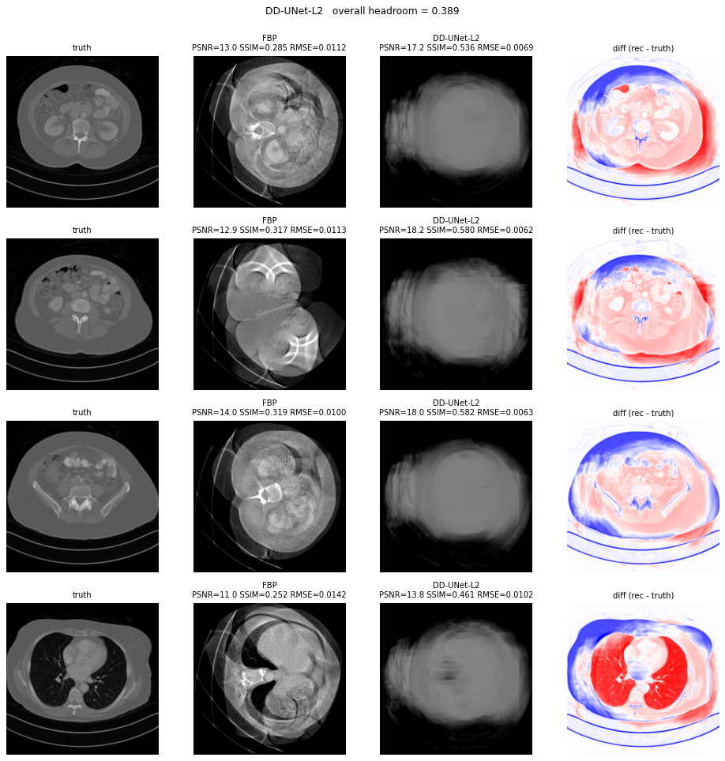

**Agent4CT** is a continuously-running LLM agent that improves a CT reconstruction codebase by editing it, running short experiments on a Slurm GPU cluster, and keeping or discarding changes based on the resulting metrics. The pattern is borrowed from [karpathy/autoresearch](https://github.com/karpathy/autoresearch) and generalised to **five** CT-imaging benchmarks — the **Pentathlon**.

<strong>Live</strong> · The dashboard at <a href="dashboard.html">dashboard.html</a> shows every run, every iteration, and the agents' shared scratch pad — including the side-by-side reconstruction images for each iteration.

<strong>Running now</strong> · The first real autoresearch run, <code>dl-sparse-view-*</code>, targets the AAPM DL-Sparse-View CT challenge (128-view 2D fan-beam, perfectly-known truth) on the LME cluster. Iteration budget 150; stage check every 30 iterations on a 3× larger subset. Follow live progress on the <a href="dashboard.html">dashboard</a>.

## The Pentathlon

Five public AAPM CT reconstruction challenges, run on the same recon backbone (PYRO-NN fan-beam, Wagner / Siemens-AS geometry):

  

    <h3>Mayo LDCT</h3>
    
AAPM Low Dose CT Grand Challenge (2016) — abdomen / chest / head, 25 % low-dose.

    
Metric: PSNR + SSIM vs high-dose recon

  

  

    <h3>DL-Sparse-View CT</h3>
    
2021 — 2D breast phantom, 128-view sparse fan-beam, perfectly-known truth.

    
Metric: RMSE vs exact phantom

  

  

    <h3>TrueCT</h3>
    
Truth-based CT (2022) — 200 virtual patients, mono-energetic phantom truth.

    
Metric: PSNR + RMSE vs mono-energetic truth

  

  

    <h3>CT-MAR</h3>
    
CT Metal Artifact Reduction (2024) — sinogram + image pairs, 8-metric IQ score.

    
Metric: aggregate clinical IQ

  

  

    <h3>DL-Spectral CT</h3>
    
Spectral CT (2022) — 1000 cases, two kVp, three-tissue map decomposition.

    
Metric: tissue-map RMSE

  

See [Pentathlon](pentathlon.html) for the headroom-recovered scoring and per-challenge train/val/test splits.

## How the loop runs

Each iteration is one 5-minute Slurm job. The agent edits `pentathlon/<challenge>/solver.py`, the harness runs the job, computes the validation metric, and decides keep / discard via `git`. Every 30 iterations a 1-hour **stage** job runs on a 3× larger subset to catch overfitting. Test sets are touched exactly once, at the end. See [Agents](agents.html).

## 🏆 Leaderboards

Best-of-best per solver per dataset under the canonical
calibrated-SSIM-headroom scoring convention. Full 19-solver inventory
exercised on each dataset as of 2026-06-09.

| Dataset | Top solver | hr | Leaderboard |
|---|---|---:|---|
| **Mayo-LDCT** (real helical, Wagner split) | DD-UNet supervised L2 *(Step-3 TPE iter-12)* | **0.3890** | [mayo_ldct](leaderboards/mayo_ldct.html) |
| **Breast-CT** (Sidky synthetic + anatomy, 128 views) | Learned Primal-Dual *(TPE iter-11)* | **0.9062** | [breast_ct](leaderboards/breast_ct.html) |
| **Demo-DL** (Sidky synthetic ellipses, 128 views) | DD-UNet supervised L2 *(TPE iter-15)* | **0.4950** | [demo_dl](leaderboards/demo_dl.html) |

*Top: Mayo-LDCT champion (DD-UNet supervised L2, Step-3 TPE iter-12 — hr 0.3890).
Middle: Breast-CT champion (Learned Primal-Dual, TPE iter-11 — hr 0.9062).
Bottom: Demo-DL champion (DD-UNet supervised L2, TPE iter-15 — hr 0.4950).
Click any leaderboard link for the full per-solver ranking with comparison images.*

See [Leaderboards](leaderboards/) for the cross-dataset summary, full
19-solver inventory coverage matrix, and the 2026-06-08/09 Step-3 TPE
findings (DD-UNet sup +191% on Mayo, Hammernik VN STOP overturned via
TPE, ItNet v1 inventory-gap closure on synthetic datasets, etc.).

## Quick links

- 🏆 [Leaderboards](leaderboards/) — calibrated headroom rankings per dataset
- 📊 [Live dashboard](dashboard.html) — every run, every iteration, scratch pad with images
- 🧪 [Setup](setup.html) — env, cluster, data
- 🥇 [Pentathlon](pentathlon.html) — challenges + scoring
- 🧠 [Agents](agents.html) — the autoresearch loop
- ⚡ [Performance](performance.html) — PYRO-NN + NFS tips
- 📓 [Findings](findings.html) — cross-cutting insights from the autoresearch loop
- 📦 [GitHub](https://github.com/akmaier/Agent4CT)
