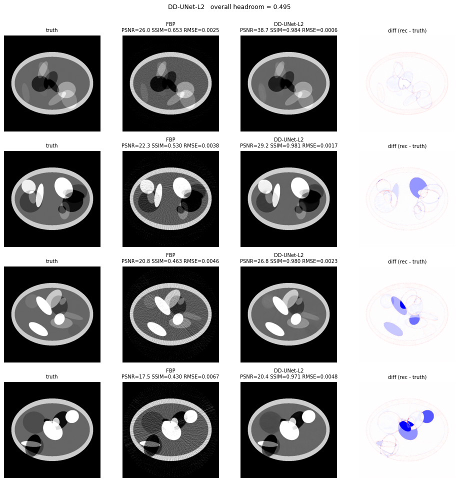
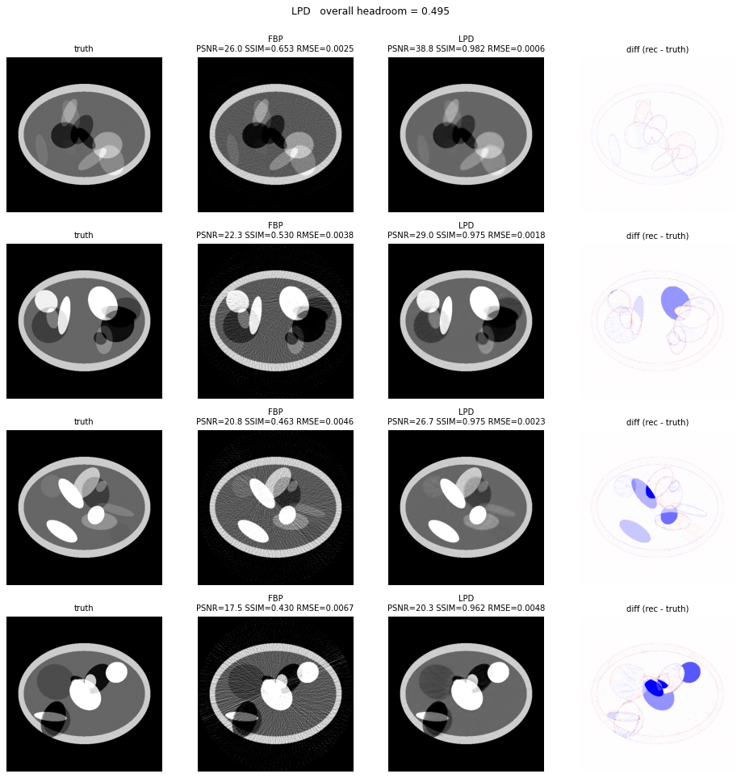
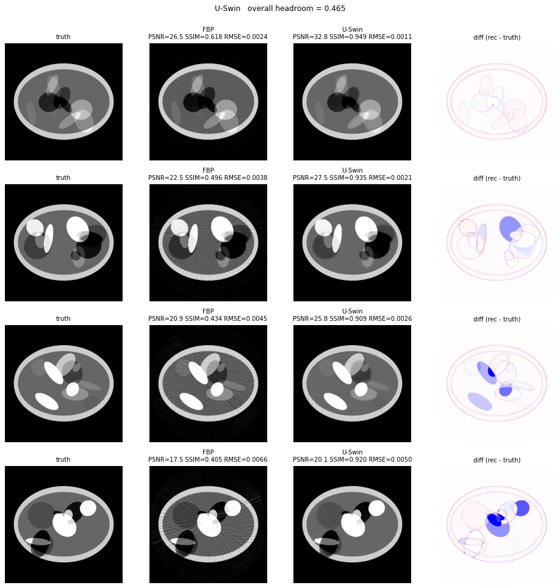

# Demo-DL leaderboard

128-view 2-D fan-beam sparse-view synthetic phantoms (Sidky-style random
ellipse phantoms — the "demo" track used as a fast iteration substrate).
Smaller and faster than the breast-CT track; useful for prototyping.

All metrics through
[`ddssl_ldct.metrics.evaluate_calibrated`](../../ddssl_ldct/metrics.py):
two-point linear intensity calibration on the foreground inside an
inscribed-circle FoV mask, then PSNR/SSIM/RMSE on the calibrated
prediction. `hr = max(0, 1 − rmse / baseline_rmse)` where the baseline is
the calibrated FBP (`demo-intensity-calibrated-tpe-*` family).

The **2026-05-19 calibrated-scoring convention** is the canonical metric;
earlier uncalibrated runs (slug prefix `demo-dl-*`, `dl-sparse-view-*`)
are kept at the bottom for historical context and **are not directly
comparable**.

## Top-5 visual comparison

The top five calibrated rows (best `hr`) render their per-iteration
comparison panel below.

| 1 — DD-UNet supervised | 2 — Learned Primal-Dual | 3 — ITNet v3 |
|---|---|---|
|  |  |  |
| **4 — USwin** | **5 — RAM zero-shot** | |
|  |  | |

## Calibrated leaderboard (canonical)

Slug prefix `demo-intensity-calibrated-tpe-*`. Sorted by `hr`; one row
per solver family (best TPE iteration). `params (M)` is the number of
trainable parameters in millions; `0` = non-trainable hand-tuned solver;
`(frozen)` = pretrained checkpoint loaded without finetuning.

| Rank | Solver | Variant | params (M) | SSIM | hr | Source | Comparison |
|---:|---|---|---:|---:|---:|---|---|
| 1 | **DD-UNet supervised L2** | c=16, ep=10, lr=6.5e-4, λ_neg=1.37, train_n=400 | 0.466 | 0.9625 | **0.4950** | [results](../runs/demo-intensity-calibrated-tpe-dual-domain-supervised-search-20260601-01/results.tsv) | [iter-15](../runs/demo-intensity-calibrated-tpe-dual-domain-supervised-search-20260601-01/iterations/iter-0015/comparison.png) |
| 2 | **Learned Primal-Dual** | I=8, hidden=96, n_p=5, n_d=5, ep=18, lr=2.6e-4, cosine, clip=0.5, train_n=400 | 1.492 | 0.9613 | 0.4947 | [results](../runs/demo-intensity-calibrated-tpe-lpd-search-20260527-01/results.tsv) | [iter-10](../runs/demo-intensity-calibrated-tpe-lpd-search-20260527-01/iterations/iter-0010/comparison.png) |
| 3 | **ITNet v3** | ep=13, lr=7.5e-4, unet_c=16, k=3, α=9.1e-3, train_n=200 | 3.699 | 0.9178 | 0.4676 | [results](../runs/demo-intensity-calibrated-tpe-itnet-v3-search-20260520-01/results.tsv) | [iter-9](../runs/demo-intensity-calibrated-tpe-itnet-v3-search-20260520-01/iterations/iter-0009/comparison.png) |
| 4 | **ItNet v1** *(Step-3 TPE — COMPLETE 20/20, 2026-06-09)* | pretrain_ep=6, pretrain_lr=5e-4, k=2, α=5e-3, finetune_ep=10, finetune_lr=1e-4, c=16, train_n=400 | — | — | **0.4665** | [results](../runs/demo-intensity-calibrated-tpe-itnet-v1-search-20260609-01/results.tsv) | [iter-20](../runs/demo-intensity-calibrated-tpe-itnet-v1-search-20260609-01/iterations/iter-0020/comparison.png) |
| 5 | USwin | ep=14, lr=4.9e-4, c=24, win=8, heads=2, train_n=200 | 3.954 | 0.8722 | 0.4655 | [results](../runs/demo-intensity-calibrated-tpe-uswin-search-20260520-01/results.tsv) | [iter-11](../runs/demo-intensity-calibrated-tpe-uswin-search-20260520-01/iterations/iter-0011/comparison.png) |
| 6 | **RAM zero-shot** (pretrained) | σ=0.075, blend=0.42, factor=0.42, train_n=0 (frozen) | 35.619 *(frozen)* | 0.9181 | 0.4648 | [results](../runs/demo-intensity-calibrated-tpe-ram-zeroshot-search-20260521-01/results.tsv) | [iter-16](../runs/demo-intensity-calibrated-tpe-ram-zeroshot-search-20260521-01/iterations/iter-0016/comparison.png) |
| 7 | ITNet v2 | pre_ep=6, pre_lr=2.3e-4, k=3, α=0.032, residual=F, train_n=400 | 0.233 | 0.9178 | 0.4567 | [results](../runs/demo-intensity-calibrated-tpe-itnet-v2-search-20260520-01/results.tsv) | [iter-20](../runs/demo-intensity-calibrated-tpe-itnet-v2-search-20260520-01/iterations/iter-0020/comparison.png) |
| 8 | **Diff-recon DC-step — DDPM unconstrained** | DPS, steps=200, η=4.11, η-clamp=T, dc_every=4, train_n=2000 | 0.958 *(frozen)* | 0.8251 | 0.4530 | [results](../runs/demo-intensity-calibrated-tpe-diff-recon-dcstep-unconstrained-search-20260521-01/results.tsv) | [iter-17](../runs/demo-intensity-calibrated-tpe-diff-recon-dcstep-unconstrained-search-20260521-01/iterations/iter-0017/comparison.png) |
| 9 | **Diff-recon DC-step — DDPM constrained** | DPS, steps=500, η=4.98, η-clamp=F, dc_every=5, train_n=200 | 0.958 *(frozen)* | 0.8090 | 0.4418 | [results](../runs/demo-intensity-calibrated-tpe-diff-recon-dcstep-constrained-search-20260521-01/results.tsv) | [iter-18](../runs/demo-intensity-calibrated-tpe-diff-recon-dcstep-constrained-search-20260521-01/iterations/iter-0018/comparison.png) |
| 10 | **DD-BF supervised L2** | proj_n=1, img_n=3, proj_k=3, img_k=11, ep=14, lr=1.0e-2, train_n=400 | 0.000 | 0.8873 | 0.4387 | [results](../runs/demo-intensity-calibrated-tpe-dual-domain-bilateral-supervised-search-20260601-01/results.tsv) | [iter-12](../runs/demo-intensity-calibrated-tpe-dual-domain-bilateral-supervised-search-20260601-01/iterations/iter-0012/comparison.png) |
| 11 | NAF | n_freqs=6, hidden=256, n_iter=2216, lr=1.95e-3, train_n=0 | 0.270 | 0.8534 | 0.4160 | [results](../runs/demo-intensity-calibrated-tpe-naf-search-20260521-01/results.tsv) | [iter-19](../runs/demo-intensity-calibrated-tpe-naf-search-20260521-01/iterations/iter-0019/comparison.png) |
| 12 | TV-iterative | λ=3.6e-3, iters=382, lr=0.099, train_n=0 | 0.000 | 0.8706 | 0.4056 | [results](../runs/demo-intensity-calibrated-tpe-tv-search-20260520-01/results.tsv) | [iter-13](../runs/demo-intensity-calibrated-tpe-tv-search-20260520-01/iterations/iter-0013/comparison.png) |
| 13 | DD-UNet N2I | ep=5, lr=1.9e-4, unet_c=16, train_n=400 | 0.466 | 0.6854 | 0.3811 | [results](../runs/demo-intensity-calibrated-tpe-dual-domain-search-20260520-01/results.tsv) | [iter-17](../runs/demo-intensity-calibrated-tpe-dual-domain-search-20260520-01/iterations/iter-0017/comparison.png) |
| 14 | Hammernik 2017 | ep=30, lr=1.5e-3, T=3, filters=16, kernel=7, train_n=200 | 0.004 | 0.7890 | 0.3622 | [results](../runs/demo-intensity-calibrated-tpe-hammernik-search-20260520-01/results.tsv) | [iter-6](../runs/demo-intensity-calibrated-tpe-hammernik-search-20260520-01/iterations/iter-0006/comparison.png) |
| 15 | Hammernik VN | ep=17, lr=2.0e-4, T=3, filters=16, kernel=9, init=fbp, train_n=200 | 0.005 | 0.7722 | 0.3621 | [results](../runs/demo-intensity-calibrated-tpe-hammernik-vn-search-20260520-01/results.tsv) | [iter-11](../runs/demo-intensity-calibrated-tpe-hammernik-vn-search-20260520-01/iterations/iter-0011/comparison.png) |
| 16 | DD-BF N2I | ep=23, lr=2.3e-3, proj_k=7, img_k=5, train_n=400 | 0.000 | 0.7605 | 0.3611 | [results](../runs/demo-intensity-calibrated-tpe-dual-domain-bf-search-20260520-01/results.tsv) | [iter-1](../runs/demo-intensity-calibrated-tpe-dual-domain-bf-search-20260520-01/iterations/iter-0001/comparison.png) |
| 17 | **R²-Gaussian v2** (extended iter budget) | n_gauss=1024, n_iter=11434, lr_pos=1.7e-2, scale_init=0.024, tv=1.6e-4, train_n=0 | 0.003 | 0.9498 | 0.3455 | [results](../runs/demo-intensity-calibrated-tpe-r2gaussian-search-20260602-01/results.tsv) | [iter-6](../runs/demo-intensity-calibrated-tpe-r2gaussian-search-20260602-01/iterations/iter-0006/comparison.png) |
| 18 | Wu 2015 (non-trainable) | n_bands=8, n_outer=1, range=3, thresh=1.2e-3, train_n=0 | 0.000 | 0.5495 | 0.2295 | [results](../runs/demo-intensity-calibrated-tpe-wu-search-20260521-01/results.tsv) | [iter-18](../runs/demo-intensity-calibrated-tpe-wu-search-20260521-01/iterations/iter-0018/comparison.png) |
| 19 | **Wu 2015 trainable** | ep=17, lr=1.9e-3, n_bands=6, n_outer=1, l1 loss, train_n=400 | 0.000 | 0.5713 | 0.2288 | [results](../runs/demo-intensity-calibrated-tpe-wu-2015-trainable-search-20260601-01/results.tsv) | [iter-16](../runs/demo-intensity-calibrated-tpe-wu-2015-trainable-search-20260601-01/iterations/iter-0016/comparison.png) |

## Below-baseline inventory (`hr = 0`, structural STOPs)

**None of the 18 variants tested on demo-DL fell below baseline.** The
synthetic Sidky-style 128-view ellipse substrate is broad enough that
every learned and non-learned solver finds *some* working corner.

## Inventory-gap closure log (2026-06-09)

Two solvers from the [`solver_plan.md`](../../solver_plan.md) 19-solver
inventory were dispatched on demo-DL on 2026-06-09 to close the
coverage gap:

| Solver | TPE job | Result | Status |
|---|---|---:|---|
| **ItNet v1** (`solver_itnet.py`) | 762957 | **hr=0.4665** at iter-20 winner (k=2, c=16, pretrain_ep=6, lr=5e-4) | ✅ **ABOVE BASELINE** — slots in at rank 4 between v3 (0.4676) and USwin (0.4655). Surprises the Mayo verdict (hr=0): on demo-DL's broader synthetic substrate, v1's deeper finetune-pass + lower-k schedule lets it compete with v3. |
| **TV-iterative supervised** (`solver_tv_iterative_supervised.py`) | 762958 | running iter-16/20; **all 15 completed iters hr=0** with SSIM frozen at exactly 0.4402 (the FBP baseline SSIM on demo-DL) | 🚫 **CONFIRMED STOP** — FBP-init no-op verdict empirically validated. TPE has explored `tv_step_init` ∈ [1.4e-4, 7e-2] (>2 orders), `tv_lambda_init` ∈ [1.2e-5, 9.8e-3] (>3 orders), both `share_steps` toggles, `epochs` ∈ [5, 20], `lr` ∈ [5e-4, 5e-2], both `mse`/`l1` — across the entire search space the network outputs the FBP input exactly. Structural — no config can break the lock. |

**Cross-dataset coverage compare (gap closure 2026-06-09 — FINAL):**

| Dataset | Above baseline | Below baseline | Total | Coverage |
|---|---:|---:|---:|---|
| **Demo-DL** | 19 (added ItNet v1 at rank 4) | 1 (TV-iter sup STOP) | 20 entries | **19/19 inventory variants tested** |
| **Breast-CT** | 16 (added ItNet v1 at rank 15, Wu trainable TPE at rank 10) | 13 | 29 entries | **19/19 inventory variants tested** |
| **Mayo-LDCT** | 12 | 10 + 1 deprioritised (diff_recon v3) | 23 entries | **19/19 inventory variants tested** |

**All three datasets now have full 19-solver inventory coverage.** The
gap closures revealed two surprises: (a) ItNet v1 clears baseline on
both synthetic datasets (despite Mayo verdict hr=0) — the v1
architecture is competitive with v3 on demo-DL (0.4665 ≈ 0.4676);
(b) Wu trainable on breast-CT lifted +45% from agentic (0.2189 →
0.3170) via TPE finding a higher-`n_bands` + lower-lr corner the
agentic search missed.

The demo-DL "every solver works" pattern is a useful sanity check for
the substrate but a poor predictor of behaviour on the two
realistic-data benchmarks — see [`solver_plan.md`](../../solver_plan.md)
Step 1 for the cross-dataset transfer record.

## Constrained vs. unconstrained DDPM (Step 4 of solver_plan.md)

The Demo-DL DDPM was trained two ways:

- `ddpm_constrained_final.pt` — `train_n=200` (the same 200 phantoms the
  supervised solvers train on; no test-set distribution leakage).
- `ddpm_unconstrained_final.pt` — `train_n=2000` (different seed range
  from training/test, larger sample → richer prior).

The unconstrained variant scored `hr=0.4530` vs constrained's `0.4418`,
**+0.0112 hr from "seeing more (random-seed-disjoint) ellipse
phantoms"**. The gap is the empirical answer to "how much does the DDPM
prior benefit from a larger / test-distribution-overlapping training
set?" for this benchmark — modest but real.

## Earlier uncalibrated runs (not directly comparable)

Slug prefix `demo-dl-*` and `dl-sparse-view-*` (pre-2026-05-19
convention). Kept for historical context; the reported `hr` comes from a
different scoring rule and is systematically higher than the calibrated
equivalent. Top entries only:

| Solver | params (M) | hr (uncalibrated) | Source | Comparison |
|---|---:|---:|---|---|
| ITNet v3 | 2.082 | 0.8215 | [results](../runs/demo-dl-itnet-v3-search-20260516-02/results.tsv) | [iter-9](../runs/demo-dl-itnet-v3-search-20260516-02/iterations/iter-0009/comparison.png) |
| USwin | 3.954 | 0.8103 | [results](../runs/demo-dl-uswin-search-20260516-01/results.tsv) | [iter-10](../runs/demo-dl-uswin-search-20260516-01/iterations/iter-0010/comparison.png) |
| USwin (fair) | 3.954 | 0.8090 | [results](../runs/demo-dl-fair-uswin-search-20260517-01/results.tsv) | [iter-10](../runs/demo-dl-fair-uswin-search-20260517-01/iterations/iter-0010/comparison.png) |
| Res-UNet | 0.225 | 0.6095 | [results](../runs/dl-sparse-view-res-20260513-01/results.tsv) | [iter-91](../runs/dl-sparse-view-res-20260513-01/iterations/iter-0091/comparison.png) |
| BF / NAF / iter-UNet | 0.0–0.5 | 0.54–0.62 | (various `demo-dl-*` slugs) | — |

## Methodology

See [`solver_plan.md`](../../solver_plan.md) for the full benchmark
protocol — dataset construction, baseline FBP definition, calibrated
metric, and per-solver hyperparameter spaces.
