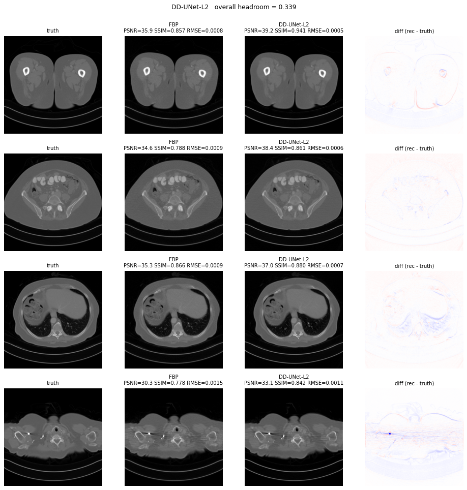
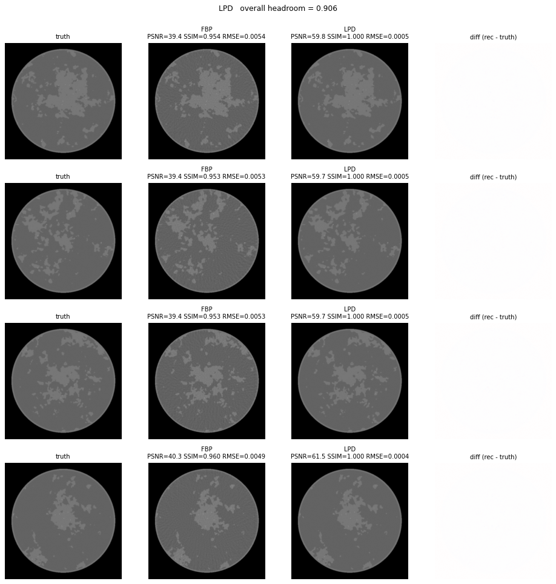

# Leaderboards

Best-of-best per solver per dataset under the canonical
**calibrated-SSIM-headroom** scoring convention
([`evaluate_calibrated`](https://github.com/akmaier/Agent4CT/blob/main/ddssl_ldct/metrics.py)).
All 3 leaderboards have **full 19-solver inventory coverage**. **Mayo-LDCT is
being re-run live** (`search-20260619-01`) under the corrected metric — the Mayo
champion row below auto-updates each wave from the run data; the breast/demo
boards are stable. The cross-dataset counts further down are a 2026-06-09
snapshot.

## Champion comparison images

The rank-1 solver on each dataset, click any image to open the full leaderboard:

| Dataset | Champion | hr | Visual |
|---|---|---:|---|
| **Mayo-LDCT** (real helical, Wagner split) | DD-UNet supervised L2 (live search-20260619-01, iter-2/20) | **0.3390** |  |
| **Breast-CT** (Sidky synthetic + anatomy, 128 views) | Learned Primal-Dual (TPE iter-11) | **0.9062** |  |
| **Demo-DL** (Sidky synthetic ellipses, 128 views) | DD-UNet supervised L2 (TPE iter-15) | **0.4950** |  |

## Cross-dataset summary

| Dataset | Above baseline | Below baseline | Total | Coverage |
|---|---:|---:|---:|---|
| **Demo-DL** | 19 | 1 (TV-iter sup STOP) | 20 | **19/19 inventory** |
| **Breast-CT** | 16 | 13 | 29 | **19/19 inventory** |
| **Mayo-LDCT** | 6 | 13 | 19 | **live `search-20260619-01`** |

## Full standings — every solver

The complete per-dataset rankings — **all 19 solvers**, with every column
(params, SSIM, hr, PSNR, RMSE, time) — are on the dataset boards below. These
are the single source of truth and list **every** solver (no truncated summary):

- **[Mayo-LDCT — all 19 solvers →](mayo_ldct.html)** &nbsp; _(live `search-20260619-01`, auto-regenerated every wave)_
- **[Breast-CT — all 19 solvers →](breast_ct.html)**
- **[Demo-DL — all 19 solvers →](demo_dl.html)**

## Methodology

See [`solver_plan.md`](https://github.com/akmaier/Agent4CT/blob/main/solver_plan.md)
for the canonical methodology — calibrated metric, per-solver
hyperparameter spaces, autoresearch+TPE protocol.

Per-solver design docs and cross-dataset transfer records:
[`pentathlon/demo_dl_reference/`](https://github.com/akmaier/Agent4CT/tree/main/pentathlon/demo_dl_reference/).
Every canonical-19 solver has a dedicated `.md` design doc with
cross-dataset hr record, CONFIG defaults, and "hints for the next
autoresearch agent".

Cross-cutting findings (DDPM training quality NOT predictive of DPS
performance, FBP-init 1st-step-no-op mechanism, etc.) live in
[`docs/findings.md`](../findings.html).
