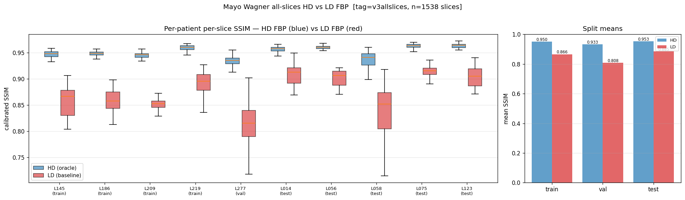
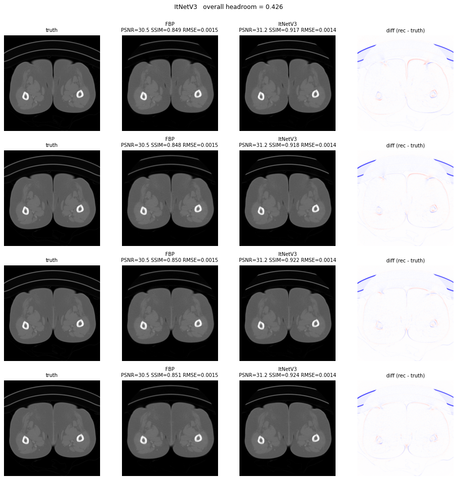
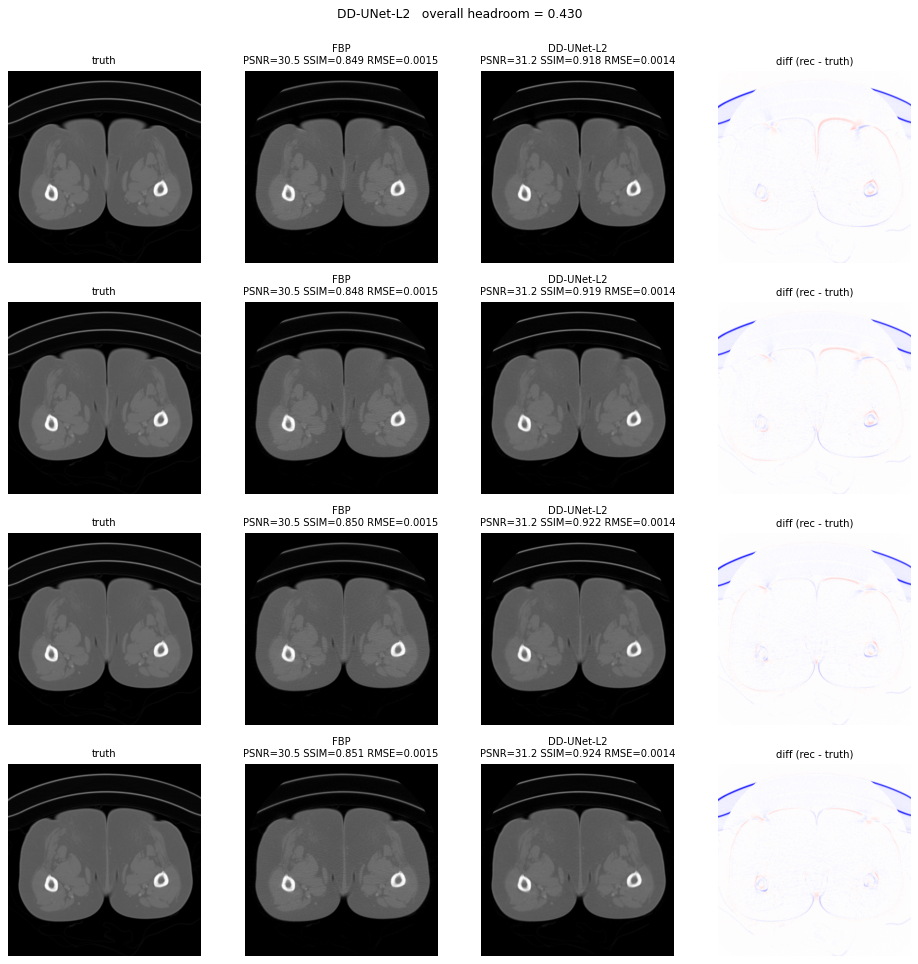
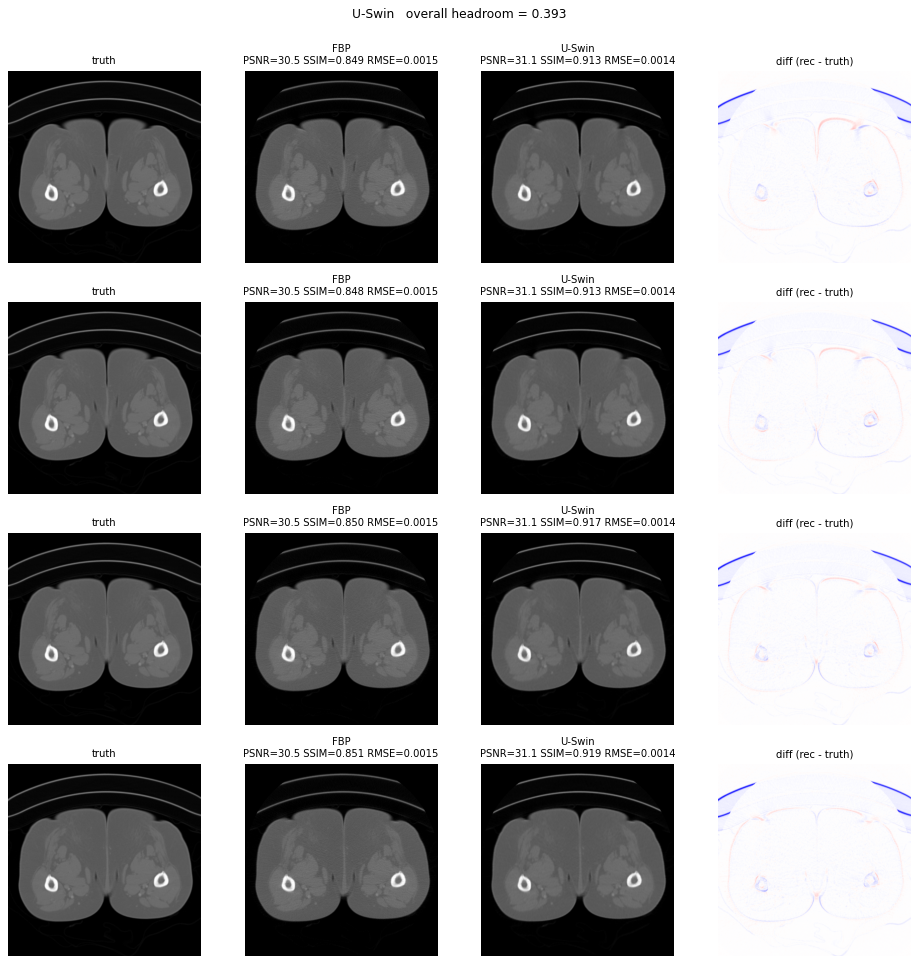
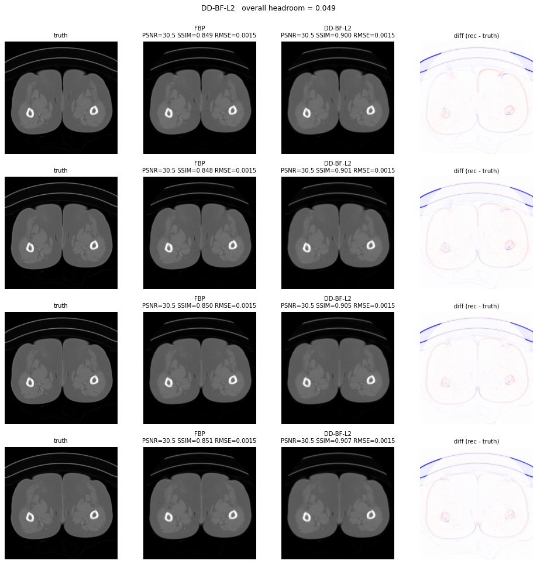
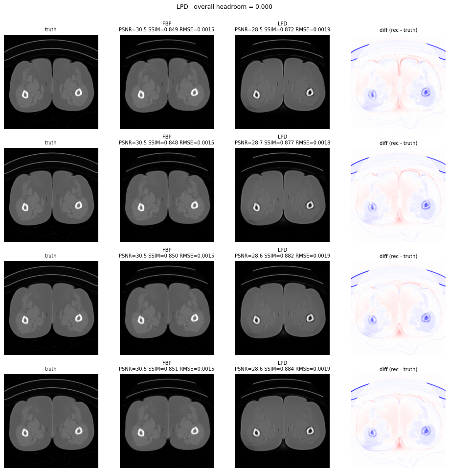
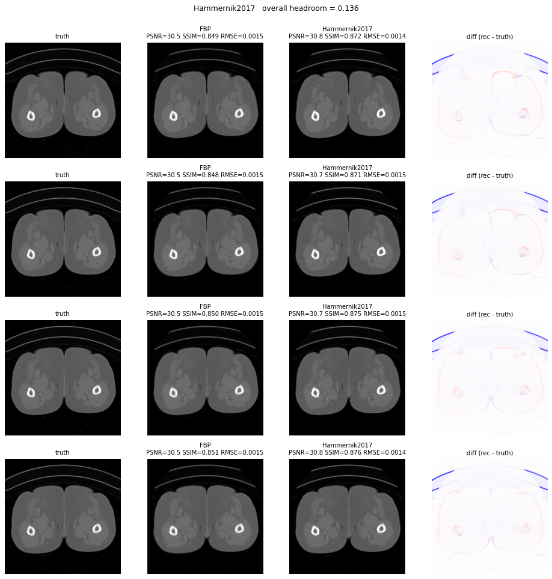

# Mayo-LDCT leaderboard (Wagner split)

> 🧹 **2026-06-14 — leaderboard reset. Starting over.**
> Every Mayo result produced before this date has been **discarded** and
> the dashboard run directories removed. Two compounding problems made the
> old numbers untrustworthy:
> 1. **`intensity_calibrate` background-offset bug** — all calibrated
>    SSIM/PSNR were scored mapping the recon background to 0, but Mayo
>    truth background is ~+0.0005 μ (≈0.01 SSIM low on average, more for
>    low-overlap slices). Fixed via opt-in `bg_target="truth"`
>    (commit `bcfa2720`); end-to-end validated 2026-06-13.
> 2. **Geometry + FBP path not fully hard-wired** — the old agentic/TPE
>    runs scored on a subset of slices, did not all use the final v3 SSR
>    geometry, and the solver FBP path did not yet carry the detector
>    offset + water-cylinder truncation correction.
>
> The rebuild starts from a clean **HD vs LD FBP baseline computed over
> every truth slice** of all 10 Wagner patients, using the frozen
> production path (v3 SSR rebin + Powell FBP geometry + `MAYO_LDCT_DET_OFFSET`
> + `MAYO_LDCT_TRUNCATION` + `bg_target="truth"`). That baseline defines the
> headroom-scoring endpoints (LD FBP = score 0, HD FBP = score 1) for every
> solver added from here on. See [`docs/findings.md`](../findings.md) (2026-06-14).

AAPM 2016 Low-Dose CT Grand Challenge data — helical Siemens SOMATOM
AS+, rebinned to 2-D fan-beam via the in-house
[`helix2fan`](../../ddssl_ldct/helix2fan.py) SSR pipeline. Wagner split:

```
Train: L145, L186, L209, L219      (4 patients)
Val:   L277                         (1 patient)
Test:  L014, L056, L058, L075, L123 (5 patients)
```

**All splits are evaluated on _every_ reconstructed slice** (≈155 full-dose
truth-image slices per patient), not a subsampled subset.

## Baseline — HD vs LD FBP (all slices)

Computed 2026-06-14 (SLURM 763659, `scripts/compare_hd_ld_fbp_allslices.py`)
over **every** full-dose truth slice of all 10 Wagner patients (**1538 slices**),
both doses, on the frozen production path. These define the headroom-scoring
endpoints: **`score = (SSIM − LD_FBP) / (HD_FBP − LD_FBP)`** per split.
z-registration residual ≤ 0.38 mm for every patient; HD-FBP L277 0.9331
matches the validated central-slice number (0.9315).

| Split | Patients | n slices | HD-FBP SSIM (oracle) | LD-FBP SSIM (baseline) | HD PSNR | LD PSNR | headroom gap |
|---|---|---:|---:|---:|---:|---:|---:|
| **train** | L145 L186 L209 L219 | 579 | 0.9501 | 0.8659 | 36.88 | 34.95 | 0.0843 |
| **val** | L277 | 214 | 0.9331 | 0.8078 | 37.65 | 34.45 | 0.1252 |
| **test** | L014 L056 L058 L075 L123 | 745 | 0.9528 | 0.8848 | 37.99 | 36.15 | 0.0680 |
| **overall** | all 10 | 1538 | 0.9491 | 0.8670 | 37.52 | 35.46 | 0.0821 |

Per-patient (calibrated SSIM, all slices):

| Patient | split | n | truth ps (mm) | HD-FBP | LD-FBP | gap |
|---|---|---:|---:|---:|---:|---:|
| L145 | train | 160 | 0.781 | 0.9469 | 0.8571 | 0.0898 |
| L186 | train | 167 | 0.781 | 0.9482 | 0.8588 | 0.0894 |
| L209 | train | 98 | 0.742 | 0.9453 | 0.8534 | 0.0919 |
| L219 | train | 154 | 0.664 | 0.9587 | 0.8905 | 0.0682 |
| L277 | val | 214 | 0.742 | 0.9331 | 0.8078 | 0.1252 |
| L014 | test | 154 | 0.703 | 0.9564 | 0.9078 | 0.0487 |
| L056 | test | 93 | 0.703 | 0.9605 | 0.9017 | 0.0588 |
| L058 | test | 210 | 0.742 | 0.9330 | 0.8272 | 0.1058 |
| L075 | test | 137 | 0.664 | 0.9626 | 0.9149 | 0.0477 |
| L123 | test | 151 | 0.664 | 0.9631 | 0.9039 | 0.0591 |



Per-patient representative slices (min / median / max LD-SSIM; GT | HD | LD | LD−GT)
and per-slice SSIM-vs-z curves are in
[`baseline_2026-06-14/`](baseline_2026-06-14/) — e.g. val patient
[L277 montage](baseline_2026-06-14/L277_montage.png) ·
[L277 SSIM vs z](baseline_2026-06-14/L277_ssim_vs_z.png), test patient
[L014 montage](baseline_2026-06-14/L014_montage.png).

## Solver leaderboard

> **Rebuild in progress (2026-06-14).** Agentic autoresearch loop (Step 2 of
> [`solver_plan.md`](../../solver_plan.md)) on the corrected per-sample path:
> training-NaN grad-clip fix (`metrics.clip_and_step`) + per-sample `ps_eff`
> reconstruction + `bg_target="truth"` calibration. Numbers are the **agentic
> search metric** — calibrated full-image SSIM on a `val_n=20` stratified L277
> subset, `train_n=200` stratified across the 4 train patients. The headroom
> `hr` is the solver-internal `(SSIM − LD_FBP)/(oracle − LD_FBP)` on that
> subset (in-solver LD-FBP baseline ≈ 0.918 on these 20 slices). The per-solver
> winner will be re-evaluated on **all 214 val slices** for the final row.
> Driving toward the iter-20 hard stop per solver; **updated every wave.**

Best agentic iter so far per solver (table auto-regenerated from run data each
wave by [`scripts/gen_mayo_leaderboard.py`](../../scripts/gen_mayo_leaderboard.py),
ranked by headroom; all solvers train stably — 0 nonfinite-grad skips, confirming
the NaN fix):

<!-- AGENTIC_TABLE_START -->
| Rank | Solver | Best iter | SSIM | hr | params | Source | Comparison |
|---:|---|---|---:|---:|---:|---|---|
| 1 | **ITNet v3** | iter-10 (epochs=20, itnet_k=3, lr=0.0002, unet_c=24) | 0.9657 | 0.4258 | 8.318 M | [results](../runs/mayo-ldct-claude-agentic-itnet-v3-search-20260614-01/results.tsv) | [](../runs/mayo-ldct-claude-agentic-itnet-v3-search-20260614-01/iterations/iter-0010/comparison.png) |
| 2 | DD-UNet supervised L2 | iter-7 (epochs=8, lr=0.0002, unet_c=24) | 0.9626 | 0.4296 | 1.045 M | [results](../runs/mayo-ldct-claude-agentic-dual-domain-supervised-search-20260614-01/results.tsv) | [](../runs/mayo-ldct-claude-agentic-dual-domain-supervised-search-20260614-01/iterations/iter-0007/comparison.png) |
| 3 | U-Swin | iter-5 (epochs=14, lr=0.0005, uswin_c=24) | 0.9595 | 0.3935 | 3.954 M | [results](../runs/mayo-ldct-claude-agentic-uswin-search-20260614-01/results.tsv) | [](../runs/mayo-ldct-claude-agentic-uswin-search-20260614-01/iterations/iter-0005/comparison.png) |
| 4 | DD-BF supervised L2 | iter-1 (epochs=8, lr=0.005) | 0.9502 | 0.0493 |  | [results](../runs/mayo-ldct-claude-agentic-dual-domain-bilateral-supervised-search-20260614-01/results.tsv) | [](../runs/mayo-ldct-claude-agentic-dual-domain-bilateral-supervised-search-20260614-01/iterations/iter-0001/comparison.png) |
| 5 | Learned Primal-Dual | iter-9 (epochs=8, lpd_hidden=48, lpd_iters=3, lr=0.002) | 0.9358 | 0.0000 | 0.155 M | [results](../runs/mayo-ldct-claude-agentic-learned-primal-dual-search-20260614-01/results.tsv) | [](../runs/mayo-ldct-claude-agentic-learned-primal-dual-search-20260614-01/iterations/iter-0009/comparison.png) |
| 6 | Hammernik VN (2017) | iter-4 (epochs=14, lr=0.0005) | 0.9101 | 0.1360 | 0.018 M | [results](../runs/mayo-ldct-claude-agentic-hammernik-2017-search-20260614-01/results.tsv) | [](../runs/mayo-ldct-claude-agentic-hammernik-2017-search-20260614-01/iterations/iter-0004/comparison.png) |
<!-- AGENTIC_TABLE_END -->

**iter-10 in flight**: **ITNet v3 overtook DD-UNet as champion (0.9634** at
epochs=16) → `epochs→20`. USwin `lr→5e-4` (c=24 lifted it to 0.9503; lr=1e-4
likely under-trains it, cf. LPD/Hammernik). LPD `lr→3e-3` (0.9358, lr climb
flattening at the baseline). Hammernik-2017 `lr→5e-4` (iter-1 0.876 — under-trained
at lr=1e-4 like LPD was; lr is the fix). PARKED (on leaderboard, resume on request):
DD-UNet 0.9626, DD-BF 0.9502. Still to onboard: Hammernik-VN, ItNet v1/v2, Wu-2015,
the two N2I variants, diffusion-recon (DPS), NAF, R²-Gaussian, RAM.
