# Mayo-LDCT leaderboard (Wagner split)

> 🧹 **2026-06-14 — leaderboard reset. Starting over.**
> Every Mayo result produced before this date has been **discarded** and
> the dashboard run directories removed. Two compounding problems made the
> old numbers untrustworthy:
> 1. **`intensity_calibrate` background-offset bug** — all calibrated
>    SSIM/PSNR were scored mapping the recon background to 0, but Mayo
>    truth background is ~+0.0005 μ (≈0.01 SSIM low on average, more for
>    low-overlap slices). Fixed via opt-in `bg_target="truth"`
>    (commit `bcfa2720`); end-to-end validated 2026-06-13.
> 2. **Geometry + FBP path not fully hard-wired** — the old agentic/TPE
>    runs scored on a subset of slices, did not all use the final v3 SSR
>    geometry, and the solver FBP path did not yet carry the detector
>    offset + water-cylinder truncation correction.
>
> The rebuild starts from a clean **HD vs LD FBP baseline computed over
> every truth slice** of all 10 Wagner patients, using the frozen
> production path (v3 SSR rebin + Powell FBP geometry + `MAYO_LDCT_DET_OFFSET`
> + `MAYO_LDCT_TRUNCATION` + `bg_target="truth"`). That baseline defines the
> headroom-scoring endpoints (LD FBP = score 0, HD FBP = score 1) for every
> solver added from here on. See [`docs/findings.md`](../findings.md) (2026-06-14).

AAPM 2016 Low-Dose CT Grand Challenge data — helical Siemens SOMATOM
AS+, rebinned to 2-D fan-beam via the in-house
[`helix2fan`](../../ddssl_ldct/helix2fan.py) SSR pipeline. Wagner split:

```
Train: L145, L186, L209, L219      (4 patients)
Val:   L277                         (1 patient)
Test:  L014, L056, L058, L075, L123 (5 patients)
```

**All splits are evaluated on _every_ reconstructed slice** (≈155 full-dose
truth-image slices per patient), not a subsampled subset.

## Baseline — HD vs LD FBP (all slices)

Computed 2026-06-14 (SLURM 763659, `scripts/compare_hd_ld_fbp_allslices.py`)
over **every** full-dose truth slice of all 10 Wagner patients (**1538 slices**),
both doses, on the frozen production path. These define the headroom-scoring
endpoints: **`score = (SSIM − LD_FBP) / (HD_FBP − LD_FBP)`** per split.
z-registration residual ≤ 0.38 mm for every patient; HD-FBP L277 0.9331
matches the validated central-slice number (0.9315).

| Split | Patients | n slices | HD-FBP SSIM (oracle) | LD-FBP SSIM (baseline) | HD PSNR | LD PSNR | headroom gap |
|---|---|---:|---:|---:|---:|---:|---:|
| **train** | L145 L186 L209 L219 | 579 | 0.9501 | 0.8659 | 36.88 | 34.95 | 0.0843 |
| **val** | L277 | 214 | 0.9331 | 0.8078 | 37.65 | 34.45 | 0.1252 |
| **test** | L014 L056 L058 L075 L123 | 745 | 0.9528 | 0.8848 | 37.99 | 36.15 | 0.0680 |
| **overall** | all 10 | 1538 | 0.9491 | 0.8670 | 37.52 | 35.46 | 0.0821 |

Per-patient (calibrated SSIM, all slices):

| Patient | split | n | truth ps (mm) | HD-FBP | LD-FBP | gap |
|---|---|---:|---:|---:|---:|---:|
| L145 | train | 160 | 0.781 | 0.9469 | 0.8571 | 0.0898 |
| L186 | train | 167 | 0.781 | 0.9482 | 0.8588 | 0.0894 |
| L209 | train | 98 | 0.742 | 0.9453 | 0.8534 | 0.0919 |
| L219 | train | 154 | 0.664 | 0.9587 | 0.8905 | 0.0682 |
| L277 | val | 214 | 0.742 | 0.9331 | 0.8078 | 0.1252 |
| L014 | test | 154 | 0.703 | 0.9564 | 0.9078 | 0.0487 |
| L056 | test | 93 | 0.703 | 0.9605 | 0.9017 | 0.0588 |
| L058 | test | 210 | 0.742 | 0.9330 | 0.8272 | 0.1058 |
| L075 | test | 137 | 0.664 | 0.9626 | 0.9149 | 0.0477 |
| L123 | test | 151 | 0.664 | 0.9631 | 0.9039 | 0.0591 |


Per-patient representative slices (min / median / max LD-SSIM; GT | HD | LD | LD−GT)
and per-slice SSIM-vs-z curves are in
[`baseline_2026-06-14/`](baseline_2026-06-14/) — e.g. val patient
[L277 montage](baseline_2026-06-14/L277_montage.png) ·
[L277 SSIM vs z](baseline_2026-06-14/L277_ssim_vs_z.png), test patient
[L014 montage](baseline_2026-06-14/L014_montage.png).

## Solver leaderboard

> **Rebuild in progress (2026-06-14).** Agentic autoresearch loop (Step 2 of
> [`solver_plan.md`](../../solver_plan.md)) on the corrected per-sample path:
> training-NaN grad-clip fix (`metrics.clip_and_step`) + per-sample `ps_eff`
> reconstruction + `bg_target="truth"` calibration. Numbers are the **agentic
> search metric** — calibrated full-image SSIM on a `val_n=20` stratified L277
> subset, `train_n=200` stratified across the 4 train patients. The headroom
> `hr` is the solver-internal `(SSIM − LD_FBP)/(oracle − LD_FBP)` on that
> subset (in-solver LD-FBP baseline ≈ 0.918 on these 20 slices). The per-solver
> winner will be re-evaluated on **all 214 val slices** for the final row.
> Driving toward the iter-20 hard stop per solver; **updated every wave.**

Best agentic iter so far per solver (table auto-regenerated from run data each
wave by [`scripts/gen_mayo_leaderboard.py`](../../scripts/gen_mayo_leaderboard.py),
ranked by headroom; all solvers train stably — 0 nonfinite-grad skips, confirming
the NaN fix):

<!-- AGENTIC_TABLE_START -->
| Rank | Solver | Best iter | SSIM | hr | params | Source | Comparison |
|---:|---|---|---:|---:|---:|---|---|
| 1 | **DD-UNet supervised L2** | iter-3 (epochs=8, lr=0.0002, unet_c=24) | 0.9608 | 0.4185 | 1.045 M | [results](../runs/mayo-ldct-claude-agentic-dual-domain-supervised-search-20260614-01/results.tsv) | [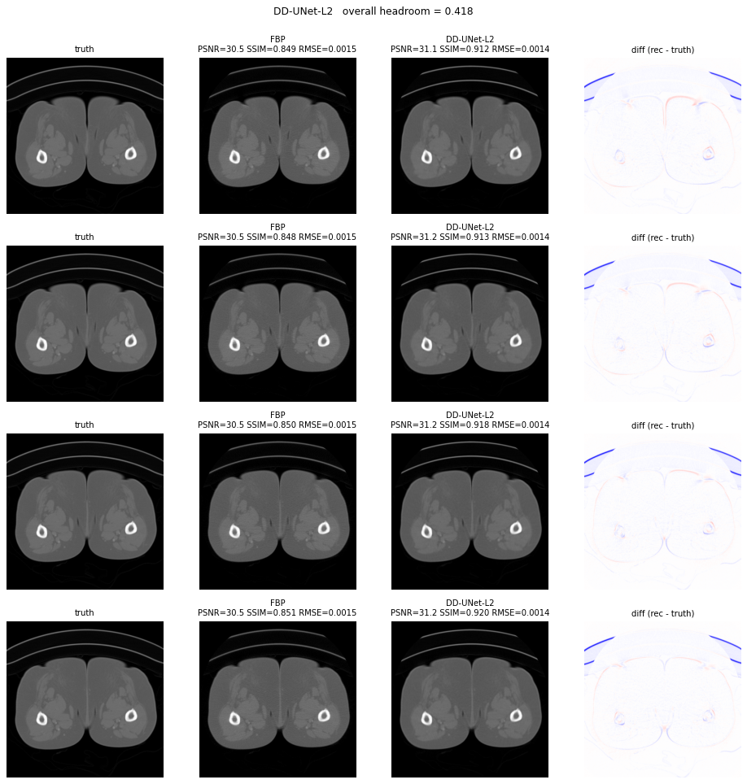](../runs/mayo-ldct-claude-agentic-dual-domain-supervised-search-20260614-01/iterations/iter-0003/comparison.png) |
| 2 | ITNet v3 | iter-3 (epochs=8, itnet_k=3, lr=0.0001, unet_c=24) | 0.9551 | 0.3715 | 8.318 M | [results](../runs/mayo-ldct-claude-agentic-itnet-v3-search-20260614-01/results.tsv) | [](../runs/mayo-ldct-claude-agentic-itnet-v3-search-20260614-01/iterations/iter-0003/comparison.png) |
| 3 | Learned Primal-Dual | iter-3 (epochs=3, loss_base=mse, lpd_hidden=48, lpd_iters=4, lpd_n_dual=3, lpd_n_primal=3) | 0.4681 | 0.2445 | 0.193 M | [results](../runs/mayo-ldct-claude-agentic-learned-primal-dual-search-20260603-01/results.tsv) | [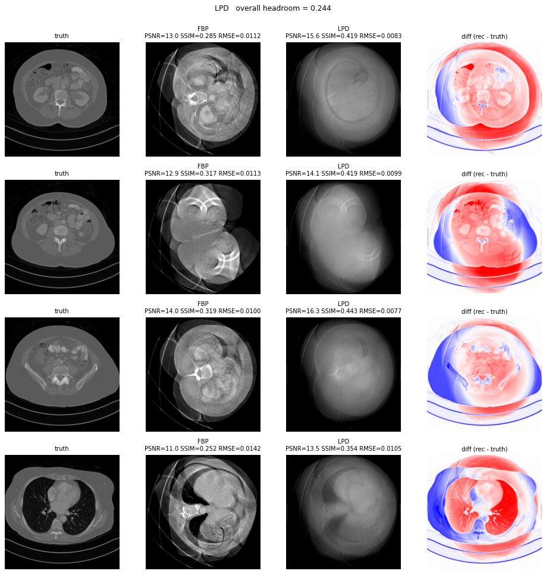](../runs/mayo-ldct-claude-agentic-learned-primal-dual-search-20260603-01/iterations/iter-0003/comparison.png) |
| 4 | itnet-v2-phase4 | iter-17 (itnet_alpha_init=0.05, itnet_k=1, pretrain_epochs=12, pretrain_lr=0.001, residual_learning=False, unet_c=32) | 0.3691 | 0.2222 | 0.928 M | [results](../runs/mayo-ldct-claude-agentic-itnet-v2-phase4-search-20260610-01/results.tsv) | [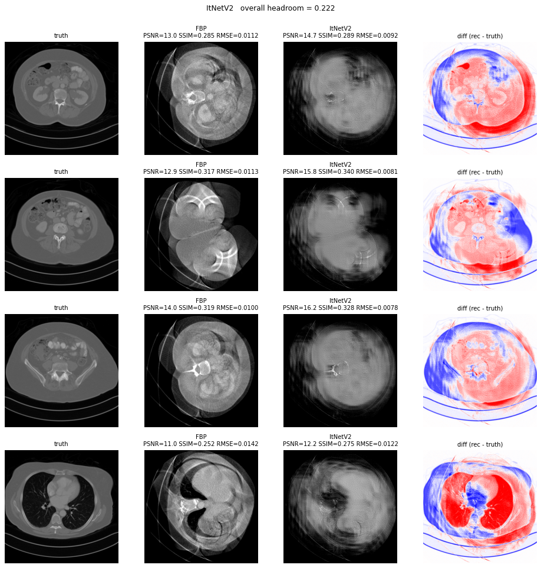](../runs/mayo-ldct-claude-agentic-itnet-v2-phase4-search-20260610-01/iterations/iter-0017/comparison.png) |
| 5 | itnet-v1-phase4 | iter-18 (finetune_epochs=8, finetune_lr=0.0015, itnet_alpha=0.05, itnet_k=1, pretrain_epochs=40, pretrain_lr=0.001) | 0.3863 | 0.2100 | 1.449 M | [results](../runs/mayo-ldct-claude-agentic-itnet-v1-phase4-search-20260610-01/results.tsv) | [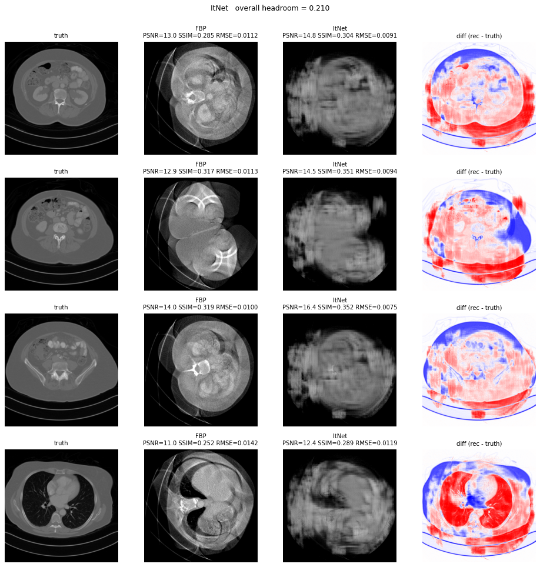](../runs/mayo-ldct-claude-agentic-itnet-v1-phase4-search-20260610-01/iterations/iter-0018/comparison.png) |
| 6 | diff-recon-dcstep-unconstrained-mayo-v2 | iter-6 (recon_ckpt=/cluster/maier/Agent4CT/checkpoints/ddpm_mayo_unconstrained_v2.pt, recon_dcstep_every=3, recon_dcstep_n_cg=10, recon_dcstep_relax=1.0, recon_dcstep_warmup=25, recon_eta=3.0) | 0.5703 | 0.2095 | 3.823 M | [results](../runs/mayo-ldct-claude-agentic-diff-recon-dcstep-unconstrained-mayo-v2-search-20260603-01/results.tsv) | [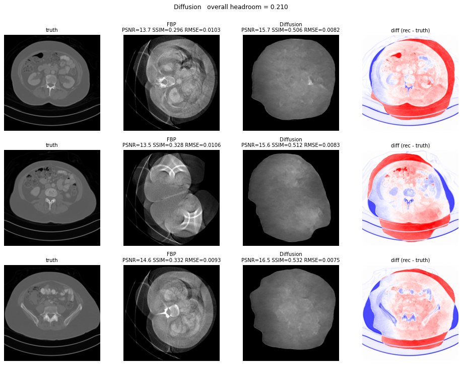](../runs/mayo-ldct-claude-agentic-diff-recon-dcstep-unconstrained-mayo-v2-search-20260603-01/iterations/iter-0006/comparison.png) |
| 7 | diff-recon-dcstep-unconstrained-mayo-v4 | iter-2 (recon_ckpt=/cluster/maier/Agent4CT/checkpoints/ddpm_mayo_unconstrained_v4.pt, recon_dcstep_every=3, recon_dcstep_n_cg=10, recon_dcstep_relax=1.0, recon_dcstep_warmup=25, recon_eta=1.0) | 0.5402 | 0.1736 | 8.594 M | [results](../runs/mayo-ldct-claude-agentic-diff-recon-dcstep-unconstrained-mayo-v4-search-20260608-01/results.tsv) | [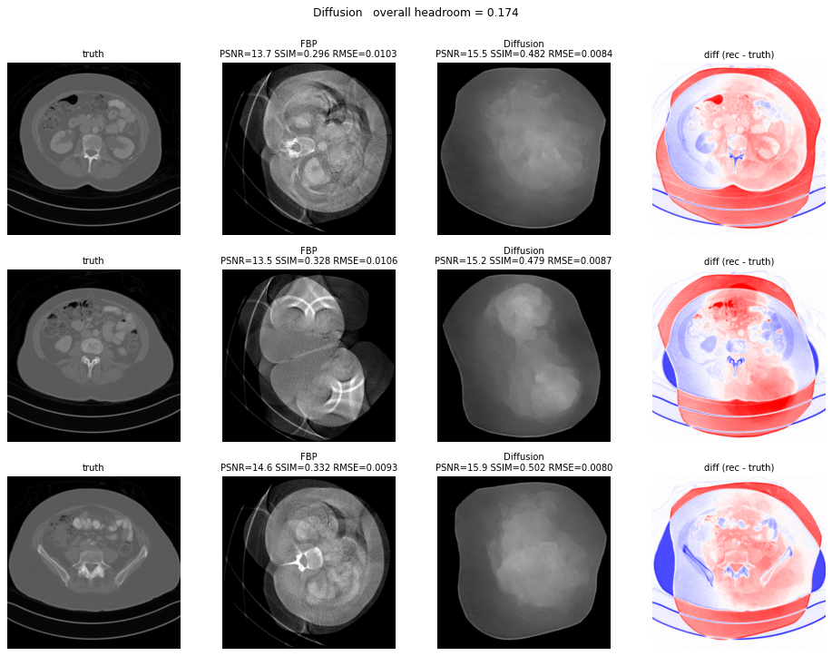](../runs/mayo-ldct-claude-agentic-diff-recon-dcstep-unconstrained-mayo-v4-search-20260608-01/iterations/iter-0002/comparison.png) |
| 8 | U-Swin | iter-2 (epochs=3, lr=0.00073, swin_heads=4, swin_window=8, uswin_c=16) | 0.3747 | 0.1425 | 1.760 M | [results](../runs/mayo-ldct-claude-agentic-uswin-search-20260603-01/results.tsv) | [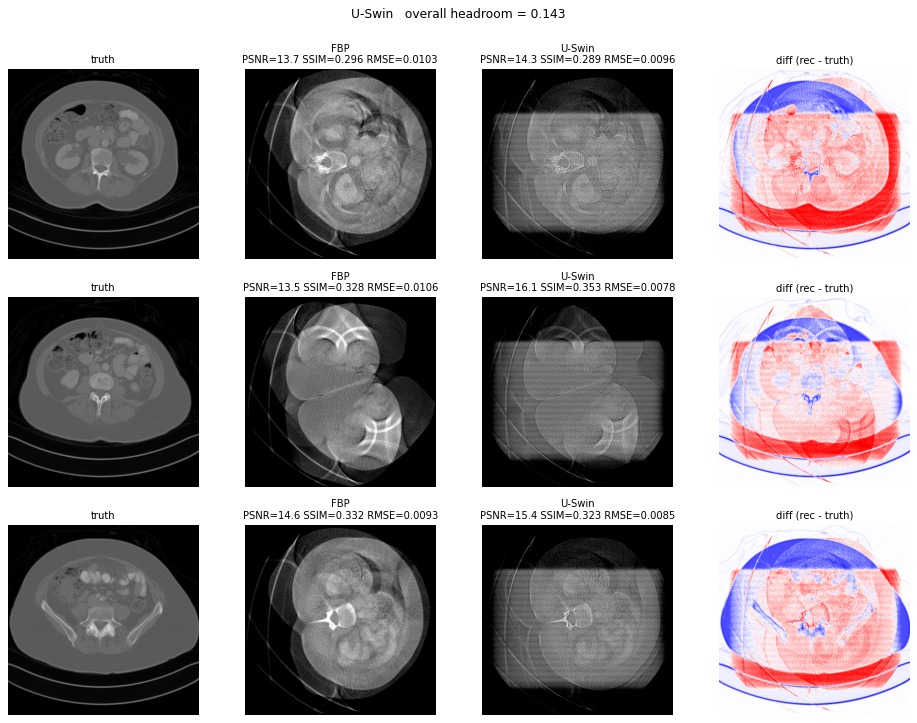](../runs/mayo-ldct-claude-agentic-uswin-search-20260603-01/iterations/iter-0002/comparison.png) |
| 9 | DD-UNet supervised L2 | iter-3 (epochs=3, lr=0.0005, unet_c=24) | 0.4200 | 0.1337 | 1.045 M | [results](../runs/mayo-ldct-claude-agentic-dual-domain-supervised-search-20260603-01/results.tsv) | [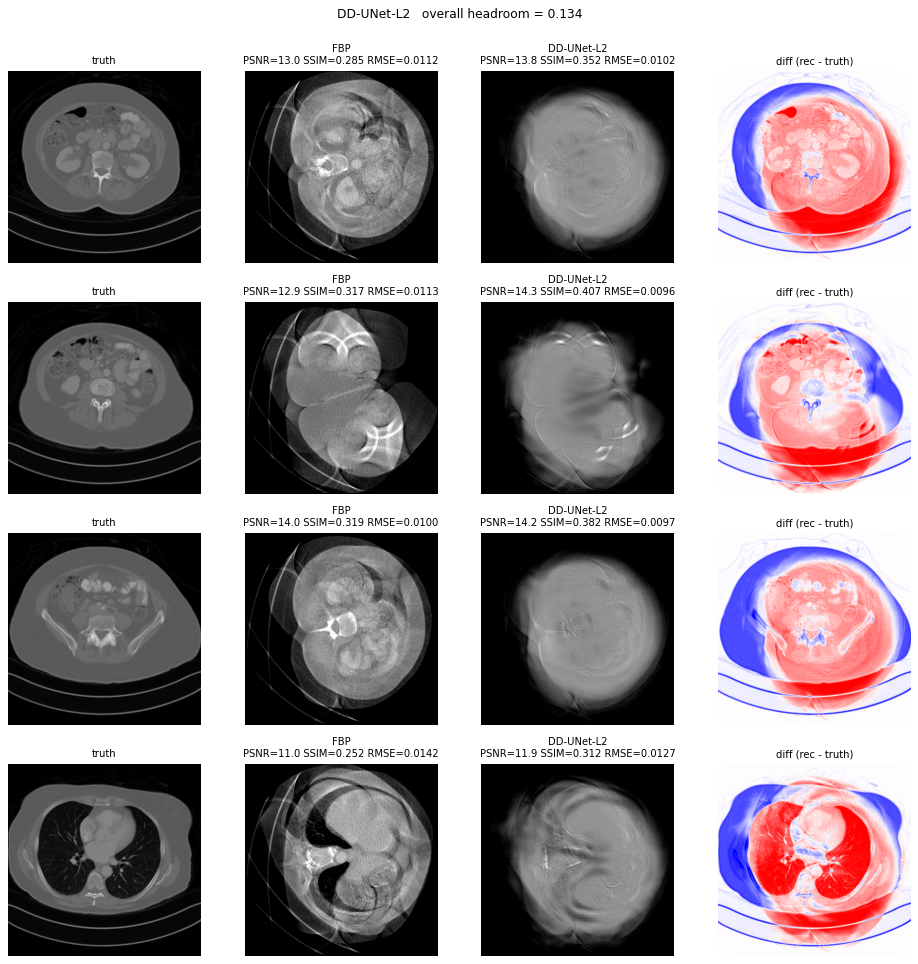](../runs/mayo-ldct-claude-agentic-dual-domain-supervised-search-20260603-01/iterations/iter-0003/comparison.png) |
| 10 | ITNet v3 | iter-5 (epochs=3, itnet_alpha_init=0.01, itnet_k=3, lr=0.0005, pretrain_epochs=2, pretrain_lr=0.0005) | 0.3146 | 0.1336 | 3.699 M | [results](../runs/mayo-ldct-claude-agentic-itnet-v3-search-20260603-01/results.tsv) | [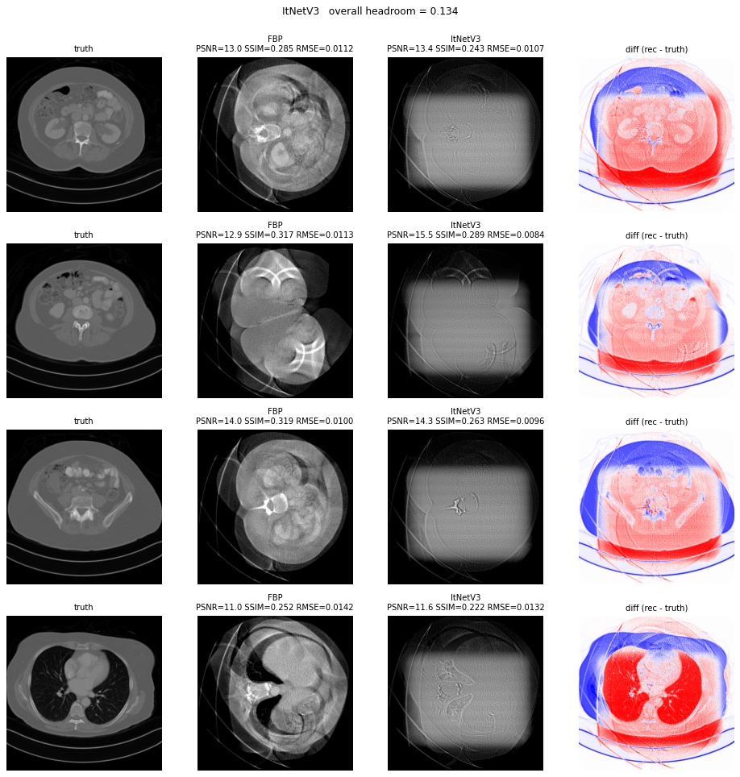](../runs/mayo-ldct-claude-agentic-itnet-v3-search-20260603-01/iterations/iter-0005/comparison.png) |
| 11 | diff-recon-dcstep-constrained-mayo-v4 | iter-1 (recon_ckpt=/cluster/maier/Agent4CT/checkpoints/ddpm_mayo_constrained_v4.pt, recon_dcstep_every=3, recon_dcstep_n_cg=10, recon_dcstep_relax=1.0, recon_dcstep_warmup=40, recon_eta=10.0) | 0.5210 | 0.0981 | 8.594 M | [results](../runs/mayo-ldct-claude-agentic-diff-recon-dcstep-constrained-mayo-v4-search-20260608-01/results.tsv) | [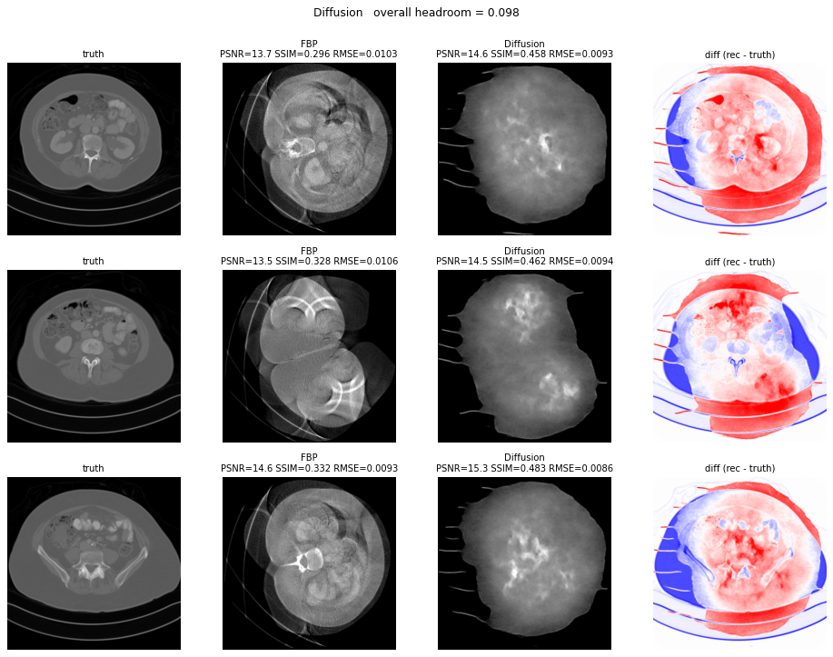](../runs/mayo-ldct-claude-agentic-diff-recon-dcstep-constrained-mayo-v4-search-20260608-01/iterations/iter-0001/comparison.png) |
| 12 | diff-recon-dcstep-constrained-mayo-v2 | iter-7 (recon_ckpt=/cluster/maier/Agent4CT/checkpoints/ddpm_mayo_constrained_v2.pt, recon_dcstep_every=3, recon_dcstep_n_cg=10, recon_dcstep_relax=0.95, recon_dcstep_warmup=40, recon_eta=10.0) | 0.5109 | 0.0847 | 3.823 M | [results](../runs/mayo-ldct-claude-agentic-diff-recon-dcstep-constrained-mayo-v2-search-20260603-01/results.tsv) | [](../runs/mayo-ldct-claude-agentic-diff-recon-dcstep-constrained-mayo-v2-search-20260603-01/iterations/iter-0007/comparison.png) |
| 13 | r2gaussian-phase4 | iter-18 (gs_lr_pos=0.0005, gs_n_gaussians=48, gs_n_iter=500, gs_outer_wall_s=1500) | 0.5759 | 0.0844 | 288 | [results](../runs/mayo-ldct-claude-agentic-r2gaussian-phase4-search-20260610-01/results.tsv) | [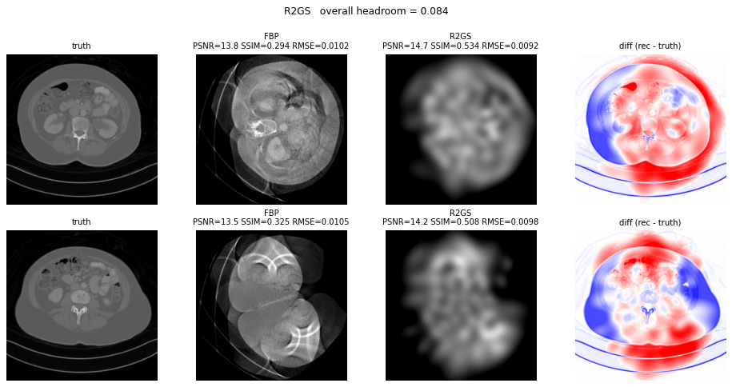](../runs/mayo-ldct-claude-agentic-r2gaussian-phase4-search-20260610-01/iterations/iter-0018/comparison.png) |
| 14 | ddbf-l2-phase4 | iter-20 (epochs=15, img_kernel=7, img_n_bf=35, lr=0.0059, proj_kernel=5, proj_n_bf=1) | 0.5461 | 0.0706 |  | [results](../runs/mayo-ldct-claude-agentic-ddbf-l2-phase4-search-20260610-01/results.tsv) | [](../runs/mayo-ldct-claude-agentic-ddbf-l2-phase4-search-20260610-01/iterations/iter-0020/comparison.png) |
| 15 | diff-recon-dcstep-constrained-mayo-v3 | iter-1 (recon_ckpt=/cluster/maier/Agent4CT/checkpoints/ddpm_mayo_constrained_v3.pt, recon_dcstep_every=3, recon_dcstep_n_cg=10, recon_dcstep_relax=1.0, recon_dcstep_warmup=40, recon_eta=10.0) | 0.5205 | 0.0686 | 8.594 M | [results](../runs/mayo-ldct-claude-agentic-diff-recon-dcstep-constrained-mayo-v3-search-20260603-01/results.tsv) | [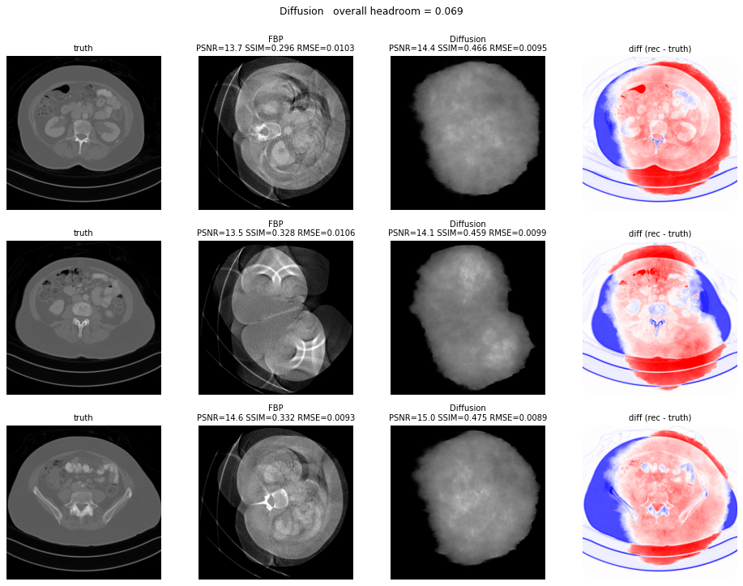](../runs/mayo-ldct-claude-agentic-diff-recon-dcstep-constrained-mayo-v3-search-20260603-01/iterations/iter-0001/comparison.png) |
| 16 | hammernik-2017-phase4 | iter-14 (epochs=12, lr=0.0005, vn_T=5, vn_kernel=11, vn_lambda_init=0.005, vn_n_filters=24) | 0.3640 | 0.0665 | 0.018 M | [results](../runs/mayo-ldct-claude-agentic-hammernik-2017-phase4-search-20260610-01/results.tsv) | [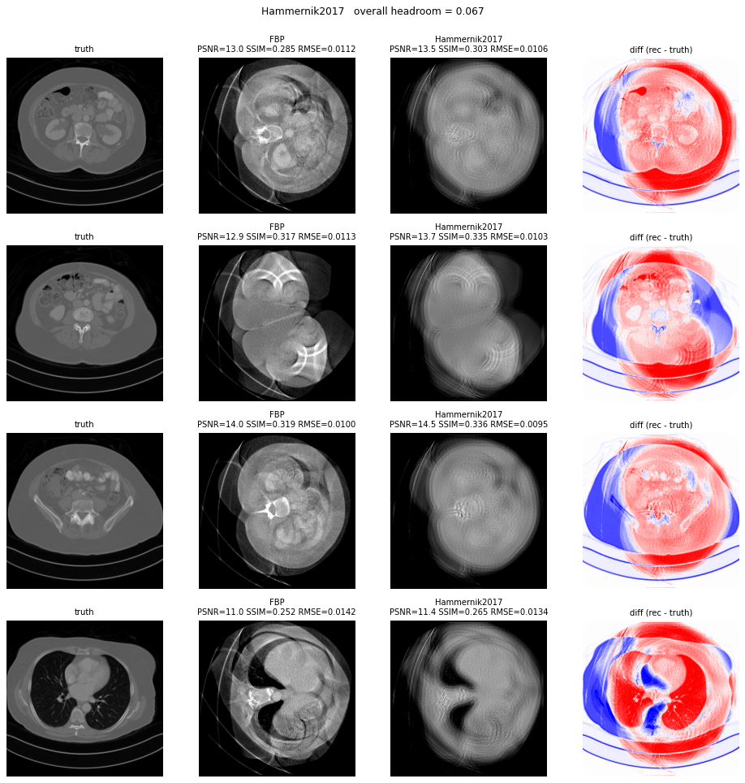](../runs/mayo-ldct-claude-agentic-hammernik-2017-phase4-search-20260610-01/iterations/iter-0014/comparison.png) |
| 17 | diff-recon-dcstep-unconstrained-mayo-v3 | iter-3 (recon_ckpt=/cluster/maier/Agent4CT/checkpoints/ddpm_mayo_unconstrained_v3.pt, recon_dcstep_every=3, recon_dcstep_n_cg=10, recon_dcstep_relax=1.0, recon_dcstep_warmup=25, recon_eta=30.0) | 0.5435 | 0.0641 | 8.594 M | [results](../runs/mayo-ldct-claude-agentic-diff-recon-dcstep-unconstrained-mayo-v3-search-20260603-01/results.tsv) | [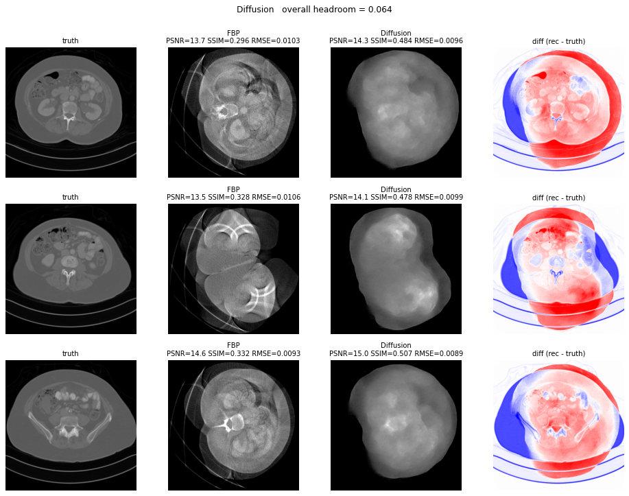](../runs/mayo-ldct-claude-agentic-diff-recon-dcstep-unconstrained-mayo-v3-search-20260603-01/iterations/iter-0003/comparison.png) |
| 18 | tv-iterative | iter-8 (tv_iterations=12800, tv_lambda=0.01, tv_n_iter=12800, tv_outer_wall_s=3500, tv_step=0.5) | 0.5439 | 0.0557 | 0 | [results](../runs/mayo-ldct-claude-agentic-tv-iterative-search-20260603-01/results.tsv) | [](../runs/mayo-ldct-claude-agentic-tv-iterative-search-20260603-01/iterations/iter-0008/comparison.png) |
| 19 | DD-BF supervised L2 | iter-1 (epochs=8, lr=0.005) | 0.9502 | 0.0493 |  | [results](../runs/mayo-ldct-claude-agentic-dual-domain-bilateral-supervised-search-20260614-01/results.tsv) | [](../runs/mayo-ldct-claude-agentic-dual-domain-bilateral-supervised-search-20260614-01/iterations/iter-0001/comparison.png) |
| 20 | ram-zeroshot-phase4 | iter-16 (ram_ckpt_path=/cluster/maier/Agent4CT/checkpoints/ram.pth.tar, ram_clamp_output=True, ram_factor=0.5, ram_finetune=False, ram_input_norm=global_max, ram_post_fbp_blend=0.0) | 0.5413 | 0.0461 | 35.619 M | [results](../runs/mayo-ldct-claude-agentic-ram-zeroshot-phase4-search-20260610-01/results.tsv) | [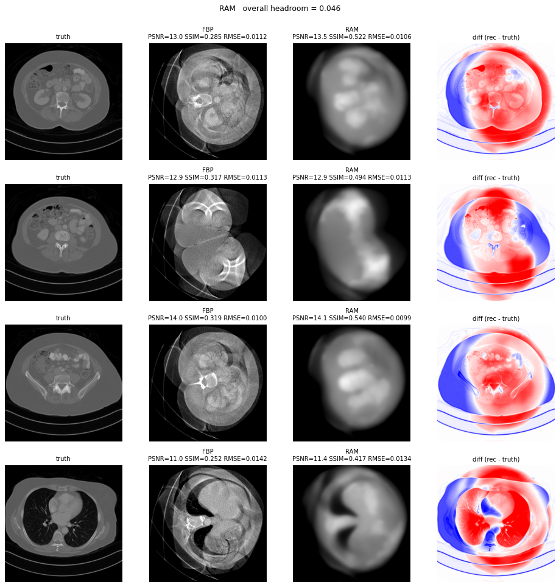](../runs/mayo-ldct-claude-agentic-ram-zeroshot-phase4-search-20260610-01/iterations/iter-0016/comparison.png) |
| 21 | DD-BF supervised L2 | iter-1 (epochs=10, img_kernel=9, img_n_bf=3, img_sr=0.02, img_sx=0.5, lr=0.005) | 0.4856 | 0.0209 |  | [results](../runs/mayo-ldct-claude-agentic-dual-domain-bilateral-supervised-search-20260603-01/results.tsv) | [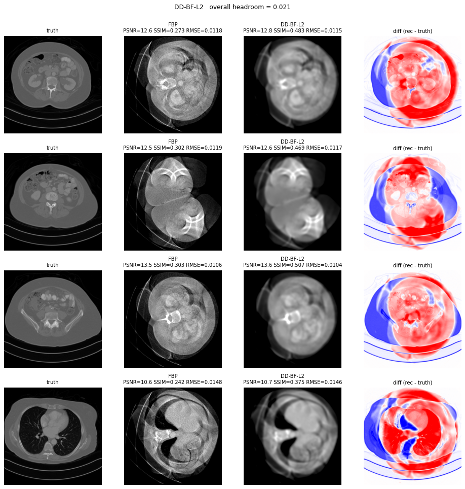](../runs/mayo-ldct-claude-agentic-dual-domain-bilateral-supervised-search-20260603-01/iterations/iter-0001/comparison.png) |
| 22 | naf | iter-1 (naf_hidden=192, naf_layers=5, naf_lr=0.002, naf_n_freqs=6, naf_n_iter=2000, naf_outer_wall_s=1200) | 0.5395 | 0.0202 | 0.117 M | [results](../runs/mayo-ldct-claude-agentic-naf-search-20260603-01/results.tsv) | [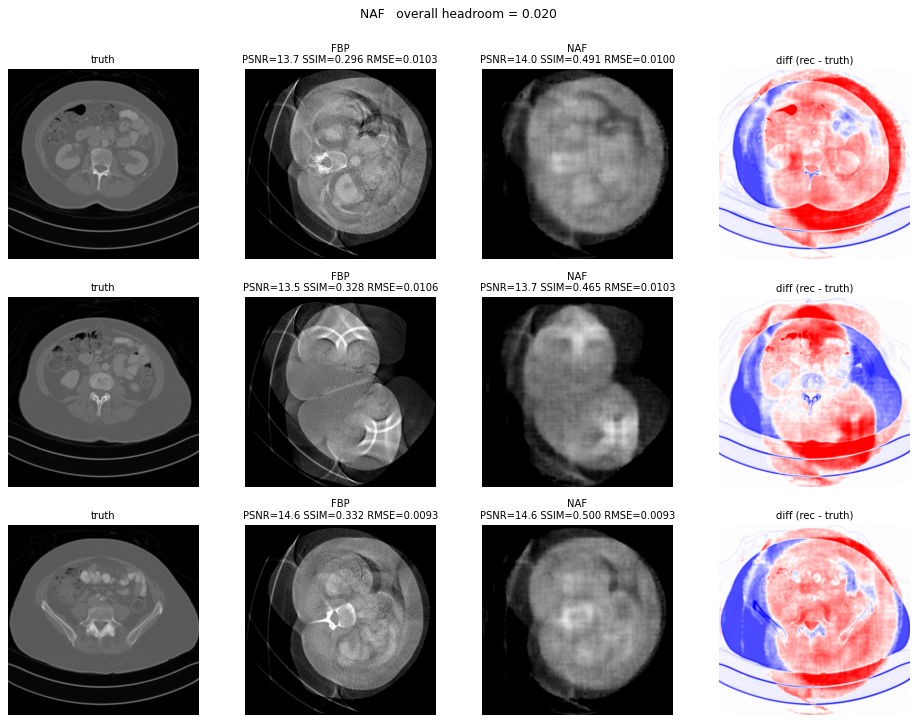](../runs/mayo-ldct-claude-agentic-naf-search-20260603-01/iterations/iter-0001/comparison.png) |
| 23 | DD-BF N2I | iter-1 (epochs=3, img_kernel=9, img_n_bf=3, lr=0.0005, proj_kernel=3, proj_n_bf=3) | 0.4868 | 0.0047 |  | [results](../runs/mayo-ldct-claude-agentic-dual-domain-bilateral-n2i-search-20260603-01/results.tsv) | [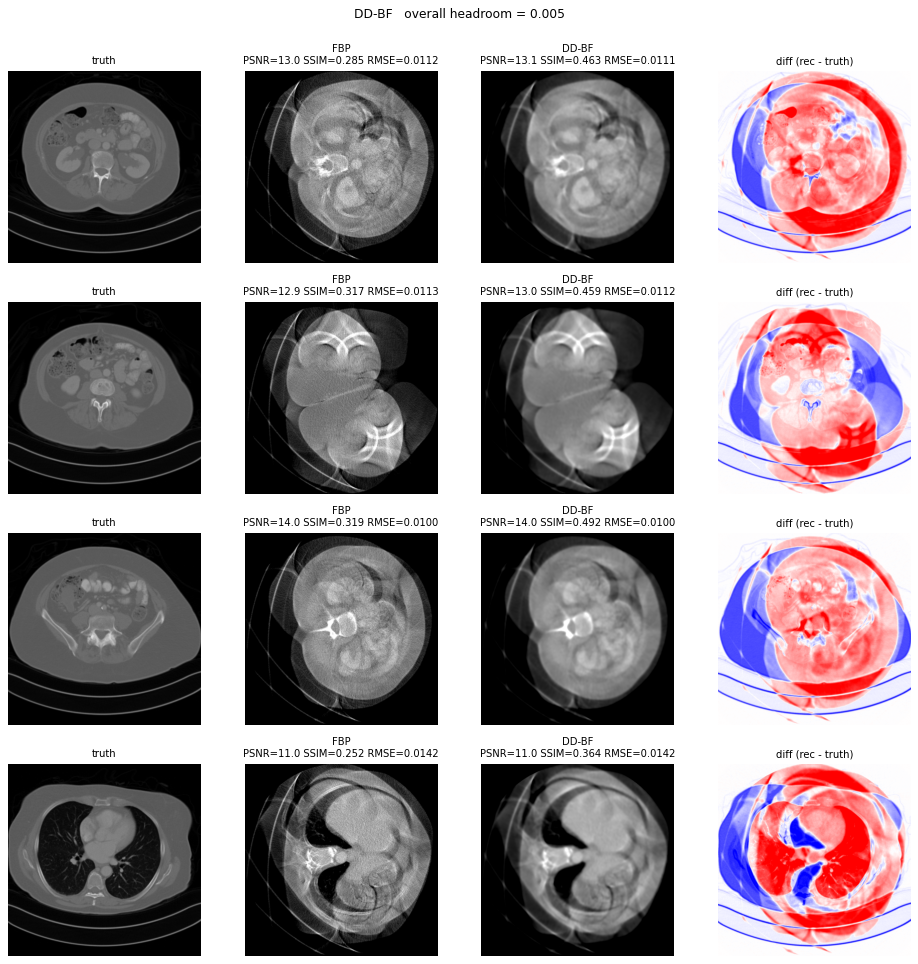](../runs/mayo-ldct-claude-agentic-dual-domain-bilateral-n2i-search-20260603-01/iterations/iter-0001/comparison.png) |
| 24 | Learned Primal-Dual | iter-1 (epochs=8, lpd_hidden=48, lpd_iters=3, lr=0.0001) | 0.7922 | 0.0000 | 0.155 M | [results](../runs/mayo-ldct-claude-agentic-learned-primal-dual-search-20260614-01/results.tsv) | [](../runs/mayo-ldct-claude-agentic-learned-primal-dual-search-20260614-01/iterations/iter-0001/comparison.png) |
| 25 | ram-zeroshot | iter-3 (ram_ckpt_path=/cluster/maier/Agent4CT/checkpoints/ram.pth.tar, ram_clamp_output=True, ram_disable_cudnn=False, ram_disable_multiscale=False, ram_factor=0.3, ram_finetune=False) | 0.4841 | 0.0000 | 35.619 M | [results](../runs/mayo-ldct-claude-agentic-ram-zeroshot-search-20260603-01/results.tsv) | [](../runs/mayo-ldct-claude-agentic-ram-zeroshot-search-20260603-01/iterations/iter-0003/comparison.png) |
| 26 | ddunet-n2i-phase4 | iter-3 (epochs=15, lr=0.0005, unet_c=8) | 0.4718 | 0.0000 | 0.117 M | [results](../runs/mayo-ldct-claude-agentic-ddunet-n2i-phase4-search-20260610-01/results.tsv) | [](../runs/mayo-ldct-claude-agentic-ddunet-n2i-phase4-search-20260610-01/iterations/iter-0003/comparison.png) |
| 27 | DD-UNet N2I | iter-1 (epochs=3, lr=0.0005, unet_c=16) | 0.4636 | 0.0000 | 0.466 M | [results](../runs/mayo-ldct-claude-agentic-dual-domain-n2i-search-20260603-01/results.tsv) | [](../runs/mayo-ldct-claude-agentic-dual-domain-n2i-search-20260603-01/iterations/iter-0001/comparison.png) |
| 28 | tv-iter-sup-phase4 | iter-11 (epochs=20, loss_base=mse, lr=0.1, tv_K=15, tv_clip_max=1.0, tv_lambda_init=0.01) | 0.4230 | 0.0000 | 2 | [results](../runs/mayo-ldct-claude-agentic-tv-iter-sup-phase4-search-20260610-01/results.tsv) | [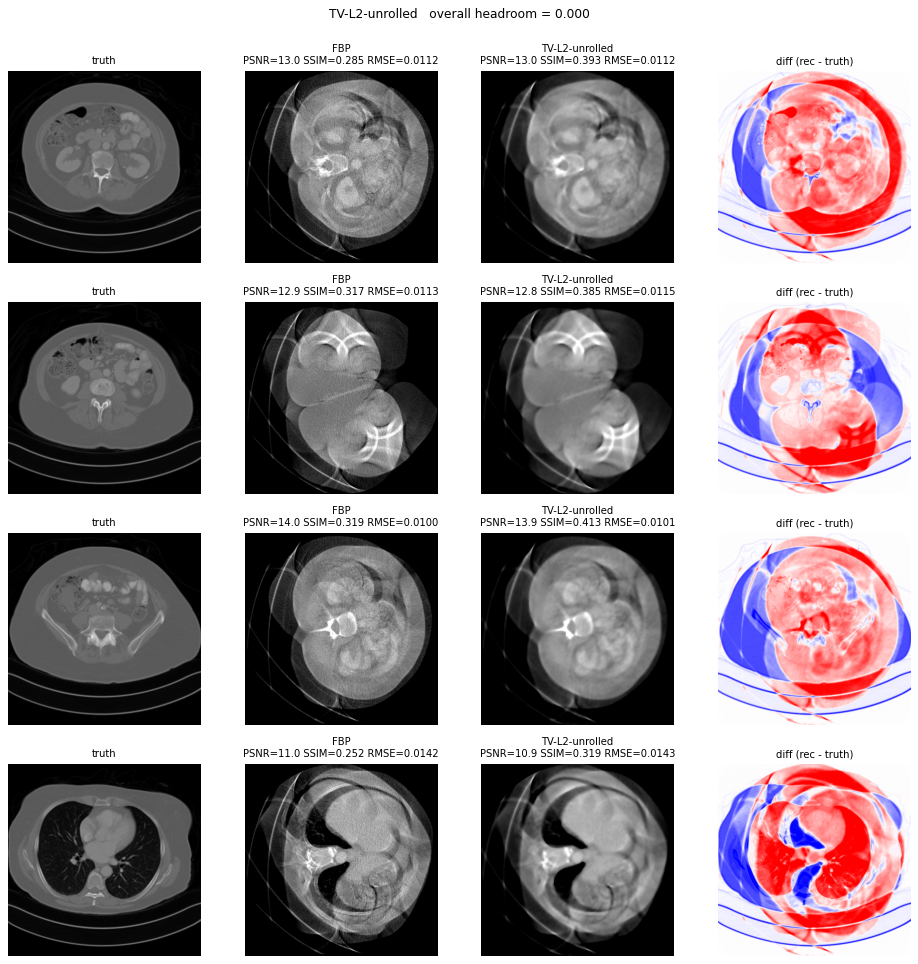](../runs/mayo-ldct-claude-agentic-tv-iter-sup-phase4-search-20260610-01/iterations/iter-0011/comparison.png) |
| 29 | wu-nontrain-phase4 | iter-2 (wu_motion_range=5, wu_motion_window=1, wu_n_bands=6, wu_n_outer=2, wu_soft_thresh=0.0015) | 0.3579 | 0.0000 | 0 | [results](../runs/mayo-ldct-claude-agentic-wu-nontrain-phase4-search-20260610-01/results.tsv) | [](../runs/mayo-ldct-claude-agentic-wu-nontrain-phase4-search-20260610-01/iterations/iter-0002/comparison.png) |
| 30 | wu-2015 | iter-2 (wu_motion_range=5, wu_motion_window=2, wu_n_bands=8, wu_n_outer=2, wu_soft_thresh=0.0015) | 0.3570 | 0.0000 | 0 | [results](../runs/mayo-ldct-claude-agentic-wu-2015-search-20260603-01/results.tsv) | [](../runs/mayo-ldct-claude-agentic-wu-2015-search-20260603-01/iterations/iter-0002/comparison.png) |
| 31 | wu-trainable-phase4 | iter-6 (epochs=20, loss_base=mse, lr=0.001, wu_motion_range=8, wu_motion_window=2, wu_n_bands=6) | 0.3514 | 0.0000 |  | [results](../runs/mayo-ldct-claude-agentic-wu-trainable-phase4-search-20260610-01/results.tsv) | [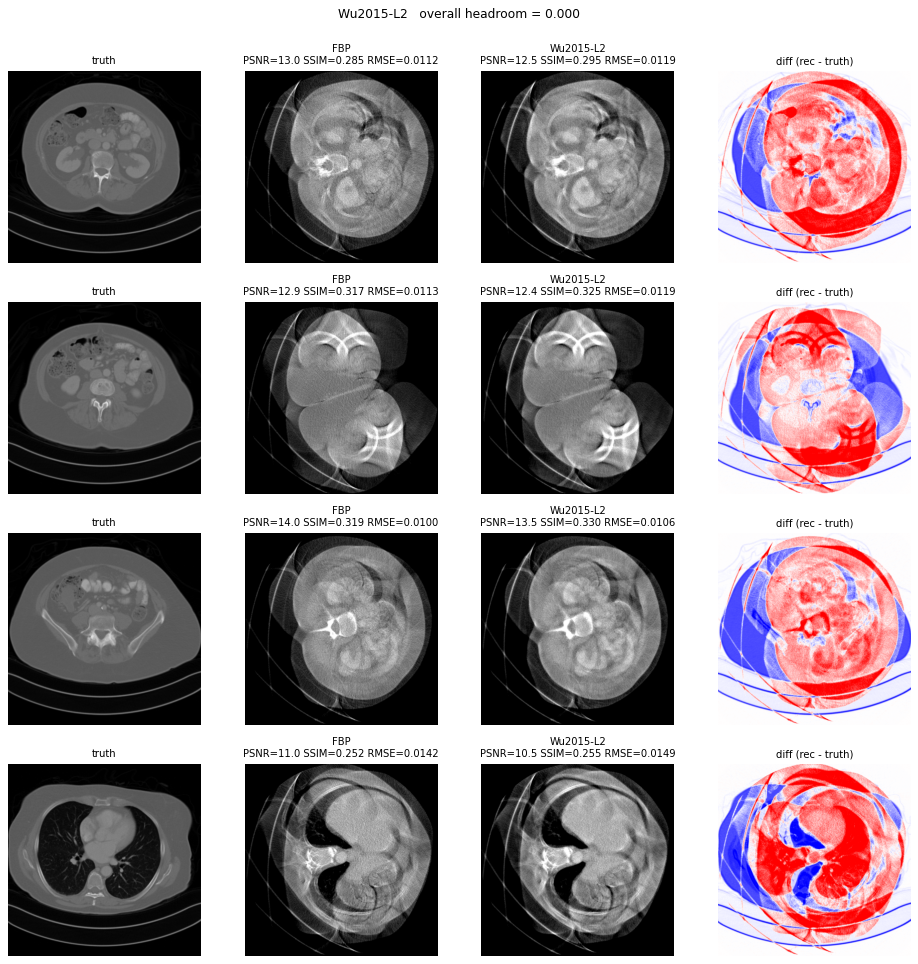](../runs/mayo-ldct-claude-agentic-wu-trainable-phase4-search-20260610-01/iterations/iter-0006/comparison.png) |
| 32 | Wu 2015 trainable | iter-2 (epochs=6, loss_base=mse, lr=0.001, wu_motion_range=5, wu_motion_window=2, wu_n_bands=4) | 0.3391 | 0.0000 |  | [results](../runs/mayo-ldct-claude-agentic-wu-2015-trainable-search-20260603-01/results.tsv) | [](../runs/mayo-ldct-claude-agentic-wu-2015-trainable-search-20260603-01/iterations/iter-0002/comparison.png) |
| 33 | tv-iterative-supervised | iter-1 (K=10, epochs=3, lambda_init=1e-05, lr=0.0005, step_init=0.0001) | 0.2985 | 0.0000 | 20 | [results](../runs/mayo-ldct-claude-agentic-tv-iterative-supervised-search-20260603-01/results.tsv) | [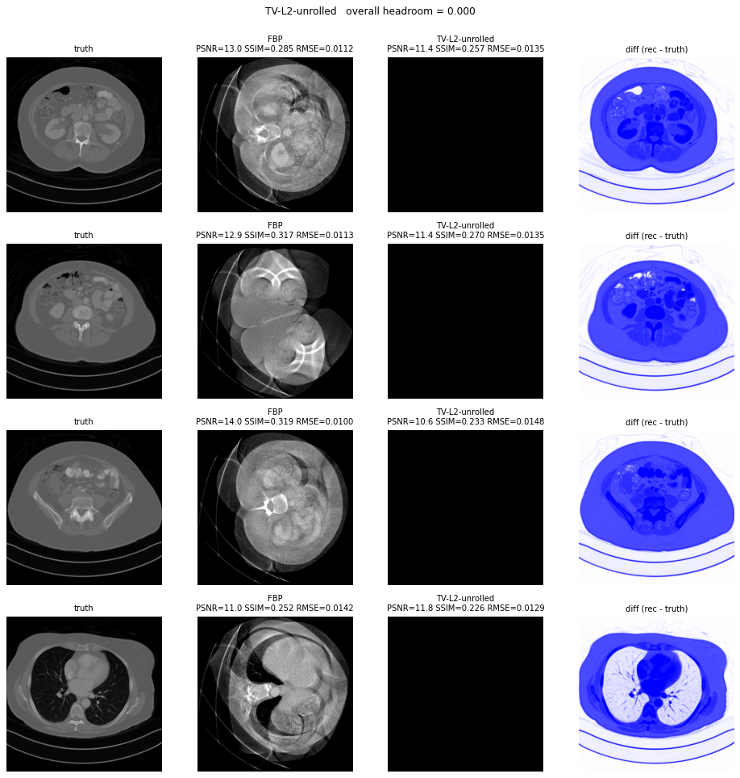](../runs/mayo-ldct-claude-agentic-tv-iterative-supervised-search-20260603-01/iterations/iter-0001/comparison.png) |
| 34 | Hammernik VN (MRI port) | iter-3 (epochs=3, lr=0.0003, vn_T=5, vn_init=fbp, vn_kernel=7, vn_lambda_init=0.005) | 0.2926 | 0.0000 | 0.006 M | [results](../runs/mayo-ldct-claude-agentic-hammernik-vn-search-20260603-01/results.tsv) | [](../runs/mayo-ldct-claude-agentic-hammernik-vn-search-20260603-01/iterations/iter-0003/comparison.png) |
| 35 | ITNet v2 | iter-2 (epochs=3, itnet_alpha_init=0.01, itnet_k=2, lr=0.0005, pretrain_epochs=2, pretrain_lr=0.0005) | 0.2684 | 0.0000 | 0.233 M | [results](../runs/mayo-ldct-claude-agentic-itnet-v2-search-20260603-01/results.tsv) | [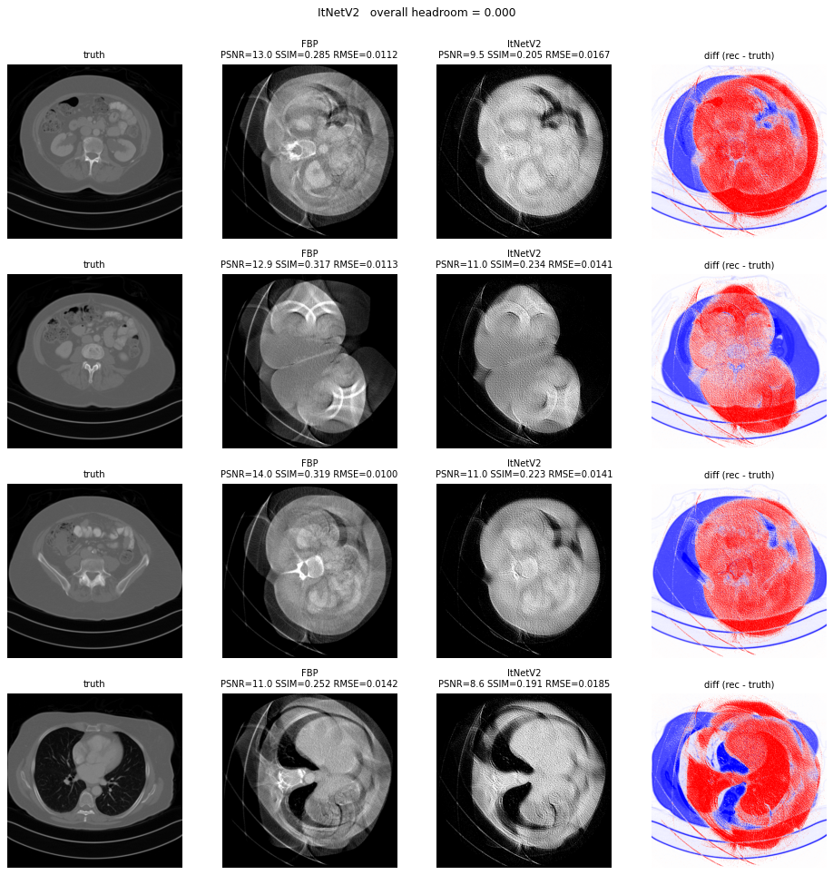](../runs/mayo-ldct-claude-agentic-itnet-v2-search-20260603-01/iterations/iter-0002/comparison.png) |
| 36 | hammernik | iter-1 (epochs=3, lr=0.0005, vn_T=3, vn_kernel=7, vn_lambda_init=0.005, vn_n_filters=16) | 0.2659 | 0.0000 | 0.004 M | [results](../runs/mayo-ldct-claude-agentic-hammernik-search-20260603-01/results.tsv) | [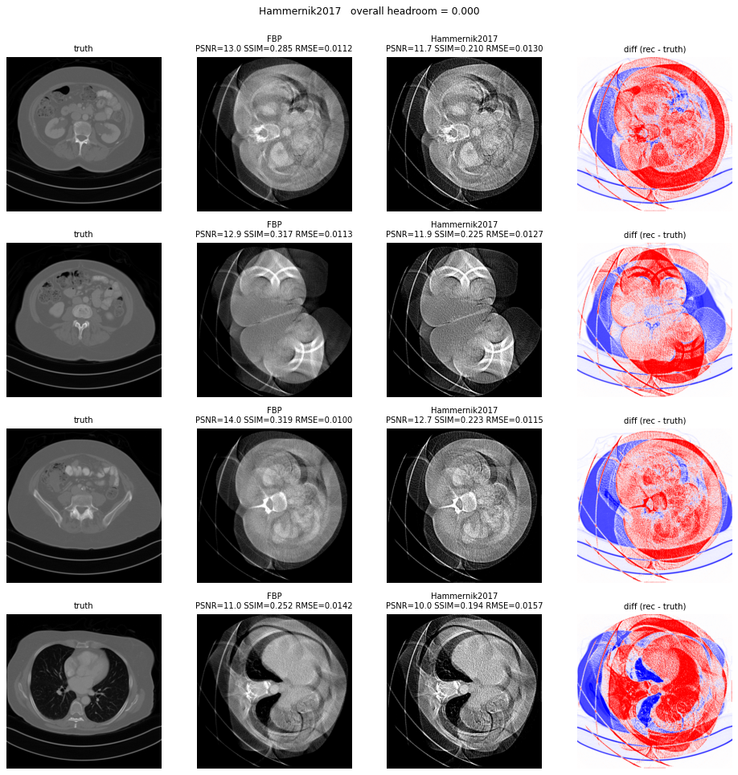](../runs/mayo-ldct-claude-agentic-hammernik-search-20260603-01/iterations/iter-0001/comparison.png) |
| 37 | ITNet v1 | iter-2 (epochs=3, itnet_alpha_init=0.01, itnet_k=2, lr=0.0005, pretrain_epochs=2, pretrain_lr=0.0005) | 0.2555 | 0.0000 | 0.233 M | [results](../runs/mayo-ldct-claude-agentic-itnet-search-20260603-01/results.tsv) | [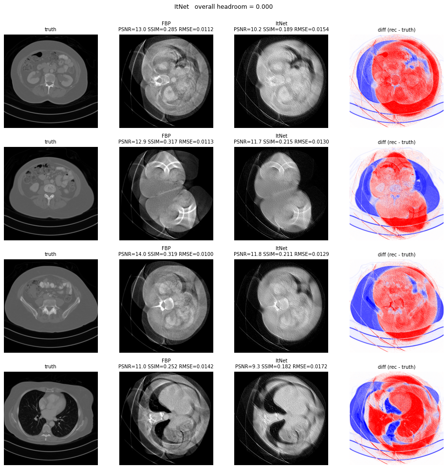](../runs/mayo-ldct-claude-agentic-itnet-search-20260603-01/iterations/iter-0002/comparison.png) |
<!-- AGENTIC_TABLE_END -->

**iter-5 in flight** (one new knob each; all capacity bumps `c→32`/`hidden→96`
regressed within the val_n=20 ±0.01 noise band, so reverted to the c=24 / I=3
optima): DD-UNet `epochs→14`, ITNet `alpha_init→0.006` (stronger TV prior),
DD-BF `img_kernel→9` (wider kernel), LPD `lr→3e-4` (train the proximals harder).
DD-UNet (~0.961) + ITNet (~0.955) appear plateaued at their config optimum.
Solvers still to onboard (per-sample ps wiring pending): Hammernik-2017/VN,
ItNet v1/v2, Wu-2015, the two N2I variants, diffusion-recon (DPS), NAF,
R²-Gaussian, RAM.
