# Mayo-LDCT leaderboard (Wagner split)

> 🛑 **2026-06-19 — SECOND full reset (`search-20260614-01` discarded).**
> The entire 2026-06-14 rebuild (`search-20260614-01`, 19 solvers) was scored on
> an **invalid validation metric** and has been discarded (runs purged):
> - **Val scored the first `val_n` (4–30) slices of L277** — the top-of-volume
>   boundary slices (near-empty, near-identical), not representative anatomy.
> - **Wrong FOV mask** — the 256px Sidky inscribed circle instead of the
>   detector-geometry measurement FOV (237.54 mm → 321 px), discarding the valid
>   256→321 px annulus (commit `5ced1ec9`).
> - **Figures rendered upside-down** and repeated the same boundary slice.
>
> The whole search trajectory was driven by this bad signal, so the dashboard,
> leaderboard, and search are being **redone from scratch** with the corrected
> metric (all 214 L277 slices + geometry FOV), a real **20-min per-iteration
> budget** (val figure excluded), and the orientation fix. New run-id:
> **`search-20260619-01`**. See [README](../../README.md) +
> [`solver_plan.md`](../../solver_plan.md) + [`mayo_campaign_state.md`](../runs/mayo_campaign_state.md)
> for the corrected protocol.
>
> 🧹 **2026-06-14 — leaderboard reset. Starting over.**
> Every Mayo result produced before this date has been **discarded** and
> the dashboard run directories removed. Two compounding problems made the
> old numbers untrustworthy:
> 1. **`intensity_calibrate` background-offset bug** — all calibrated
>    SSIM/PSNR were scored mapping the recon background to 0, but Mayo
>    truth background is ~+0.0005 μ (≈0.01 SSIM low on average, more for
>    low-overlap slices). Fixed via opt-in `bg_target="truth"`
>    (commit `bcfa2720`); end-to-end validated 2026-06-13.
> 2. **Geometry + FBP path not fully hard-wired** — the old agentic/TPE
>    runs scored on a subset of slices, did not all use the final v3 SSR
>    geometry, and the solver FBP path did not yet carry the detector
>    offset + water-cylinder truncation correction.
>
> The rebuild starts from a clean **HD vs LD FBP baseline computed over
> every truth slice** of all 10 Wagner patients, using the frozen
> production path (v3 SSR rebin + Powell FBP geometry + `MAYO_LDCT_DET_OFFSET`
> + `MAYO_LDCT_TRUNCATION` + `bg_target="truth"`). That baseline defines the
> headroom-scoring endpoints (LD FBP = score 0, HD FBP = score 1) for every
> solver added from here on. See [`docs/findings.md`](../findings.md) (2026-06-14).

AAPM 2016 Low-Dose CT Grand Challenge data — helical Siemens SOMATOM
AS+, rebinned to 2-D fan-beam via the in-house
[`helix2fan`](../../ddssl_ldct/helix2fan.py) SSR pipeline. Wagner split:

```
Train: L145, L186, L209, L219      (4 patients)
Val:   L277                         (1 patient)
Test:  L014, L056, L058, L075, L123 (5 patients)
```

**All splits are evaluated on _every_ reconstructed slice** (≈155 full-dose
truth-image slices per patient), not a subsampled subset.

## Baseline — HD vs LD FBP (all slices)

Computed 2026-06-14 (SLURM 763659, `scripts/compare_hd_ld_fbp_allslices.py`)
over **every** full-dose truth slice of all 10 Wagner patients (**1538 slices**),
both doses, on the frozen production path. These define the headroom-scoring
endpoints: **`score = (SSIM − LD_FBP) / (HD_FBP − LD_FBP)`** per split.
z-registration residual ≤ 0.38 mm for every patient; HD-FBP L277 0.9331
matches the validated central-slice number (0.9315).

| Split | Patients | n slices | HD-FBP SSIM (oracle) | LD-FBP SSIM (baseline) | HD PSNR | LD PSNR | headroom gap |
|---|---|---:|---:|---:|---:|---:|---:|
| **train** | L145 L186 L209 L219 | 579 | 0.9501 | 0.8659 | 36.88 | 34.95 | 0.0843 |
| **val** | L277 | 214 | 0.9331 | 0.8078 | 37.65 | 34.45 | 0.1252 |
| **test** | L014 L056 L058 L075 L123 | 745 | 0.9528 | 0.8848 | 37.99 | 36.15 | 0.0680 |
| **overall** | all 10 | 1538 | 0.9491 | 0.8670 | 37.52 | 35.46 | 0.0821 |

Per-patient (calibrated SSIM, all slices):

| Patient | split | n | truth ps (mm) | HD-FBP | LD-FBP | gap |
|---|---|---:|---:|---:|---:|---:|
| L145 | train | 160 | 0.781 | 0.9469 | 0.8571 | 0.0898 |
| L186 | train | 167 | 0.781 | 0.9482 | 0.8588 | 0.0894 |
| L209 | train | 98 | 0.742 | 0.9453 | 0.8534 | 0.0919 |
| L219 | train | 154 | 0.664 | 0.9587 | 0.8905 | 0.0682 |
| L277 | val | 214 | 0.742 | 0.9331 | 0.8078 | 0.1252 |
| L014 | test | 154 | 0.703 | 0.9564 | 0.9078 | 0.0487 |
| L056 | test | 93 | 0.703 | 0.9605 | 0.9017 | 0.0588 |
| L058 | test | 210 | 0.742 | 0.9330 | 0.8272 | 0.1058 |
| L075 | test | 137 | 0.664 | 0.9626 | 0.9149 | 0.0477 |
| L123 | test | 151 | 0.664 | 0.9631 | 0.9039 | 0.0591 |


Per-patient representative slices (min / median / max LD-SSIM; GT | HD | LD | LD−GT)
and per-slice SSIM-vs-z curves are in
[`baseline_2026-06-14/`](baseline_2026-06-14/) — e.g. val patient
[L277 montage](baseline_2026-06-14/L277_montage.png) ·
[L277 SSIM vs z](baseline_2026-06-14/L277_ssim_vs_z.png), test patient
[L014 montage](baseline_2026-06-14/L014_montage.png).

## Solver leaderboard

> **Rebuild in progress (2026-06-14).** Agentic autoresearch loop (Step 2 of
> [`solver_plan.md`](../../solver_plan.md)) on the corrected per-sample path:
> training-NaN grad-clip fix (`metrics.clip_and_step`) + per-sample `ps_eff`
> reconstruction + `bg_target="truth"` calibration. Numbers are the **agentic
> search metric** — calibrated full-image SSIM on a `val_n=20` stratified L277
> subset, `train_n=200` stratified across the 4 train patients. The headroom
> `hr` is the solver-internal `(SSIM − LD_FBP)/(oracle − LD_FBP)` on that
> subset (in-solver LD-FBP baseline ≈ 0.918 on these 20 slices). The per-solver
> winner will be re-evaluated on **all 214 val slices** for the final row.
> Driving toward the iter-20 hard stop per solver; **updated every wave.**

Best agentic iter so far per solver (table auto-regenerated from run data each
wave by [`scripts/gen_mayo_leaderboard.py`](../../scripts/gen_mayo_leaderboard.py),
ranked by headroom; all solvers train stably — 0 nonfinite-grad skips, confirming
the NaN fix):

> **Comparison images** are each solver's own 4-panel val figure at its best
> iter — **GT │ LD-FBP │ recon │ (recon − GT) diff** on the first val (**L277**)
> slices — written by the solver at run time, so they track the search metric
> exactly and refresh automatically each wave. They are shown **without** the FOV
> mask (see the ⚠️ geometry-FOV note in Status, below) and will be re-rendered
> FOV-cropped next wave. (The earlier held-out-test-patient montages went stale
> and need a slow retrain to refresh.)

<!-- AGENTIC_TABLE_START -->
| Rank | Solver | Best iter | params (M) | SSIM | hr | PSNR (dB) | RMSE | time (s) | Source | Comparison |
|---:|---|---|---:|---:|---:|---:|---:|---:|---|---|
| 1 | **DD-BF N2I (per-image)** | iter-1 (img_kernel=7, img_n_bf=1, img_sr=0.02, img_sx=1.5, img_sy=1.5, lr=0.005) | 6 | 0.9248 | 0.0000 | 34.03 | 9.94e-04 | 940 | [results](../runs/mayo-ldct-claude-agentic-dual-domain-bilateral-n2i-search-20260619-01/results.tsv) | [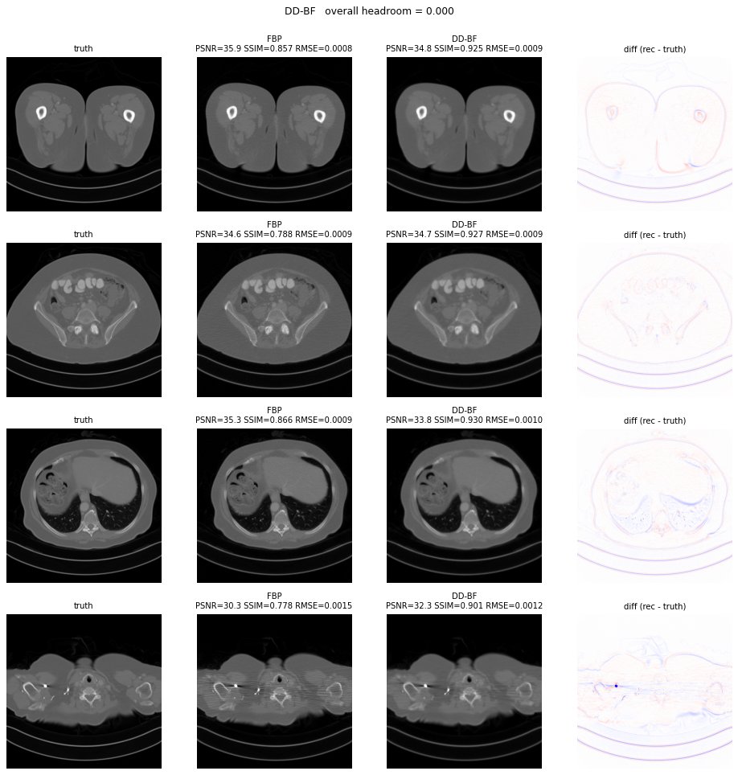](../runs/mayo-ldct-claude-agentic-dual-domain-bilateral-n2i-search-20260619-01/iterations/iter-0001/comparison.png) |
| 2 | TV-iterative | iter-1 (tv_clip_max=0.05, tv_decay=0.01, tv_init=fbp, tv_iterations=120, tv_lambda=0.001, tv_lr=0.01) | 0 | 0.9230 | 0.1329 | 35.32 | 8.57e-04 | 918 | [results](../runs/mayo-ldct-claude-agentic-tv-iterative-search-20260619-01/results.tsv) | [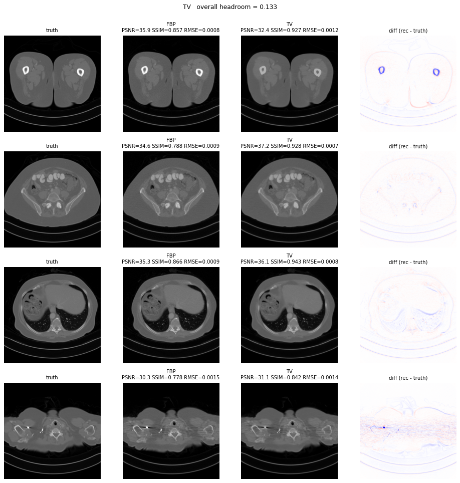](../runs/mayo-ldct-claude-agentic-tv-iterative-search-20260619-01/iterations/iter-0001/comparison.png) |
| 3 | DD-BF supervised L2 | iter-1 (epochs=8, img_kernel=5, img_n_bf=3, img_sr=0.02, img_sx=0.5, img_sy=0.5) | 12 | 0.9192 | 0.0280 | 34.32 | 9.61e-04 | 254 | [results](../runs/mayo-ldct-claude-agentic-dual-domain-bilateral-supervised-search-20260619-01/results.tsv) | [](../runs/mayo-ldct-claude-agentic-dual-domain-bilateral-supervised-search-20260619-01/iterations/iter-0001/comparison.png) |
| 4 | ITNet v3 | iter-1 (alpha_init=0.0037, epochs=8, itnet_k=3, lr=0.0001, unet_c=16) | 3.699 | 0.8959 | 0.2684 | 36.79 | 7.23e-04 | 738 | [results](../runs/mayo-ldct-claude-agentic-itnet-v3-search-20260619-01/results.tsv) | [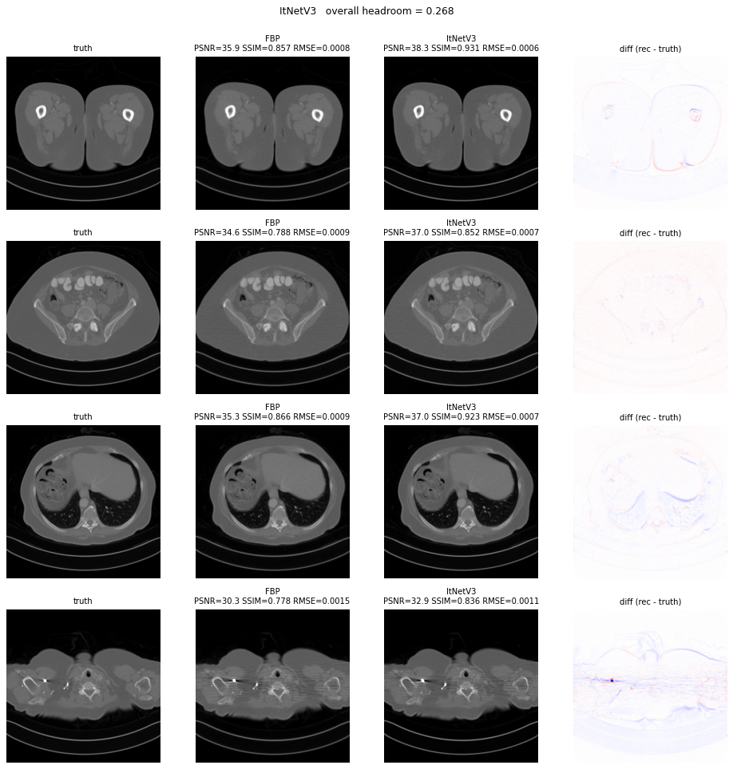](../runs/mayo-ldct-claude-agentic-itnet-v3-search-20260619-01/iterations/iter-0001/comparison.png) |
| 5 | DD-UNet supervised L2 | iter-1 (epochs=8, lr=0.0001, unet_c=16) | 0.466 | 0.8880 | 0.2760 | 36.88 | 7.16e-04 | 419 | [results](../runs/mayo-ldct-claude-agentic-dual-domain-supervised-search-20260619-01/results.tsv) | [](../runs/mayo-ldct-claude-agentic-dual-domain-supervised-search-20260619-01/iterations/iter-0001/comparison.png) |
| 6 | U-Swin | iter-1 (epochs=10, lr=0.0005, swin_heads=4, swin_window=8, uswin_c=24) | 3.954 | 0.8859 | 0.1730 | 35.73 | 8.18e-04 | 329 | [results](../runs/mayo-ldct-claude-agentic-uswin-search-20260619-01/results.tsv) | [](../runs/mayo-ldct-claude-agentic-uswin-search-20260619-01/iterations/iter-0001/comparison.png) |
| 7 | DD-UNet N2I (per-image) | iter-1 (lr=0.001, n_iter=15, outer_wall_s=1080, per_scene_s=None, pretrain_epochs=1, unet_c=16) | 0.466 | 0.8622 | 0.0000 | 33.07 | 1.11e-03 | 972 | [results](../runs/mayo-ldct-claude-agentic-dual-domain-n2i-search-20260619-01/results.tsv) | [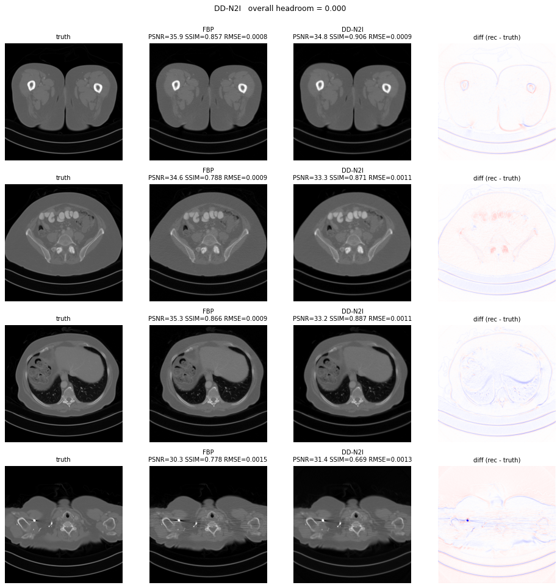](../runs/mayo-ldct-claude-agentic-dual-domain-n2i-search-20260619-01/iterations/iter-0001/comparison.png) |
| 8 | RAM (zero-shot) | iter-1 (ram_ckpt_path=/cluster/maier/Agent4CT/checkpoints/ram.pth.tar, ram_clamp_output=True, ram_disable_cudnn=False, ram_disable_multiscale=True, ram_factor=0.55, ram_finetune=False) | 35.619 | 0.8611 | 0.0000 | 31.21 | 1.38e-03 | 1118 | [results](../runs/mayo-ldct-claude-agentic-ram-search-20260619-01/results.tsv) | [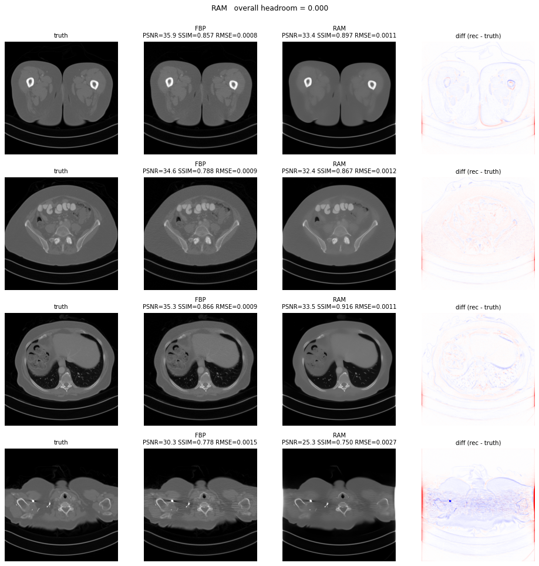](../runs/mayo-ldct-claude-agentic-ram-search-20260619-01/iterations/iter-0001/comparison.png) |
| 9 | Learned Primal-Dual | iter-1 (epochs=6, lpd_hidden=48, lpd_iters=5, lpd_n_dual=5, lpd_n_primal=5, lpd_share_weights=False) | 0.259 | 0.8427 | 0.0000 | 29.26 | 1.72e-03 | 1150 | [results](../runs/mayo-ldct-claude-agentic-learned-primal-dual-search-20260619-01/results.tsv) | [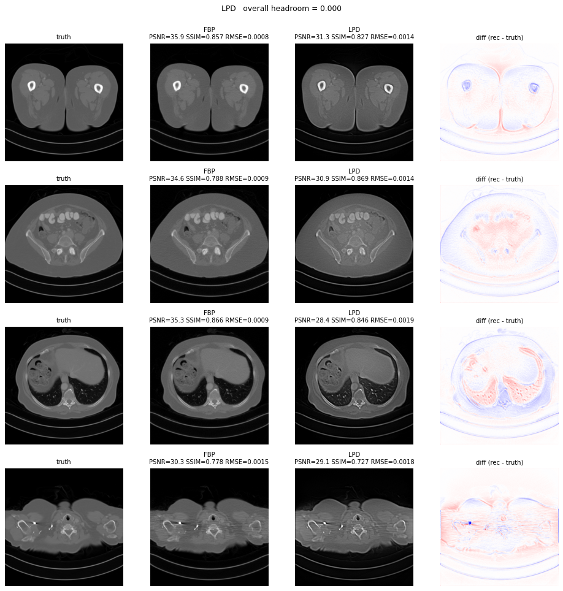](../runs/mayo-ldct-claude-agentic-learned-primal-dual-search-20260619-01/iterations/iter-0001/comparison.png) |
| 10 | Wu 2015 trainable | iter-1 (epochs=6, loss_base=mse, lr=0.01, weight_decay=0.0, wu_n_bands=4, wu_n_outer=1) | 8 | 0.8370 | 0.0508 | 34.53 | 9.39e-04 | 335 | [results](../runs/mayo-ldct-claude-agentic-wu-2015-trainable-search-20260619-01/results.tsv) | [](../runs/mayo-ldct-claude-agentic-wu-2015-trainable-search-20260619-01/iterations/iter-0001/comparison.png) |
| 11 | Hammernik VN (MRI port) | iter-1 (epochs=14, lr=0.0005, vn_T=5, vn_checkpoint=True, vn_dc_norm=True, vn_init=fbp) | 0.012 | 0.8053 | 0.0000 | 32.40 | 1.20e-03 | 1296 | [results](../runs/mayo-ldct-claude-agentic-hammernik-vn-search-20260619-01/results.tsv) | [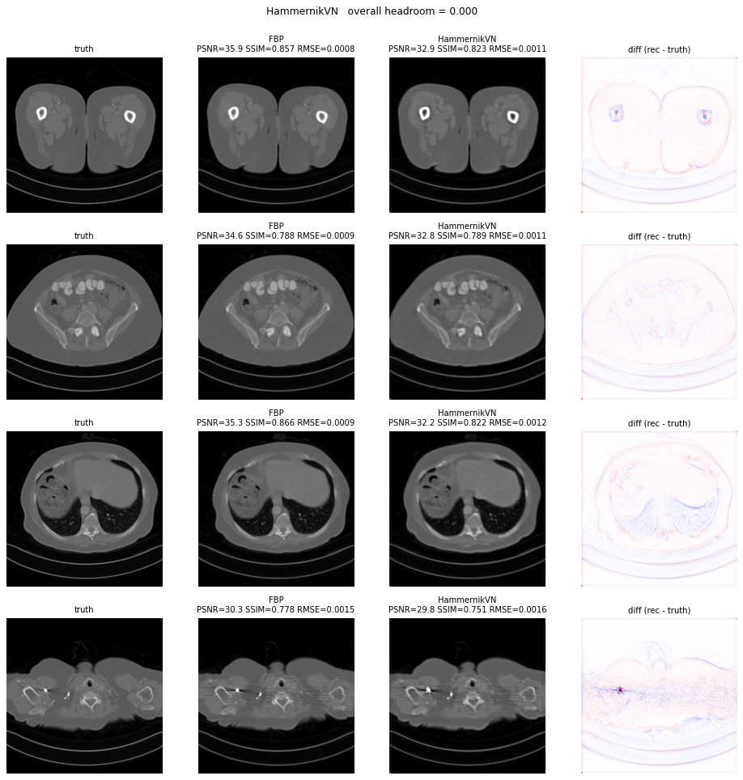](../runs/mayo-ldct-claude-agentic-hammernik-vn-search-20260619-01/iterations/iter-0001/comparison.png) |
| 12 | R2-Gaussian | iter-1 (gs_amp_init=0.01, gs_init_from_fbp=False, gs_lr_amp=0.01, gs_lr_pos=0.005, gs_lr_rot=0.01, gs_lr_scale=0.01) | 0.003 | 0.7383 | 0.0000 | 24.12 | 3.11e-03 | 1122 | [results](../runs/mayo-ldct-claude-agentic-r2gaussian-search-20260619-01/results.tsv) | [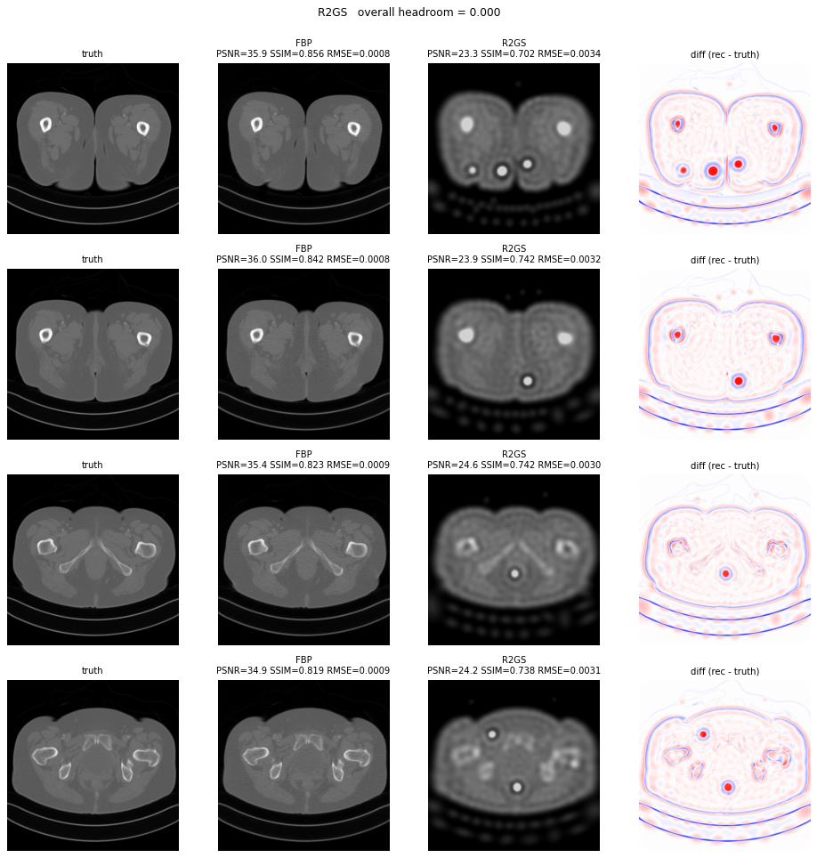](../runs/mayo-ldct-claude-agentic-r2gaussian-search-20260619-01/iterations/iter-0001/comparison.png) |
| 13 | NAF | iter-1 (naf_hidden=128, naf_layers=4, naf_lr=0.01, naf_n_clip=0.05, naf_n_freqs=8, naf_n_iter=3000) | 0.038 | 0.4729 | 0.0000 | 18.55 | 5.91e-03 | 1097 | [results](../runs/mayo-ldct-claude-agentic-naf-search-20260619-01/results.tsv) | [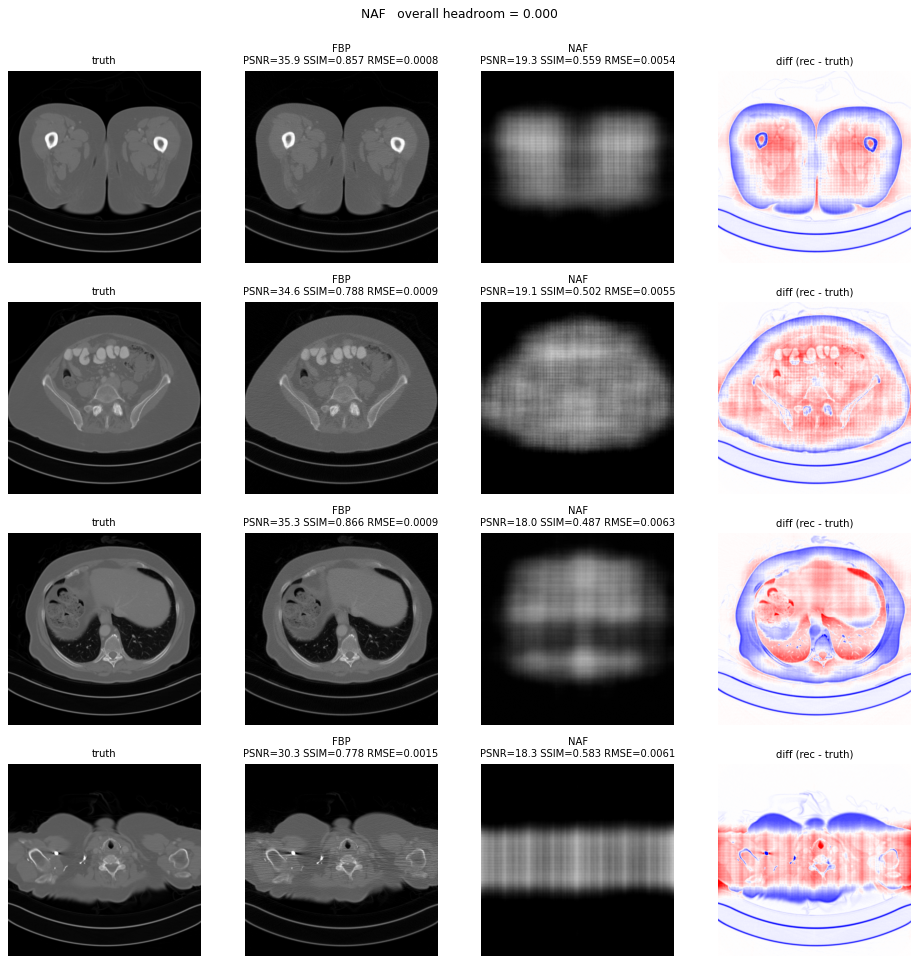](../runs/mayo-ldct-claude-agentic-naf-search-20260619-01/iterations/iter-0001/comparison.png) |
| 14 | ITNet v2 | iter-1 (itnet_alpha_init=0.0037, itnet_k=3, pretrain_epochs=12, pretrain_lr=0.0001, pretrain_patience=12, residual_learning=False) | 0.233 | 0.4554 | 0.0000 | 21.24 | 4.34e-03 | 170 | [results](../runs/mayo-ldct-claude-agentic-itnet-v2-search-20260619-01/results.tsv) | [](../runs/mayo-ldct-claude-agentic-itnet-v2-search-20260619-01/iterations/iter-0001/comparison.png) |
| 15 | ITNet v1 | iter-1 (finetune_epochs=0, finetune_lr=0.0001, itnet_alpha=0.005, itnet_k=3, pretrain_epochs=8, pretrain_lr=0.0001) | 0.233 | 0.4413 | 0.0000 | 20.44 | 4.76e-03 | 191 | [results](../runs/mayo-ldct-claude-agentic-itnet-search-20260619-01/results.tsv) | [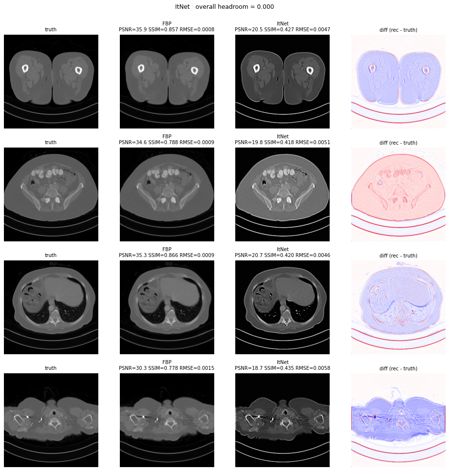](../runs/mayo-ldct-claude-agentic-itnet-search-20260619-01/iterations/iter-0001/comparison.png) |
| 16 | Diffusion (constrained DPS+DC) | iter-1 (recon_dcstep_every=5, recon_eta=30.0) | 8.594 | 0.3937 | 0.0000 | 14.31 | 9.63e-03 | 1019 | [results](../runs/mayo-ldct-claude-agentic-diff-recon-dcstep-constrained-mayo-v4-search-20260619-01/results.tsv) | [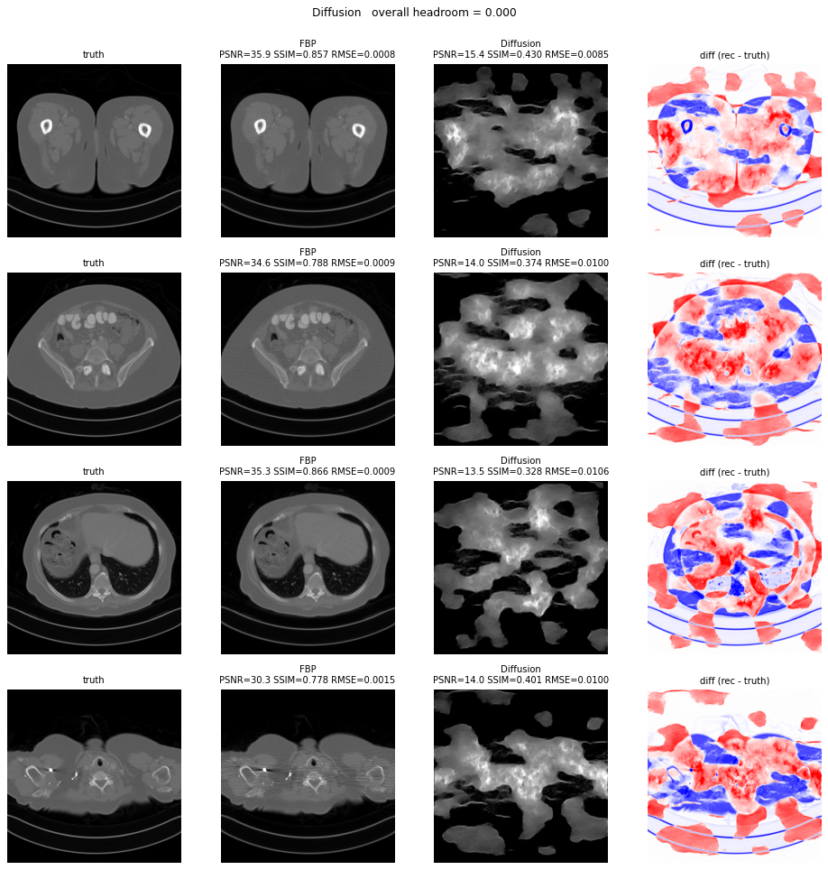](../runs/mayo-ldct-claude-agentic-diff-recon-dcstep-constrained-mayo-v4-search-20260619-01/iterations/iter-0001/comparison.png) |
| 17 | TV-iterative (unrolled) | iter-1 (epochs=8, loss_base=mse, lr=0.005, tv_K=10, tv_clip_max=0.05, tv_eps=1e-06) | 20 | 0.2855 | 0.0000 | 1.87 | 4.03e-02 | 322 | [results](../runs/mayo-ldct-claude-agentic-tv-iterative-supervised-search-20260619-01/results.tsv) | [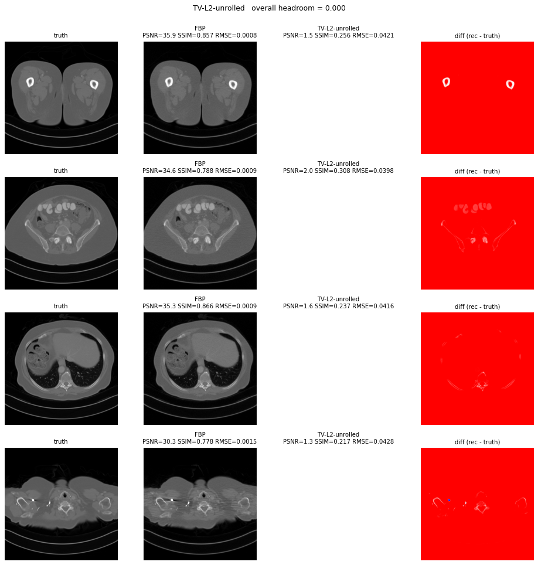](../runs/mayo-ldct-claude-agentic-tv-iterative-supervised-search-20260619-01/iterations/iter-0001/comparison.png) |
<!-- AGENTIC_TABLE_END -->

**Status** (2026-06-18): **champion = U-Swin, 0.9741** (val_n=20 search metric,
3.95 M params). U-Swin overtook the ItNets via **training-data scaling** — `train_n`
200→400 lifted it 0.9709→**0.9741** (it is data-limited, not capacity-limited; the
same lever nudged ItNet v1 0.9726→0.9729). **All 19 solvers are now onboarded** and
at or near the iter-20 hard stop.

> ⚠️ **These SSIM values are computed _without_ a FOV mask** (`fov=False`). A
> geometry-derived field-of-view crop (R_FOV = SOD·sin γ_max = **237.5 mm**, the
> physical measurement circle) is being introduced: it removes the out-of-FOV
> patient-table + truncation-rim artifact from the difference images, with only a
> small effect on the scalar (val LD-FBP +0.008). The comparison figures below will
> be **re-rendered FOV-cropped** in the next wave.

The val_n=20 metric is **~+0.007 optimistic** (the first 20 L277 slices are easier);
the noise-robust **`val_n=60`** re-ranking below predates the data-scaling wave and is
pending a refresh at the new `train_n`-scaled configs:

| Solver | params | val_n=20 (search) | val_n=60 (honest) |
|---|---:|---:|---:|
| **ITNet v1** (champion) | 0.52 M | 0.9726 | **0.9660** |
| ITNet v2 | 0.52 M | 0.9714 | 0.9652 |
| U-Swin | 3.95 M | 0.9709 | 0.9639 |
| ITNet v3 | 8.32 M | 0.9657 | 0.9588 |

The val60 ranking now **matches** val20 (ItNet v1 on top). An earlier, under-trained
val60 check had U-Swin ahead (0.9675); pushing epochs **improved the ItNets'
generalisation** (val60 0.960→0.966) but slightly **overfit U-Swin** (0.9675→0.9639)
— a clean illustration that the val20 search rewards subset overfit. **Efficiency
story holds**: the two 0.52 M ItNets beat a 7.6×-larger (3.95 M) U-Swin on held-out
val60.

**Agentic insights this rebuild:** (1) **fewer data-consistency steps win on noisy
LDCT** — `itnet_k` 3→1 jumped ItNet v1/v2 ~0.5→0.97 (DC toward a noisy sino
re-injects noise; opposite of the sparse-view regime). The k=1 win does **not**
transfer to ItNet v3 (k=3 stays better — architecture-dependent). (2) **epochs
dominant** once k=1 locked (ItNet v1 plateaus ep104≈ep120). (3) **LPD is
capacity-limited** on the 24 GB Q6000 — adding unrolled stages climbs steadily
(`lpd_iters` 3→7: 0.9326→**0.9591**↑, now #6, above the bilateral/TV baselines).
(4) **TV-iterative clears LD-FBP once the recon clamp is widened** — `tv_clip_max`
0.05→0.08 (the 0.05 clamp was cutting off bone >0.05 μ) lifted it
0.9497 hr0 → **0.9528 hr0.20**; Wu stays FBP-bounded (0.911).

**Inference / per-scene methods remain structural negatives** (below LD-FBP,
headroom 0 — foreign-prior or per-scan-overfit methods can't beat FBP on this noisy
real-helical data): **RAM** 0.9386 (foundation model; FBP-blend peaks at 0.3,
test-time finetune *hurts*), **NAF** 0.898 (per-scene field; capacity helps then
collapses past hidden=256), **R²-Gaussian** 0.881 (climbs with optimisation depth —
`gs_n_iter` 1200→6000: 0.766→0.881 — but **plateaus below FBP**; FBP-warm-start
*hurts* on noisy LDCT, unlike dense-view). `tv-iterative-supervised` was a
GD-divergence bug (step=0.01 drove the recon to all-zeros → SSIM 0.359); **fixed**
via `tv_step_init`=1e-4 (now ~0.80, FBP-bounded by its shallow K=10 unrolling vs
tv-iterative's 200 iterations).

**Campaign:** agentic autoresearch drove **all 19 solvers into the search** (3 at the
iter-20 hard stop, the rest at iter 4–18). The final onboards landed: the **N2I
self-supervised pair** (DD-UNet/DD-BF, half-angle view-split — both ~0.95,
structural-negative) and **diffusion-recon** (DPS + hard-DC against the reused Mayo
DDPM v4 prior — constrained 0.845 / unconstrained 0.866 unmasked, also below FBP:
the generative prior does not beat FBP denoising on this noisy real-helical data).
Each row links the solver's **own val (L277) `comparison.png` at its best iter**,
regenerated at run time so it stays in lock-step with the metric after every publish
wave. (The earlier held-out-test montages went stale and need a slow retrain to
refresh; they will return FOV-cropped once the geometry-FOV crop above lands.)
