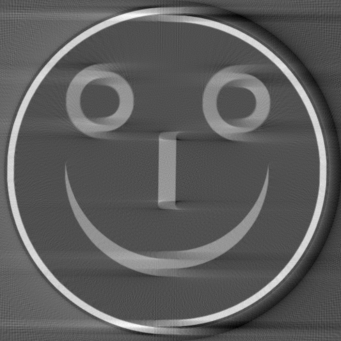
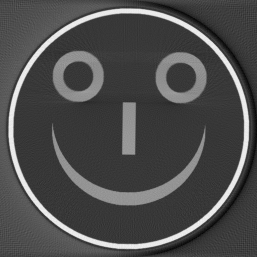
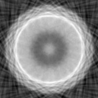
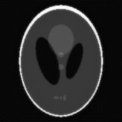
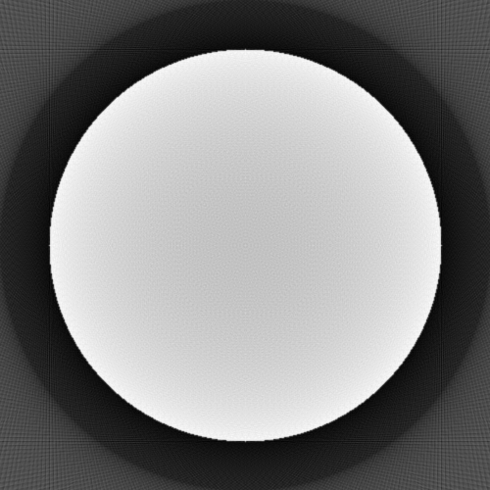
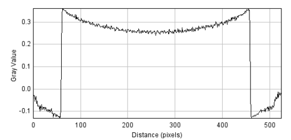
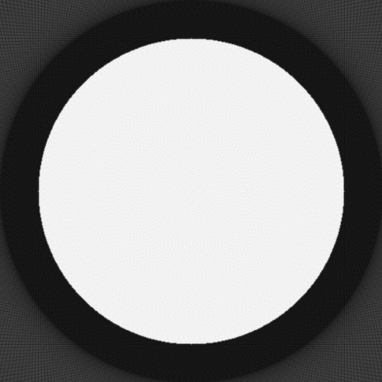
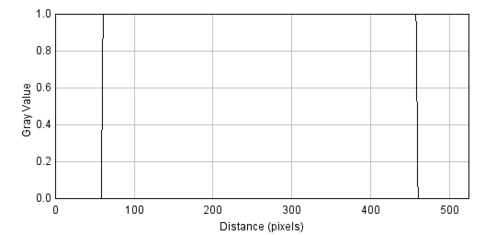
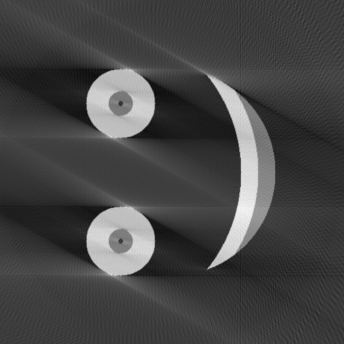

# CONRAD Artifact Gallery

Mirrored from <https://www5.cs.fau.de/conrad/tutorials/artifact-gallery/index.html> for offline reference.
Images live under [`artifact_gallery_images/`](artifact_gallery_images).

The gallery shows characteristic CT-reconstruction artefacts — how they look in the final image and what causes them. Useful sanity-checks when debugging a fan-beam pipeline.

## Overview

_Source: <https://www5.cs.fau.de/conrad/tutorials/artifact-gallery/index.html>_

# Artifact Gallery

Here we show some very common artifacts and explain how these artifacts are created. This list is not complete but may be interesting if you encounter a specific artifact. The description might help to find the problem in your reconstruction.  Please select one of the artifacts on the left.

## Detector Shift

_Source: <https://www5.cs.fau.de/conrad/tutorials/artifact-gallery/detector-shift/index.html>_

# Detector Shift

### The reconstructed image with artifacts

The reconstruction with artifacts|   
---  
  
What you can observe from this image:

  * It looks smeared in one direction in general (x-direction in the 

example).

  * Lines which should be aligned overlap or are not connected 

correctly.

  * The image gets blurrier the closer you get to these 

artifacts.

  * Bright parts look like they got kind of a shadow.

### Explanation for the artifacts

For the calculation of the fan angle _γ_ the distance _s_ to the central beam has to be shifted to the left by half of the maximal distance _s max_. To get the position on the detector from _γ_ , the detector value _t_ then has to be shifted back to the right by half of the detector size _t max_. If either of these shifts is performed by a wrong value the mentioned artifacts occur. 

A likely mistake would be to shift _s_ and _t_ by the same value, e.g. ½ · _s max_. 

### The correct reconstruction

The shift-corrected reconstruction  
---  
  
### Authors

Anja Pohan, Stefan Nottrott

## Flower Artifact

_Source: <https://www5.cs.fau.de/conrad/tutorials/artifact-gallery/flower-artifact/index.html>_

# Flower Artifact

The flower artifact|   
---  
  
This artifact can be observed when using the algebraic resoconstruction technique.  
It does not show the correct reconstructed phantom but rather a shaded circle that becomes edgy with increasing iteration. Its appearance reminds of a flower.

### Explanation for the artifact

The original phantom  
---  
  
The recostruction after 50 iterations  
---  
  
The ART algorithm iterates the sinogram with specific angles. If the angle increases too much in each iteration the geometry does not hold and instead of the correctly reconstructed image we get these flowers. This occurs for example when the angle is not correctly converted from degrees to radians. After correction, the phantom is correctly reconstructed as shown on the right.

### Authors

Anja Jäger, Tilmann Hübner, Karoline Kallis, Hamidreza Moghada, Yixing Huang, Andreas Maier

## Filter Discretization

_Source: <https://www5.cs.fau.de/conrad/tutorials/artifact-gallery/filter-discretization/index.html>_

# Filter Discretization

### Artifact Image

Reconstructed image with artifact|   
---  
  
The picture should show a homogenous disc, but there is a cupping artifact.

### Line Plot

Line plot of the cupping artifact  
---  
  
A line plot reveals the artifact in more detail. The intensities in the center of the image are artificially reduced.

### Explanation

The problem of discretization is not too often described in literature. But when implementing the filtering step this has to be handled correctly. 

Implementing only the ramp filter as absolute value in Fourier domain will lead the above described artifact. 

If the discretization is handled correctly, e.g. by using the Ram-Lak-Filter, the artifact disappears.

### Correct Reconstruction

Correct reconstruction using Ram-Lak Filter  
---  
  
Line plot of the correct reconstruction without cupping  
---  
  
### Authors

Magdalena Herbst, Salah Saleh, Michael Dorner

## Limited Angle

_Source: <https://www5.cs.fau.de/conrad/tutorials/artifact-gallery/limited-angle/index.html>_

# Limited Angle

### Artifact Image

Reconstructed image with missing angles of the last 30°|   
---  
  
This is the typical artifact appearing when the angular range is insufficient. In this case 30° are missing. Streaks with a predominant direction emerge.

Reconstructed image with full angular range  
---  
  
If a sufficient angular range is scanned, a correct reconstruction is obtained.

### Authors

Magdalena Herbst, Salah Saleh, Michael Dorner
