# CONRAD API Tutorials

Mirrored from <https://www5.cs.fau.de/conrad/tutorials/api-tutorials/index.html> for offline reference.
Images live under [`conrad_api_tutorials_images/`](conrad_api_tutorials_images).

> **Python wrapper available.** Most of the Java API documented below can be
> driven from Python via **pyCONRAD**:
> <https://git5.cs.fau.de/PyConrad/pyCONRAD>. If you only need to *call* CONRAD
> (geometry helpers, projectors, phantoms, file IO) from Python, start there
> — these tutorials are still the canonical reference for the underlying
> Java API but you do not need to write Java to use it.

CONRAD is a Java open-source CT software framework from the Pattern Recognition Lab (Erlangen) / Stanford Radiology, developed by C. Schaller, A. Maier, R. Fahrig et al. The tutorials below are useful references when porting geometry / projector conventions between CONRAD and PYRO-NN.

## Overview

_Source: <https://www5.cs.fau.de/conrad/tutorials/api-tutorials/index.html>_

# API Tutorials

In the following pages, you will find tutorials on how to use the API. We presently have basic tutorials on how to read data and display ist. The reconstruction tutorials describe how to perform simple reconstructions and reconstruction related tasks using the API. Furthermore, we have a couple of advanced tutorials that explain physical modeling in CONRAD, MATLAB integration and further topics.

## Basic Tutorials

_Source: <https://www5.cs.fau.de/conrad/tutorials/api-tutorials/basic-tutorials/index.html>_

# Basic Tutorials

In this category, you find basic tutorials on how to use CONRAD, like

  * how to read image data from disk
  * how to read custom file formats such as MHD
  * how to visualize 3D points

### Basic Tutorials → Grid Data Container

_Source: <https://www5.cs.fau.de/conrad/tutorials/api-tutorials/basic-tutorials/grid-data-container/index.html>_

# Grid Data Container

CONRAD's principle data container is called "Grid". It is used to store any rasterized 1D, 2D, or 3D data. Also it is also possible to store multi-dimensional data such as multi-material images which will be described towards the end of this tutorial.

### Abstract Grid

The class Grid itself is abstract and is designed for n-dimensional data. It stores the size, the spacing of the voxels, and the world position of voxel (0,0,...,0) as origin. Furthermore, all Grids have PointwiseIterators that allow sequential access to all elements of the Grid as the memory format of different n-dimensional data might differ. Note that we used the ... notation to implement variable argument length functions instead of arrays.    
The Grid's basic operations are:

  * getNumberOfElements()
  * getOrigin()
  * getSize()
  * getSpacing()
  * show()
  * setOrigin(double ...)
  * setSpacing(double ...)

### Grid1D

Grid1D is the one-dimensional implementation of Grid. It uses linear memory as float[] that is accessible via the getBuffer() method. Grid1D features a copy constructor that copies the array data bit-wise from the other Grid1D. Otherwise it also has a wrapper constructor that is able to wrap an existing float[] into a Grid1D. Grid1D has an extension to complex numbers Grid1DComplex that supports Fourier transforms. Note that this will initialize spacings and size with 0 which may cause trouble in the further processing.

### Grid2D

Grid2D is the two-dimensional implementation of Grid. It also uses linear memory, i.e. float[] as underlying memory, as this is compatible with ImageJ, OpenGL, and OpenCL. It furthermore has auxiliary methods getWidth() and getHeight() that return getSize()[0] and getSize()[1] respectively. The method getSubGrid() delivers a Grid1D that can be processed as Grid1D. Internally the memory is mapped and the Grid1D operates directly on the Grid2D memory. Furthermore, Grid2D has a Complex subclass that supports 2D Fourier transform. Multi-material data can be processed by the subclass MultiChannelGrid2D which is an ArrayList of Grid2D. Internally it redirects all Grid2D functionality to the 0th channel.

### Grid3D

Grid3D is the volume implementation of Grid. It uses an ArrayList of Grid2D to represent the volume. This is directly compatible with ImageJ and Grid2D and Grid3D can be wrapped to ImageJ containers without having to copy the memory. It also interoperates with OpenCL, as memory transfers can use pointer arithmetic to remap the ArrayList to linear memory in OpenCL. As all other Grids Grid3D offers a copy constructor to copy data.

### PointwiseOperators

Simple mathematical operations like add, divide, multiply, subtract, log, etc. are found in this class. Depending on the underlying Grid, the different implementations are executed. If the grid lies in CPU memory, the operation is executed in CPU memory. If the grid lies in OpenCL memory, the operation is executed on OpenCL memory. If two grids are processed and both are in OpenCL memory, the operation is performed entirely in OpenCL.Otherwise, the data is first transferred to the CPU and the operation is executed on CPU.

### InterpolationOperators

The InterpolationOperators allow reading and writing to non-uniform grid positions, i.e. (0.5). In contrast to OpenCL Textures, the indexing is not shifted by 0.5 and (1.0) refers to an exact grid node.

### Raw Data IO

All grids can be read and written using ImageJ API. Convenience methods are found in GridRawIOUtil. Note that the file format is defined in the ImageJ Object FileInfo. Examples on how to use the methods are found in TestGridRawDataIO.java.

### Basic Tutorials → Read Image Data

_Source: <https://www5.cs.fau.de/conrad/tutorials/api-tutorials/basic-tutorials/read-image-data/index.html>_

# Read Image Data

CONRAD support to read any file type that is supported by ImageJ. Reading from hard disk is done via the ImageJ API. The ImageJ containers can then be easily wrapped to CONRAD containers. This example is found in the source tree in package edu.stanford.rsl.tutorial.basics in ReadImageDataFromFile.java

### Code Example

` public class ReadImageDataFromFile {  
  
/**  
* Main routine for this example.  
* @param args  
*/  
public static void main(String[] args) {  
try {  
// we need ImageJ in the following  
new ImageJ();  
// locate the file  
// here we only want to select files ending with ".bin". This will open them as "Dennerlein" format.  
// Any other ImageJ compatible file type is also OK.  
// new formats can be added to HandleExtraFileTypes.java  
String filenameString = FileUtil.myFileChoose(".bin", false);  
// call the ImageJ routine to open the image:  
ImagePlus imp = IJ.openImage(filenameString);  
// Convert from ImageJ to Grid3D. Note that no data is copied here.   
// The ImageJ container is only wrapped. Changes to the Grid will also affect the ImageJ ImagePlus.  
Grid3D impAsGrid = ImageUtil.wrapImagePlus(imp);  
// Display the data that was read from the file.  
impAsGrid.show("Data from file");  
} catch (Exception e) {  
// TODO Auto-generated catch block  
e.printStackTrace();  
}  
}  
}  
` 

### Basic Tutorials → Simple MHD Reader

_Source: <https://www5.cs.fau.de/conrad/tutorials/api-tutorials/basic-tutorials/simple-mhd-reader/index.html>_

# Simple MHD Reader

This is a simple tutorial on how to create a simple reader for MHD image data. We will only consider little endian unsigned short data in the following example. The code could, however, be easily adapted to other MHD image formats. The full MHD reader will be adapted as required.

### MHD File Header

View of the MHD header as opened by ImageJ| [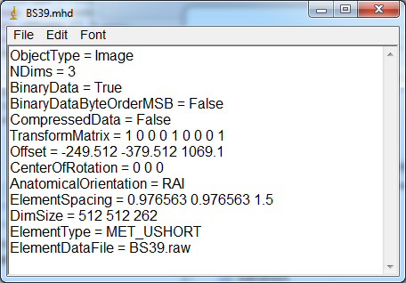](<https://www5.cs.fau.de/fileadmin/_migrated/pics/image001.png> "View of the MHD header as opened by ImageJ")  
---  
  
First, we need to read the ASCII header file that describes the raw data file contents. On the right, this header is shown as it will be opened by ImageJ via drag and drop. 

We open a buffered reader to parse the ASCII file: 

_BufferedReader br = new BufferedReader(new FileReader(MHDfilename));_  

Next, we read the first line, to initialize the String line 

_line = br.readLine();_

Now we have to go through the file row by row to find the relevant information. We sub-divide each line into variable-name and variable-value. Having done that, we save the value in a predefined variable.  

The for us relevant variables are as followed: 

  * BinaryDataByteOrderMSB  
 _String [] split = line.split(" = ");__  
if (line.contains("BinaryDataByteOrderMSB")){  
boolean value = Boolean.parseBoolean(split[1]);  
__intelByteOrder = !value;  
}_

  * Offset  
 _if (line.contains("Offset")){  
String [] split2 = split[1].split(" ");  
offsets = new double [split2.length];  
for (int i=0; i < split2.length; i++){  
offsets[i] = Double.parseDouble(split2[i]);  
}  
}  
  
_
  * ElementSpacing  
 _if (line.contains("ElementSpacing")){  
String [] split2 = split[1].split(" ");  
spacings = new double [split2.length];  
for (int i=0; i < split2.length; i++){  
spacings[i] = Double.parseDouble(split2[i]);  
}  
}_

  * DimSize  
 _if (line.contains("DimSize")){  
String [] split2 = split[1].split(" ");  
width = Integer.parseInt(split2[0]);  
height = Integer.parseInt(split2[1]);  
nImages = Integer.parseInt(split2[2]);  
}  
  
_
  * ElementType  
 _if (line.contains("ElementType")){__  
if (split[1].equals("MET_USHORT")) fileType = FileInfo.GRAY16_UNSIGNED;  
  
_
  * ElementDataFile  
 _if (line.contains("ElementDataFile")){__  
datafile = split[1];  
}_  

### Reading the Raw Data File using ImageJ API

Finally we have to use the read values to read the “.raw”-Image. This is performed using a FileInfo object from the ImageJ API: 

_FileInfo fi = new FileInfo();  
fi.width = width;  
fi.height = height;  
fi.offset = offset;  
fi.nImages = nImages;  
fi.fileType = fileType;  
fi.intelByteOrder = intelByteOrder;  
fi.fileFormat = FileInfo.RAW;  
fi.fileName = datafile;  
fi.directory = new File(MHDfilename).getParent();___

The image is then read using the following call: 

_ImagePlus img = new FileOpener(fi).open(false);_

We can convert the ImagePlus container to CONRAD API using a wrapper call: 

_Grid3D grid = ImageUtil.wrapImagePlus(img, false, true);_

This call will not create new memory, but just wrap the ImageJ container into the CONRAD API. Note that we have not considered the spacing so far. Thus it need to be set appropriately: 

_grid.setSpacing(spacings);_

### Code

The code of this example is founded in edu.stanford.rsl.tutorial.basics.

### Authors

Rimon Saffoury, Andreas Maier

### Basic Tutorials → Point Cloud Visualization

_Source: <https://www5.cs.fau.de/conrad/tutorials/api-tutorials/basic-tutorials/point-cloud-visualization/index.html>_

# Point Cloud Visualization

Here we show a simple example that parses a volumetric representation of a segmentation mask. The result is a set of points on the surface of the segmentation. In the end, this point cloud is visualized using the point cloud viewer.

### Point Generation

First we create a constructor which takes the image and saves it in a variable.  _Grid3D image;  
public PointsCloudMaker(Grid3D image) {  
this.image = image;  
}_ After having created a Constructor, we determine a method which creates a Point-Cloud from the given image.  _public ArrayList <PointND> getPoints(int id)_ The initial variable in this method is the Image size ([0]=x, [1]=y, [2]=z).  _int [] size = image.getSize();_ Then we walk over the x, y, z variables and use a mask on the i and i+1 values every single step.  for (int k=0; k <size[2]; k++){ for (int j=0; j <size[1]; j++){ for (int i=0; i <size[0]-1; i++){ float one = image.getAtIndex(i, j, k); float two = image.getAtIndex(i+1, j, k); } }}  If the variables "one" and "two" have different values we have to test on what position the point supposed to be placed (i or i+1). In the case that the point is not “null” it will be saved in the ArrayList “points”.  _if (one != two) {  
PointND point = null;  
if (one == id){  
point = new PointND(General.voxelToWorld(new int [] {i,j,k}, image.getSpacing(), image.getOrigin()));  
}  
if (two == id){  
point = new PointND(General.voxelToWorld(new int [] {i+1,j,k}, image.getSpacing(), image.getOrigin()));  
}  
if (point != null) points.add(point);  
}_ Finally we return the Point-Cloud!  _return points;_

### Visualization

Resulting Visualization| [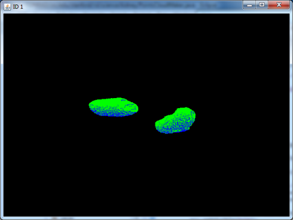](<https://www5.cs.fau.de/fileadmin/_migrated/pics/image001_01.png> "Resulting Visualization")  
---  
  
In the main method the "getPoints" method for the left (value 1) and right (value 2) kidney has to be invoked. Afterwards the two Point-Clouds will be displayed in one Image. 

_PointsCloudMaker ptsMaker = new PointsCloudMaker(image);  
ArrayList<PointND> id1 = ptsMaker.getPoints(1);  
ArrayList<PointND> id2 = ptsMaker.getPoints(2);  
id2.addAll(id1);  
PointCloudViewer pcv = new PointCloudViewer("ID 1", id2);  
pcv.setVisible(true);_

### Code

The code of this example is founded in edu.stanford.rsl.tutorial.basics.

### Authors

Rimon Saffoury, Andreas Maier

### Basic Tutorials → OpenCL Introduction

_Source: <https://www5.cs.fau.de/conrad/tutorials/api-tutorials/basic-tutorials/opencl-introduction/index.html>_

# OpenCL Introduction

CONRAD offers Grid classes to handle 1D, 2D, and 3D image data. In order to speed computation up, there are also variants of Grid1D, Grid2D, and Grid3D that are compatible with OpenCL. These OpenCL grids can be used in the same way as the normal grids. If they are used in operations with other OpenCL grids, all computations are done entirely on the OpenCL device. If they are mixed with CPU grids, the data is automatically transferred from the device to the host memory. Thus, the user does not have to think about memory transfers. One drawback of this method is, that the memory has always to exist on the host and on the OpenCL device. One advantage is that the code can be executed on the OpenCL device easily. In fact, the CPU code is exactly the same as the OpenCL code. Only the underlying container is replaced. Thus, OpenCL grids are comfortable, but come at a slight overhead.  Here we show some examples about how OpenCL grids are operated, indicate advantages and disadavantages, and give intructions on how to use these containers efficiently. For further details also consult the [OpenCL Design Considerations](<../../advanced/opencl-considerations/index.html> "Opens internal link in current window").

### OpenCL Grids

This part is a simple example about OpenCL grids and we demonstrate that using OpenCl grids can improve the computation speed.  First, we need to define the OpenCL Context and choose an OpenCL Device. The CLContext is used to manage objects, memory transfers, and kernel executions.  _CLContext context = OpenCLUtil.getStaticContext();_ Note that we use a CONRAD method from the OpenCLUtil here. It will create a static reference to the current OpenCL context. If this is called for the first time, a dialogue box will appear that will query the user for the OpenCL device to use. This device is then stored in CONRAD's registry for later use. If you want to reset this, you can use the ReconstructionPipelineFrame that is introduced in the [Installation Tutorial](<../../../user-guide/installation/index.html> "Opens internal link in current window"). Go to Configuration / Registry to remove the OpenCL device entry.  Then, we select the OpenCL device with the best peak performance:  _CLDevice device = context.getMaxFlopsDevice();_ Next, we create a 2000*2000 Shepp Logan phantom on CPU:  _Phantom shepp = new SheppLogan(2000);_ Transfer to the OpenCL device is handled by the corresponding OpenCL grid container. It automatically copies the phantom data from CPU to OpenCL memory.  _OpenCLGrid2D sheppCL = new OpenCLGrid2D(shepp, context, device);_ Now we double the phantom data for _number_ times on CPU:  _for (int i = 0; i < number; i++){  
PointwiseOperators.addBy(shepp, shepp);  
}_ The corresponding OpenCL code is identical, but using the OpenCL grid:  _for (int i = 0; i < number; i++){  
PointwiseOperators.addBy(sheppCL, sheppCL);  
}_ After that we compare the time costs on CPU and OpenCL device. We can use the following function to calculate the time cost:  _long starttime= System.nanoTime();_ _//Codes..._ _long endtime= System.nanoTime();_ _long timecost= endtime - statrttime;_ In the case of 10 iterations, the computation time on CPU is 192.899 ms and the time cost on OpenCL is only 25.916 ms, which indicates that parallel computation with OpenCL on GPU is much faster. Here, we achieve a speed up factor of 7.4. For the experiment, we used an Nvidia GTX 480.

### Code

The code of this example is founded in [src.FlatPanelProject.SimpleCLGridExample.java](<http://src.flatpanelproject.simpl/>)

###  OpenCL Texture Memory

Fig 1: Time Cost For Different Methods| [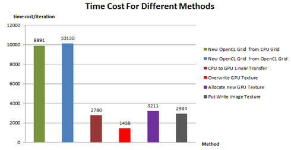](<https://www5.cs.fau.de/fileadmin/_migrated/pics/timecost.jpg> "Fig 1: Time Cost For Different Methods")  
---  
  
Fig 2: Time Cost Per Iteration For "Overwrite GPU Texture"[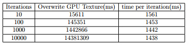](<https://www5.cs.fau.de/fileadmin/_migrated/pics/overwriteresults.jpg> "Fig 2: Time Cost Per Iteration For ")  
---  
  
In this example, we compare different methods for memory copy. Again, we create a 2000*2000 Shepp Logan phantom on CPU. Then we use different methods to copy the phantom data into GPU memory. 

Method 1: We make a new OpenCL grid from a CPU grid and iterate for _number_ iterations. 

_for (int i = 0; i < number; i++){  
OpenCLGrid2D grid = new OpenCLGrid2D(shepp, context, device);  
grid.getDelegate().release();} _

Method 2: We make a new OpenCL grid from a previously existing OpenCL grid and iterate for the same _number_. 

_for (int i = 0; i < number; i++){  
OpenCLGrid2D grid = sheppCL.clone();  
grid.getDelegate().release();}_

Method 3: For every iteration, we copy the phantom data from CPU memory to OpenCL memory using a linear buffer. 

_for (int i = 0; i < number; i++){  
queue.putWriteBuffer(sheppCL.getDelegate().getCLBuffer(), true);}_

Method 4: First, allocate an OpenCL texture (called image in OpenCL language) and then overwrite the texture memory for _number_ iterations. Note that the code below uses only buffers allocated in the OpenCL memory. We just copy data from OpenCL linear memory to the same OpenCL device into the texture memory. 

_CLImage2d <FloatBuffer> image = context.createImage2d(sheppCL.getDelegate().getCLBuffer().getBuffer(), sheppCL.getSize()[0], sheppCL.getSize()[1], format);  
  
for (int i = 0; i < number; i++){  
queue.putCopyBufferToImage(sheppCL.getDelegate().getCLBuffer(), image).finish();  
}  
image.release();_

Method 5: For every iteration, we allocate a new texture on the OpenCL device and copy the image data from CPU memory to OpenCL texture memory: 

_for (int i = 0; i < number; i++){  
CLImage2d<FloatBuffer> image2 = context.createImage2d(sheppCL.getDelegate().getCLBuffer().getBuffer(), sheppCL.getSize()[0], sheppCL.getSize()[1], format);  
queue.putWriteImage(image2, true);  
queue.finish();  
image2.release();  
}_

Method 6:First, we allocate the OpenCL texture memory for the image data and then for every iteration we only write the image data into the OpenCL texture memory. This means we copy for every iteration data from CPU to the OpenCL device but don't need to reallocate OpenCL texture memory. 

_CLImage2d <FloatBuffer> image2 = context.createImage2d(sheppCL.getDelegate().getCLBuffer().getBuffer(), sheppCL.getSize()[0], sheppCL.getSize()[1], format);  
  
for (int i = 0; i < number; i++){  
queue.putWriteImage(image2, true);  
queue.finish();  
}  
image2.release();_

Comparing the results for different methods displayed in Figure 1, we can observe that:

  1. Overwriting OpenCL texture (Method 4) performs best as it is just copying inside the GPU texture memory. No memory from the host has to be accessed.
  2. Method 3, Method 5, and Method 6 have almost the same time cost. Comparing Method 3 and Method 6, we can see copying data into the OpenCL linear memory is a little faster than texture memory. And Method 5 is faster than Method 6 because it doesn't need to reallocate OpenCL texture memory. There is, however, only a small difference.
  3. Making a new OpenCL grid from a CPU grid (Method 1) or from an OpenCL grid (Method 2) is quite time consuming. Note that these two Methods operate both on CPU and OpenCL, and need to allocate and initialize memory on CPU and OpenCL plus data transfers. 
  4. For each method, with an increase in the iteration number, the time cost per iteration is decreasing slightly and converges to a constant. In order to avoid random time measurement results, a large number of iterations is necessary. Here, we chose 10,000 repeatitions (cf. Figure 2).

### Conclusion

OpenCL grids are useful and convenient. However, one has to keep in mind that the creation of new OpenCL grids also involves operations on the host computer. Thus, one should omit calling "new" too often in this context. Reusing memory is much faster in this context.

### Code

The code of this example is founded in src.FlatPanelProject.TestofTextureCopy.java

### Authors

Anja Jäger, Tilmann Hübner, Karoline Kallis, Hamidreza Moghadas, Yixing Huang, Andreas Maier

### Basic Tutorials → Rotate a 2D image

_Source: <https://www5.cs.fau.de/conrad/tutorials/api-tutorials/basic-tutorials/rotate-a-2d-image/index.html>_

# Rotate a 2D image

Here is a simple example to show how to rotate a 2D image. import edu.stanford.rsl.conrad.geometry.Rotations; import edu.stanford.rsl.conrad.geometry.transforms.ScaleRotate; import edu.stanford.rsl.conrad.numerics.SimpleMatrix; int imgSize=512; //Create a phantom Phantom phan = new SheppLogan(imgSize, false); //reset the origin for the image as the rotation axis phan.setOrigin(-imgSize/2, -imgSize/2); //the angle to rotate, in radians unit float angle=0.1745f; //create the rotation matrix in 3D form SimpleMatrix rotation = Rotations.createBasicZRotationMatrix(angle); //in 2D case we only need 2 by 2 submatrix ScaleRotate rot = new ScaleRotate(rotation.getSubMatrix(2, 2)); //Apply the rotation transform phan.applyTransform(rot); //Set the origin back phan.setOrigin(imgSize/2, imgSize/2);

## Basic Tutorials (Videos)

_Source: <https://www5.cs.fau.de/conrad/tutorials/api-tutorials/basic-tutorials-videos/index.html>_

# Basic Tutorials (Videos)

**Basics: Grids**  
  
**Basics: ImageJ**  
  
**Basics: Math Operations**  
  
**Basics: Geometric Shapes**  
  
**Basics: Filter Tools**  
  
**Basics: OpenCL**

## Reconstruction

_Source: <https://www5.cs.fau.de/conrad/tutorials/api-tutorials/reconstruction/index.html>_

# Reconstruction

Here you find tutorials on how to solve reconstruction problems. At present we have a tutorial on ART reconstruction and how to determine the minimal scan trajectory for non circular FOVs.

### Reconstruction → Iterative Reconstruction

_Source: <https://www5.cs.fau.de/conrad/tutorials/api-tutorials/reconstruction/iterative-reconstruction/index.html>_

# Iterative Reconstruction

### Standard ART

Fig 1: Iterative ART Reconstruction| [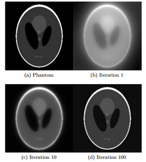](<https://www5.cs.fau.de/fileadmin/_migrated/pics/standard_ART.jpg> "Fig 1: Iterative ART Reconstruction")  
---  
  
Fig 2: Ordered Subsets ART Reconstruction[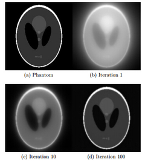](<https://www5.cs.fau.de/fileadmin/_migrated/pics/RSART.jpg> "Fig 2: Ordered Subsets ART Reconstruction")  
---  
  
**** The Algebraic Reconstruction Technique (ART) is an iterative method for Computed Tomography (CT) image reconstruction. The 2D image data can be reshaped into a 1D vector X and every projection ray in the sinogram P is computed simultaneously using the system matrix A: 

AX=P 

In each iteration, for each pixel pi and each row Ai of A, the following update is performed: 

Xk+1=Xk+(pi-AiXk)AiT/(AiAiT) 

Here k is the iteration index and we need to initialize the reconstructed image as X0=0. For kth iteration, AiXk stands for the ith projection of the reconstructed image Xk and (pi-AiXk) stands for the difference between the estimated sinogram ray and the measured sinogram ray, and (pi-AiXk)AiT means to back project the sinogram difference. This value is then normalized with the factor AiAiT. The update is performed until convergence or a maximum iteration number is reached. 

### Gradient Descent ART with Step Size Control

Fig 3: Adaptive Step Size ART Reconstruction[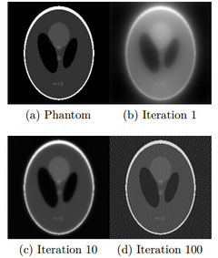](<https://www5.cs.fau.de/fileadmin/_migrated/pics/AdaptiveART.jpg> "Fig 3: Adaptive Step Size ART Reconstruction")  
---  
  
Fig 4: Adaptive Step Size Ordered Subsets ART Reconstruction[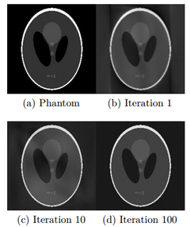](<https://www5.cs.fau.de/fileadmin/_migrated/pics/AdaptiveRSART.jpg> "Fig 4: Adaptive Step Size Ordered Subsets ART Reconstruction")  
---  
  
Another approach for iterative reconstruction is gradient descent. Here, we seek to minimize the following objective function. 

J = ||AX-P||22

To find the minimum, we follow the negative gradient direction δX in each iteration: 

Xk+1 = Xk\- λ*δXk

δXk=(pi-AiXk)AiT

The objective function for the (k+1)th iteration is found as follows: 

Jk+1 = ||AXk+1-P||22= ||AXk-λA*δXk-P||22

We derive the above equation, set it to zero. Next, we solve for λ to find the formula for the optimal step size. 

 λ= (AδXk)T(AXk-P)/(AδXk)T(AδXk) 

Here AδXk means the projection of the image update δXk and AXk-P denotes the difference between the kth estimated sinogram and the measured sinogram. 

With the adaptive step size, this iterative reconstruction method converges much faster than with a constant step size.

### Results and Discussion

We implemented gradient descent ART, Ordered Subsets ART (OSART), ddaptive step size control ART and adaptive step size control OSART for parallel beam reconstruction. [Here](<../ordered-subsets/index.html> "Opens external link in new window") is an introduction about OSART. We also implemented further experiments on OSART. The results are shown from Fig 1 to Fig 5. 

  1. Fig 1 shows the ART reconstruction results and we can find the reconstructed image is converging to the real phantom with increase of the iteration number and for iteration 100, there is no visible error.
  2. Fig 2 shows the reconstruction results of OSART. In our case, 180 angle projections are divided into K subsets, and the subsets size should be 180/K. Then for a certain i (i=1,2,...,subsetSize), the (i+k*subsetSize)th (k=0,1,...,K-1) projections are in the same subset.Here unfortunately, we can't get apparent improvement between standard ART and OSART. 
  3. Fig 3 and Fig 4 show the validation of the adaptive step size. With adaptive step size, the convergence speed is improved obviously. Besides, Fig 3 shows an interesting effect of adaptive step size. After a certain number of iterations, artifacts in the homogeneous area appear. These artifacts result from the image pixelization. They can be removed, if we obtain more projections for reconstruction. 
  4. Further experiments on OSART are implemented and Fig 5 shows that adaptive step size OSART improves the iterative ART reconstruction while fixed step size OSART doesn't, considering of 10 iterations. Besides, the adaptive step size OSART performes better with more subsets. And it's also said that OSART converges faster for the first iterations and gradually slows down.

Fig 5: Reconstruction Error For Adaptive Step Size OSART and Fixed Step Size OSART (10 iterations)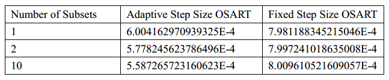  
---  
  
### Code

Please see the ART codes in the folder "FlatPanelProject" in CONRAD.

### Authors

Anja Jäger, Tilmann Hübner, Karoline Kallis, Hamidreza Moghadas, Yixing Huang, Andreas Maier

### Reconstruction → Ordered Subsets

_Source: <https://www5.cs.fau.de/conrad/tutorials/api-tutorials/reconstruction/ordered-subsets/index.html>_

# Ordered Subsets

## Iterative Reconstruction with Ordered Subsets

This is a short tutorial that describes the ideas of ordered subsets and how this can be implemented in CONRAD. The references to the CONRAD sources implementing this are found at the end of this tutorial. 

## Gradient Descent Iterative Reconstruction

Besides direct methods like the filtered backprojection, also iterative methods can be used for medical image reconstruction. These methods start with an arbitrary image and in every iteration the reconstructed image is updated such that it converges to the exact reconstruction. The clear benefit of such algorithms is, that they have an improved insensitivity to noise and they can even create very good solutions for incomplete data. The minimum of a convex function is found by following the gradient of the function in negative direction. In the case of image reconstruction (where the solution for the equation _AX = P_ is required), the reconstructed image is computed by the gradient descent reconstruction method where each update is performed as follows:   
_X k+1 = X k \+ λ(A T(P - AX k))_ Where _A_ is the system matrix, which describes the contribution of every voxel to every ray and _P_ contains the acquired projections, i.e. the sinogram of the object. To explain the equation, the reconstructed image is achieved by the following steps:   

  1. Forward project the current backprojected image _X k_: _AX k_
  2. Subtract the forward projection from the projection _P_ : _(P - AX k)_
  3. Backproject the projection difference: multiplication with _A T_
  4. Multiply the backprojection with the parameter λ
  5. Add to the current backprojected image _X k_

## Ordered Subsets Reconstruction

The main disadvantage of iterative reconstruction methods is the higher computational effort compared to direct methods where only one backprojection step is needed for the reconstruction. According to the angle between the projection hyper planes, they can sometimes converge very slow. If two considered hyper planes are orthogonal to each other, the solution is found after at most two iteration steps. The steeper the angle between the hyper planes, the longer it takes for the algorithm to converge. The influence of the angle can be seen in the images 1 and 2. The orthogonal hyper planes in image 1 (in this case the hyper planes are lines) result in a much faster convergence than the hyper planes with a steep angle inbetween in image 2 _(Source of image 1 and 2: Slides for "Diagnostic medical image processing", WS 2012/13, Andreas Maier, Joachim Hornegger, Markus Kowarschik)._ Because of the slow convergence, many techniques were developed to speed the iterative methods up. One of these techniques is the ordered subsets (OSS) reconstruction. For OSS each iteration is not performed for the whole projection, but for subsets of _P_. This can speed up the convergence by using knowledge of the order of the projection acquisition. This way, subsets of the projection can be chosen, that are more likely to be orthogonal to each other. Because only subsets of the whole projection are considered, the computational effort can be lowered significantly.  | 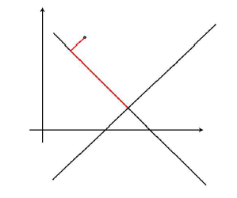 | 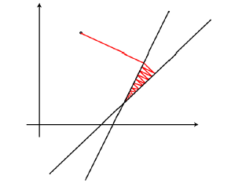  
---|---  
Img 1: Iterative reconstruction orthogonal | Img 2: Iterative reconstruction steep angle  
  
## Ordered Subsets Algorithm in CONRAD

The OSS-classes in CONRAD use the OpenCLGrid-classes and the OpenCL-projection and -backprojection methods. First a 2D- or 3D-phantom is created and projected with the available _ProjectRayDrivenCL_ -methods. The sinogram represents the projection _P_ from which the subsets will be created. In the reconstruct-method an initial reconstructed image _img_k_ is created, that is only filled with zeros. This stands for the starting image _X 0_. Then the iteration is started with two for-loops going through all iterations and for every iteration considering all subsets. The projection subsets are created in the method _getSubset_ and after the projections are split into the different subsets, the update step is only executed for these subsets. After each update, the subsets are then combined again in the method _combiningSubsets_. After the last iteration step or if the mean squared error between the prior image _X k_ and the updated image _X k+1_ is below a threshold, the achieved reconstructed image _img_k_ is returned and shown. The mean squared error is computed after each iteration step in the method _mse_.   
  
The final code for the OSS reconstruction can be found in the package edu.stanford.rsl.tutorial.fan in the class _OSSReconstructionFan_ (for 2D fan beam geometry) and in the package edu.stanford.rsl.tutorial.cone in the class _OSSReconstructionCone_ (for 3D cone beam geometry).   
  

_Copyright by Anja Pohan_

### Reconstruction → Implementation of ART

_Source: <https://www5.cs.fau.de/conrad/tutorials/api-tutorials/reconstruction/implementation-of-art/index.html>_

# Implementation of ART

We have introduced the Algebraic Reconstruction Technique (ART) method for Computation Tomography (CT) image reconstruction and have displayed some nice results for [parallel beam CT image reconstruction](<../iterative-reconstruction/index.html> "Opens internal link in current window"). Except parallel beam, ART can also be extended into fan beam or cone beam CT image reconstruction and its computation speed can be improved with [OpenCL girds](<../../basic-tutorials/opencl-introduction/index.html> "Opens internal link in current window"). Here, an implementation of ART for more general application is shown.

### Abstract Classes: Projector and Backprojector

In order to keep the ART applicable to different image acquisition geometries, corresponding projectors and backprojectors are necessary. Thus, abstract classes were introduced in our codes.  _public abstract class Projector {_ _public abstract Grid project(Grid grid, Grid sino);_ _public abstract Grid project(Grid grid, Grid sino, int index);_ _}_ Subclasses have to be implemented to extend the abstract classes for parallel beam, fan beam and cone beam geometries and for each acquisition geometry, ray driven projector and pixel driven backprojector are needed. Here the image data is stored in _grid_ and the sinogram is stored in _sino_. Besides, if we want to project the image at only one certain angle to get a 1D sinogram or only this 1D sinogram is backprojected, then _project_ can be called with a third argument _index_ , the angle index. Additionally, the pre-implemented abstract Grid class of CONRAD is used instead of Grid1D, Grid2D and Grid3D. This way, the exactly same form of ART _Projector_ can represent different projectors and backprojectors for different geometries (e.g. 2D – fan beam, 3D – cone beam).  For example: _public Grid reconstruct(Grid originalSinogram, Grid recon, Grid imageUpdate, Grid localImageUpdate, Grid diff)_ In this function, we need to project the current reconstruction Grid _recon_ at projection angle _index_. The result is stored in Grid _diff_.  _diff = projector.project(recon, diff, index);_ Which projector and grids are used for this operation depends on the instantiation of ART, where the constructor is called with specific choice of the abstract classes _projector_ and _backprojector_. _// constructor in ART.java_ _public ART(Projector projector, Backprojector backprojector){_ _this.projector = projector;_ _this.backprojector = backprojector;_ _}_

### ART and OpenCL

As mentioned above, the ART implementation works for different acquisition geometries. This also holds for OpenCL implementation. The instantiations of the subclasses in the main function are different, however the corresponding call of ART and its methods are identical to the CPU based version.  _// instantiation of ART in main of PerformReconstruction.java using OpenCL_ _projector = new ParallelProjectorRayDrivenCL(maxTheta, deltaTheta, maxS, deltaS);_ _backprojector = new ParallelBackprojectorPixelDrivenCL(originalSinogram,x ,y);_ _art = new ART(projector, backprojector);_ _// call of ART method_ _recon = (Grid2D) art.reconstruct(originalSinogram, recon, imageUpdate, localImageUpdate, sino);_ The proposed structure would also be operational with OpenCL Grids to further improve computation speed. To run the code on the GPU, we use specific subclasses to abstract _projector_ and _backprojector_. These subclasses handle the definition of an OpenCL context, selection of the OpenCL device and finally use a kernel function (*.cl) to execute the source code for a projection or backprojection. So far, kernels for ray driven projection and pixel driven backprojection for both parallel and fan beam cases are created. The kernel source code is only read by the host code (*.java) during runtime.  _// load sources, create and build program_ _program = context.createProgram(this.getClass().getResourceAsStream("FanBackprojectorPixelDriven.cl")).build();_ After the program has been generated from the *.cl file, the kernel can be created and parameters can be set. The final execution is directed by the command queue, where the kernel is run.  _// create kernel_ _CLKernel kernel = program.createCLKernel("backprojectPixelDriven2DCL");_ _// create CommandQueue_ _CLCommandQueue queue = device.createCommandQueue();_ _queue.putWriteImage(sinoGrid, true).finish()_ _.put2DRangeKernel(kernel, 0, 0, globalWorkSizeX, globalWorkSizeY,localWorkSize, localWorkSize).finish()._  _putReadBuffer(imgBuffer, true).finish();_

### Usage of ART implementation

To run our implementation of ART, we create a main function in PerformReconstruction.java. There, the sinogram of the Shepp-Logan phantom and all grids are generated. The grids are created in the beginning to avoid costly memory allocation during the reconstruction process. The instantiation of the projector, backprojector and ART is performed in a switch case statement. As shown in Fig. 1, eight different cases can be distinguished for parallel or fan beam geometry, CPU or GPU based computation and adaptive or fixed step size.  _// instantiation of ART in main of PerformReconstruction.java_ _projector = new ParallelProjectorRayDriven(maxTheta, deltaTheta, maxS, deltaS);_ _backprojector = new ParallelBackprojectorPixelDriven(originalSinogram);_ _art = new ART(projector, backprojector);_ _// call of ART method_ _recon = (Grid2D) art.reconstruct(originalSinogram, recon, imageUpdate, localImageUpdate, sino);_ To alter the parameters or geometry of the reconstruction, it is thus sufficient to adapt the main method. The ART algorithm is programmed so as to function for arbitrary settings. Fig 1: Framework for Iterative Reconstruction| [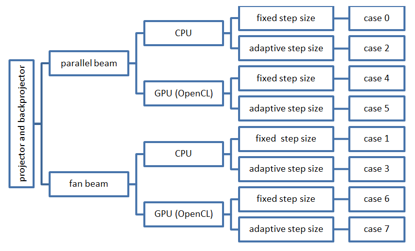](<https://www5.cs.fau.de/fileadmin/_migrated/pics/OptionsToPerformIterative_Reconstruction.png> "Fig 1: Framework for Iterative Reconstruction")  
---  
  
### Results and Discussion

Fig 2 shows the results of the above iterative reconstruction implementations. In the table, the average pixel error after 15 iterations and the average time per iteration are displayed. The results indicate that, for Fixed Step Size cases, our ART implementation with OpenCL doesn't run faster than ART CPU, which maybe result from the frequent data transfer between CPU and OpenCL memory. However, for Adaptive Step Size cases, which require much more computation, our ART implementation with OpenCL has an obvious speed up than ART CPU. 

The implementation of ART is versatile and can handle different types of projectors and backprojectors, not only regarding the geometry, but also CPU and GPU based computation. It is suited to test further implementations (e.g. cone beam geometry). The management of memory supports OpenCL application, as grids are reused rather than newly created. 

Fig 2: Results of Iterative Reconstruction[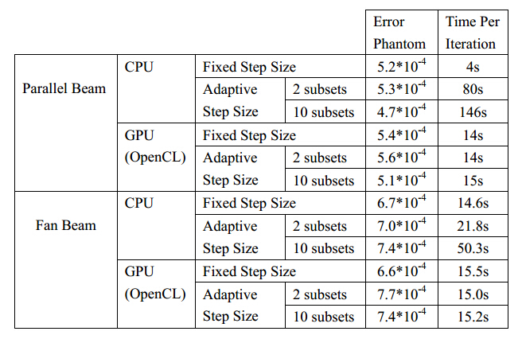](<https://www5.cs.fau.de/fileadmin/_migrated/pics/results_of_ART.jpg> "Fig 2: Results of Iterative Reconstruction")  
---  
  
### Code

For the full source codes, please refer to folder "FlatPanelProject" in CONRAD.

### Authors

Anja Jäger, Tilmann Hübner, Karoline Kallis, Hamidreza Moghadas, Yixing Huang, Andreas Maier

### Reconstruction → Minimal Scan

_Source: <https://www5.cs.fau.de/conrad/tutorials/api-tutorials/reconstruction/minimal-scan/index.html>_

# Minimal Scan

### Minimal Scan Ranges for Non-Circular Objects

Application Example - Knees| [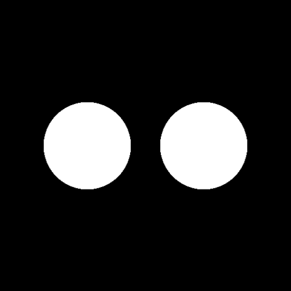](<https://www5.cs.fau.de/fileadmin/_migrated/pics/knees.png> "Application Example - Knees")  
---  
  
The minimal scan range for circlular objects in fan-beam geometry is well known. Parker demonstrated a nice and efficient method to reconstruct such a short scan. Furthermore, a offset detector is able to double the FOV. However, this comes at the restriction that the scan range has to be increased to 360 degrees. 

In this tutorial, we investigated the minimal scan range for non-circular objects. Here we only present a short example. The full research is found the [CT Meeting Paper by Herbst et. al.](<http://www5.informatik.uni-erlangen.de/Forschung/Publikationen/2014/Herbst14-ITI.pdf> "Opens external link in new window")

The respective sources are found in package edu.stanford.rsl.tutorial.noncircularfov.

### Complete Set Estimation

Knee Sinogram[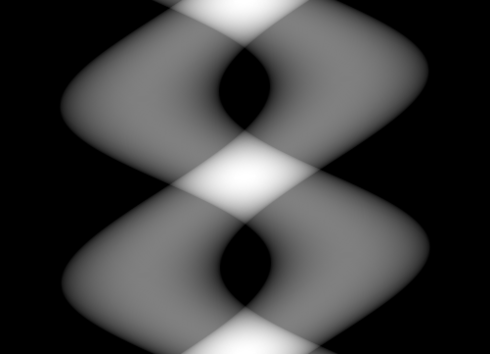](<https://www5.cs.fau.de/fileadmin/_migrated/pics/knee_sinogram.png> "Knee Sinogram")  
---  
  
In a first step, the object is projected into sinogram space and the image is thresholded to determine which rays have to be collected to create a complete reconstruction.

# Scan Mask

scan configuration following the outline of the knees.[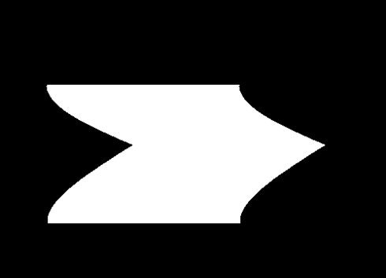](<https://www5.cs.fau.de/fileadmin/_migrated/pics/scan_configuration.png> "scan configuration following the outline of the knees.")  
---  
  
Then a mask is generated that represents the current scan configuration. Here, we chose to follow the outline of the knees from the left and chose a detector size of 250 pixels.

### Sinogram Completion using Corresponding Rays

Completed mask[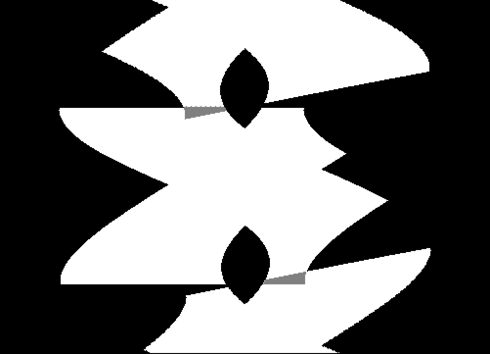](<https://www5.cs.fau.de/fileadmin/_migrated/pics/completed_sinogram.png> "Completed mask")  
---  
  
In a next step, the sinogram is completed using the information from redundant rays that are acquired in the fan-beam geometry. The image on the right shows the completed mask.

### Missing Information

Missing rays[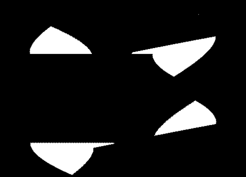](<https://www5.cs.fau.de/fileadmin/_migrated/pics/Missing_Pixels.png> "Missing rays")  
---  
  
From the completed sinogram and the complete set, the missing rays can be determined as shown on the right.

### Reconstruction

The present configuration is incomplete and resutls in artifacts in the image.[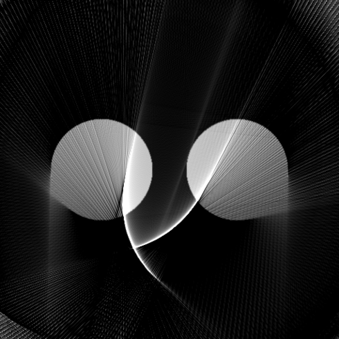](<https://www5.cs.fau.de/fileadmin/_migrated/pics/Reconstructed_result.png> "The present configuration is incomplete and resutls in artifacts in the image.")  
---  
  
The missing information leads to artifacts in the reconstruction. The algorithm to find configurations that determine the minimal complete scan configuration is described in the above mentioned CT Meeting Paper.

### Reconstruction → Scale-Space Reconstruction

_Source: <https://www5.cs.fau.de/conrad/tutorials/api-tutorials/reconstruction/scale-space-reconstruction/index.html>_

# Scale-Space Reconstruction

The class ScaleSpaceStudies.java performs convolutions of projection images (sinograms) of a phantom with either a Gaussian or a Laplacian of Gaussian for different values of sigma.  The Gaussian blurs the edges and with increasing values of sigma, the different objects with different intensities merge into one single object with one intensity. The convolution with a Gaussian containing a very small sigma subtracted from the phantom results in an image with very distinct edges.The Laplacian of Gaussian highlights the edges with a bright and a dark line along the edges. With increasing values of sigma, the edges expand and small objects vanish.  A detailed documentation on the usage of the class but also with results can be found [here](<https://www5.cs.fau.de/fileadmin/research/Projekte/Conrad/ScaleSpaceStudies/Documentation_ScaleSpaceStudies.pdf> "Initiates file download"). Copyright by Markus Wolf

## Advanced

_Source: <https://www5.cs.fau.de/conrad/tutorials/api-tutorials/advanced/index.html>_

# Advanced

In this section, you find advanced tutorials on physics, Javadoc, Matlab and memory trouble.

### Advanced → Spectral Absorption

_Source: <https://www5.cs.fau.de/conrad/tutorials/api-tutorials/advanced/spectral-absorption/index.html>_

# Spectral Absorption

# Monochromatic Absorption

Many standard reconstruction algorithms assume that X-ray absorption behaves more or less monochromatic, i.e. all X-ray photons have the same energy. If this were the case, the observed intensity $I $ could be modeled as:  
$$I=I_0e^{-\sum_i\mu_il_i}$$  where $I_0$ is the intensity emitted at the source, $\mu_i$ the material attenuation coefficient, and $l_i$ the intersection length. This constraint allows us to compute the line integral $q_{mono}$ at each detector pixel: $$q_{mono}=\sum_i\mu_il_i=-ln\frac{I}{I_0}$$  Based on this observation, one is able to derive a closed form solution (the radon inversion) to reconstruct the attenuation coefficients $\mu_i$. Unfortunately, this is not the case for most real X-ray applications.

# Polychromatic Absorption

Example of an X-ray spectrum with 120 kVp.| 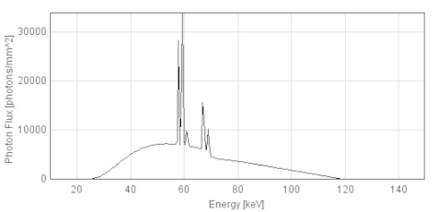  
---  
  
Most medical X-ray sources have a polychromatic X-ray spectrum. This means, that the photons that are generated have multiple photon energies. The highest energy that can appear in such a spectrum is determined by the acceleration voltage $U_a$, or peak voltage. If one electron that hits the anode is completely converted into light, its energy will be $E_{max}=U_a \cdot e^{-}$ where $e^{-}$ is the elementary charge. The image on the right shows an example of an X-ray spectrum with 120 kVp, i.e. $U_a=120kV$. 

In our case, the spectrum is modeled consisting of bins. Each bin $j$ has an intensity $I_j$ which is equal to the area under the spectrum that is covered by the respective bin. Furthermore, each absorption value $\mu_{ij}$, is also modeled dependent on the energy bin $j$. These definitions enable us to find a polychromatic absorption model as 

$$I_{poly} = \sum_j I_j e^{-\sum_i \mu_{ij} l_i}.$$ 

The total intensity of the spectrum is defined as $I=\sum_j I_j$. This allows us to compute a quantity $q_{poly}$ which is similar to the monochromatic line integral: 

$$q_{poly} = -ln(I_{poly}/I) = -ln\left(\frac{\sum_j I_j e^{-\sum_i \mu_{ij} l_i}}{\sum_j I_j}\right)$$ 

# Absorption Modeling in CONRAD

Comparison of a polychromatic and a monochromatic absorption model using a 40 kVp spectrum.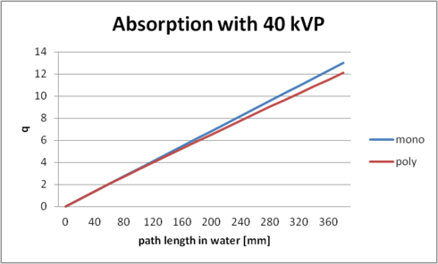  
---  
  
In order to investigate absorption, we need to create an instance of a X-ray spectrum first. This is done by instantiating an instance of PolychromaticXRaySpectrum: 

_PolychromaticXRaySpectrum spectrum = new PolychromaticXRaySpectrum(min, max, delta, peakVoltage, timeCurrentProduct);_

Next, we create an instance of a monochromatic absorption model. Here, we chose the average energy of the spectrum as energy of the monochromatic process: 

_SelectableEnergyMonochromaticAbsorptionModel monochromaticAbsorptionModel = new SelectableEnergyMonochromaticAbsorptionModel();_

_monochromaticAbsorptionModel.configure(spectrum.getAveragePhotonEnergy());_

Furthermore, we require an instance of a polychromatic absorption model: 

_PolychromaticAbsorptionModel polychromaticAbsorptionModel = new PolychromaticAbsorptionModel();_

_polychromaticAbsorptionModel.setInputSpectrum(spectrum);_

_polychromaticAbsorptionModel.configure();_

Now, we want to evaluate the absorption models several times. The model is evaluated given a list of intersection lengths with different materials. This is modeled as a list of PhysicalObjects. As we only want to investigate water, we only require a list with a single object: 

_PhysicalObject segment = new PhysicalObject();_

_segment.setMaterial(MaterialsDB.getMaterial("water"));_

_segment.setNameString("Water Path");_

_ArrayList <PhysicalObject> segments = new ArrayList<PhysicalObject>();_

_segments.add(segment);_

This segment can now be used to sample different path lengths using our absorption models: 

_for (int i = 0; i < vals; i++){_

_double length = i*20;  
Edge edge = new Edge(new PointND(0), new PointND(length));  
segment.setShape(edge);  
monochromaticAbsorptionModel.evaluateLineIntegral(segments);  
polychromaticAbsorptionModel.evaluateLineIntegrl(segments);_

_}_

The final code for the data generation of the image on the right can be reviewed in package edu.stanford.rsl.tutorial.physics in class SpectralAbsorption.

### Advanced → Custom Materials

_Source: <https://www5.cs.fau.de/conrad/tutorials/api-tutorials/advanced/custom-materials/index.html>_

# Custom Materials

# Preliminaries

One convenient thing about CONRAD is that we have a complete API for the NIST X-ray attenuation databases (<http://www.nist.gov/pml/data/xraycoef/index.cfm>). Thus, we are able to access all elemental and compound data in the database. However, CONRAD is not just restricted to the materials in that database. CONRAD also features capabilities to model other materials quite accurately. In order to do so, you only require the elemental composition of the material that you intend to model and its density as it will appear in your simulation.

# Modeling of a Custom Contrast Agent

In this tutorial, we will model a contrast agent as it is commonly used in clinical practice. In this case, we chose iopromide which is available commercially under the name “Ultravist®” (<http://bayerimaging.com/products/ultravist/>). Doing a small background check gave us two very valuable sources. rxlist.com (<http://www.rxlist.com/ultravist-drug.htm>) reports the concentration of iopromide in different versions of Ultravist® and Wikipedia (<http://en.wikipedia.org/wiki/Iopromide>) tells us that the composition of iopromide is C18H24I3N3O8.With these sources, we have enough information to create a quite accurate simulation of Ultravist’s absorption characteristics.

# Creation of Compound Materials using the API

Using the chemical formula of Iopromide, we can create a custom material. At first we need to decode the chemical formula to its weighted atomic composition: _WeightedAtomicComposition wacIopromide = new WeightedAtomicComposition("C18H24I3N3O8");_ Next, we can create a new Material using this atomic composition: _MaterialUtils.newMaterial("iopromide", density, wacIopromide);_ This will create a new material that behaves as iopromide with respect to x-ray absorption. The example above, however, has two flaws:

  * We do not know the density of iopromide.
  * Iopromide appears as solution in water in the contrast agent. Thus, we also need to model this aspect in our simulation.

# Creation of Mixtures of Compounds

In order to create a solution consisting of water and iopromide, we employ again the weighted atomic composition API. But first, we need to remember a couple of basics from chemistry. In order to be able to compute the correct parameters for the mixing, we need to know how many particles we need from the one compound (here water) and how many from the other compound (iopromide). Fortunately, the API gives us the means to do so. First we need to determine how many moles, i.e. particles are in one gram of water. Thus, we require the molar mass of water. This can be computed with two API calls: _WeightedAtomicComposition water = new WeightedAtomicComposition("H2O");_ _double molarMassWater = MaterialUtils.computeMolarMass(water);_ The number of moles is then computed as: _double waterParticlesIn1Gram = 1 / molarMassWater;_ Next, we do the same for iopromide: _WeightedAtomicComposition wacIopromide = new WeightedAtomicComposition("C18H24I3N3O8");_ _double molarMassIopromide = MaterialUtils.computeMolarMass(wacIopromide);_ From rxlist.com, we learned that Ultravist150 contains 311.7 mg of iopromide. Thus we need to compute the number of moles for this mass: _double iopromideParticles = 0.3117 / molarMassIopromide;_ Now, we can create a micture with the appropriate weighting: _WeightedAtomicComposition wacUltravist = new WeightedAtomicComposition("H2O", waterParticlesIn1Gram);_ _wacUltravist.add(formularIopromideString, iopromideParticles);_ Based on this atomic composition, we can now create the respective mixture: _Mixture iopromideSolution = new Mixture();_ _iopromideSolution.setDensity(1.157);_ _iopromideSolution.setName("Ultravist150”);_ _iopromideSolution.setWeightedAtomicComposition(wacUltravist);_ In order to save the material for later use, we can now embed it in our local material database: _MaterialsDB.put(iopromideSolution);_

# Result

Energy-dependent X-ray absorption values for four different materials.| 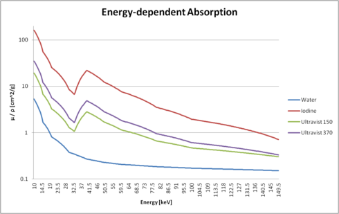  
---  
  
The figure on the right shows the interpolated absorption values as mu / rho (i.e. normalized with its density). You can clearly see the differences between water, pure iodine, and two versions of Ultravist.

# Code

The code for this example is found in edu.stanford.rsl.tutorial.physics in CreateCustomMaterial.java.

### Advanced → Javadoc Generation

_Source: <https://www5.cs.fau.de/conrad/tutorials/api-tutorials/advanced/javadoc-generation/index.html>_

# Javadoc Generation

# Preliminaries

This page is a short tutorial on how to generate the Javadoc documentation for CONRAD. In general, we provide the Javadoc for each version of CONRAD online as webpage or as zip file that can be included into your eclipse setup.  In CONRAD, we are using [LaTeXlet](<http://users.informatik.uni-halle.de/~grau/LaTeXlet/> "Opens external link in new window") a taglet, that allows to embed LaTeX into Javadoc. This allows us to put equations directly into the source code / Javadoc. The equations are rendered by the custom taglet during the generation of the documentation and embedded into the Javadoc. Although this is very convenient, the actual setup requires certain settings in eclipse that may not be straight forward. Therefore, we describe the required steps in the following. Note that you will need a working TeX environment in your path in order to execute this.

# Start Javadoc Generation in Eclipse

Use the menubar to start the javadoc generation.| 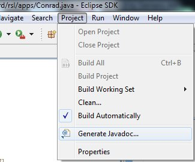  
---  
  
In order to generate the javadoc, a current Java Development Kit (JDK) needs to be installed. Here the API generation is shown using JDK 1.7. Furthermore eclipse needs to be set up such that it is able to compile the CONRAD code (cf. the tutorial on compilation). 

Open eclipse and select the Javadoc generation from the menubar. Note that the default setting in the Javadoc generation is, that all packages will be preselected that are already selected in the package explorer. It is useful to select a flat package representation here, as subpackages are not selected automatically in a hierarchical representation.

# Setting up Javadoc

The first of three screens that need to be configured to create a javadoc via eclipse.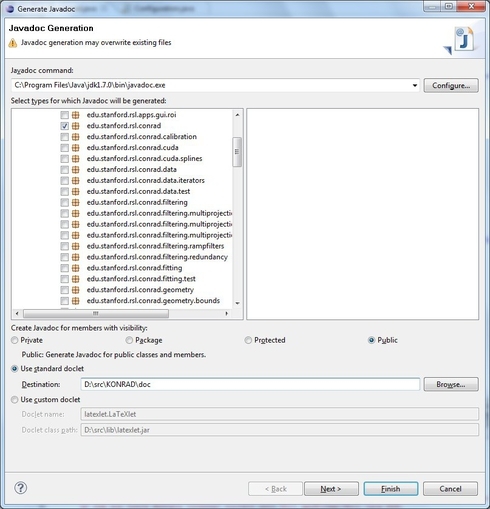  
---  
  
In the first text field, the javadoc command needs to be entered. In the example on the right, the location is in a default location "C:\Program Files\Java\jdk1.7.0\bin\javadoc.exe". 

Furthermore, you need to select the right packages that will be included in the Javadoc. It is useful to do this already in the package explorer before starting the Javadoc generation wizard. 

After selecting the standard doclet. You need to specify the path where the Javadoc will be created. We set "D:\src\KONRAD\doc" in the example on the right. 

Then, proceed to the next page of the wizard by pressing "Next".

# Configure Javadoc Arguments for the Standard Doclet

Second page of the Javadoc creation wizard.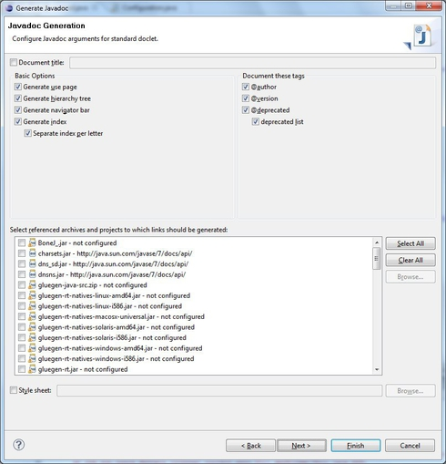  
---  
  
On the second page of the wizard, all settings are correct in default setting shown on the right. 

Click "Next" to proceed to the next step.

# Configuration of Latexlet as extra Option

On the last page of the creation wizard the latexlet options have to be set correctly in order to create the Javadoc with TeX equations.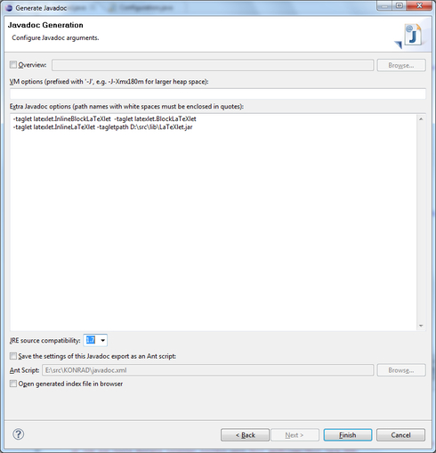  
---  
  
On the last page, the options for LaTeXlet need to be specified. In order to get a correct compilation result, a TeX environment needs to be configured in the path. Furthermore, you need to specify the folloing extra options (as shown on the right): 

-taglet latexlet.InlineBlockLaTeXlet 

-taglet latexlet.BlockLaTeXlet 

-taglet latexlet.InlineLaTeXlet 

-tagletpath $PATH$ 

Where $PATH$ is the path to your latexlet.jar. This path is configured with "D:\src\lib\LaTeXlet.jar" in this example. Note that we provide a version of this file installation package. 

Furthermore, you need to select the right Java version for your Javadoc. We selected "1.7" in the example on the right. 

The Javadoc can now be generated by clicking "Finish". The result of such a compilation is found [here](<https://www5.cs.fau.de/fileadmin/images/projekte/conrad/downloads/version_1.0.0/doc.zip> "Initiates file download").

### Advanced → Matlab Integration

_Source: <https://www5.cs.fau.de/conrad/tutorials/api-tutorials/advanced/matlab-integration/index.html>_

# Matlab Integration

As CONRAD is written in Java only, integration into MATLAB is very easy. The CONRAD classes can be used "as is". We provide a small package of code examples that are included in our GitHub source code, [here](<https://github.com/akmaier/CONRAD/tree/master/data/matCon> "Opens external link in new window"). Please follow the instructions in the Readme-file that is provided with the code examples for installation.  **Note that your Matlab version needs to run on the same or a newer JavaVM Version as used for the compilation of CONRAD.** **Code Example "MatlabCONRADtutorial.m"**  
In this code example we define a 3D object in Matlab which we then forward project using CONRAD. Afterwards a comparison is done between a backprojection only and a backprojection that includes the ramp filtering step. The ground truth object, the created projections, the backprojection and the full FDK reconstruction including filtering are visualized in ImageJ windows.  Exported from Notepad++ clear variables close all clc % Example for the forward and backward projection using CONRAD % (1) import java packages import ij.* import edu.stanford.rsl.conrad.utils.* import edu.stanford.rsl.conrad.data.* % (2) Load the CONRAD settings xml file try % default config file as provided  % (just replace path to your own config file if needed) config = Configuration.loadConfiguration(fullfile(fileparts(mfilename('fullpath')),'Conrad.xml')); Configuration.setGlobalConfiguration(config); catch err error('Could not load valid CONRAD config file!'); end % (3) open ImageJ / if already open, close all images if (isempty(IJ.getInstance())) ImageJ(); else while(WindowManager.getImageCount()>0) openImg = IJ.getImage(); openImg.close(); end end % (4) define a matlab volume (two spheres with high and low density) volDim = [512,512,512]; [x,y,z]=meshgrid(1:volDim(1),1:volDim(2),1:volDim(3)); vol=zeros(volDim); % sphere 1 vol(sqrt((x-(volDim(1)+1)/2).^2+(y-(volDim(2)+1)/2).^2+(z-(volDim(3)+1)/2).^2) < min(volDim)*0.5/2)=1; % sphere 2 vol(sqrt((x-(volDim(1)+1)/2).^2+(y-(volDim(2)+1)/2).^2+(z-(volDim(3)+1)/2).^2) < min(volDim)*0.3/2)=4; % (5) OpenCL forward projection projections=OpenCLForwardProjection(vol); projections.show('Forward Projected Matlab Object'); % (6) OpenCL backprojection without filtering volRec1=OpenCLBackProjection(projections); volRec1.show('Backprojection without filtering'); % (7) A full reconstruction with filtering volRec2=reconstructionHelper(projections); volRec2.show('Full reconstruction with filtering'); % (8) Show also the Ground Truth in ImageJ gT = mat2Grid3D(vol); gT.show('Ground Truth'); % If the outcome of the forward or backward projections are needed in % Matlab format use the following (This copies the whole volume --> slow): % mProjections = grid3D2mat(projections); % However, you can also access the Grid3D directly (much faster) by using % for example "projections.setAtIndex(x,y,z,value)".

### Advanced → Memory Trouble

_Source: <https://www5.cs.fau.de/conrad/tutorials/api-tutorials/advanced/memory-trouble/index.html>_

# Memory Trouble

Reconstruction problems often require quite some memory, if volumetric images are processed. In this tutorial, we provide a couple of tweaks that can be performed to improve the software performance.

### Increase VM Memory

Use the "-Xmx%NG" option to configure more memory for the Java VM, where %N is the number of GB that will be used at most.| [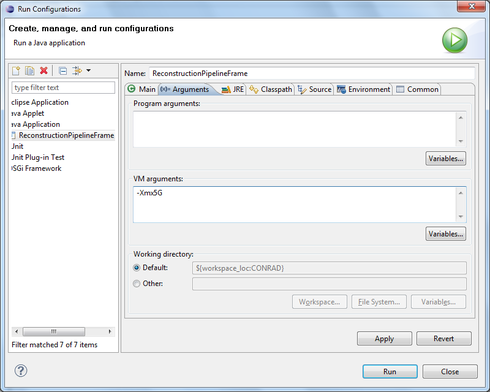](<https://www5.cs.fau.de/fileadmin/_migrated/pics/more_VM_memory.png> "Use the ")  
---  
  
The standard configuration of the 64-bit Java Virtual Machine (VM) is 2 GB. If this amount of memory is exceeded, additional memory has to be configured with a VM option. This is configured in eclipse's "Run Configurations" on the second tab "Arguments". The example on the right configures the VM using "-Xmx5G" to use at most 5 GB of memory.

### Use a 64-bit Java Virual Machine

With the -version flag the java command line tool will report current version.[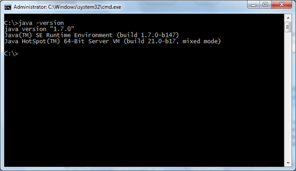](<https://www5.cs.fau.de/fileadmin/_migrated/pics/javaversion.png> "With the -version flag the java command line tool will report current version.")  
---  
  
The 32-bit Java VM can only use up to 1.3 GB of memory. In most cases this might be insufficient. Thus, it is highly advisable to use a 64-bit VM for 3D problems. The image on the right shows the call on the command line to investigate the installed java version. The output on the right indicates Java 1.7 and 64-bit. Note that the Java byte code for 32-bit and 64-bit is the same. Only the VM restricts memory sizes.

### Advanced → OpenCL Considerations

_Source: <https://www5.cs.fau.de/conrad/tutorials/api-tutorials/advanced/opencl-considerations/index.html>_

# OpenCLGrid Design Considerations

In this article, we want to reveal our thoughts and considerations about performance and the related design in CONRAD. Two technologies have to be evaluated in terms of performance: the used programming language **Java** and the low-level API for heterogeneous computing in parallel: **OpenCL**. This is not only a summary of existing results, but also a starting point for further and deeper performance improvements. 

# Java

## Evaluating Java's instanceof and its alternatives

[OpenCLGrid1D](<../../../../javadoc/index.html> "Opens internal link in current window"), [OpenCLGrid2D](<../../../../javadoc/index.html> "Opens internal link in current window"), and [OpenCLGrid3D](<../../../../javadoc/index.html> "Opens internal link in current window"), and the [PointwiseIterator](<../../../../javadoc/index.html> "Opens internal link in current window") class use frequently Java's instanceof. Therefore, a detailed consideration in terms of performance is appropriated.  There are four approaches for this goal (demo source code can be found [here](<https://gist.github.com/michaeldorner/9b2fa6eb3711db2ab92c> "Opens external link in new window")):

  1. instanceof implementation (as reference) 
  2. object orientated via an abstract class and @Override a test method
  3. using an own type implementation
  4. getClass() == _.class implementation

The results are shown in the table below (Java 1.8 without further optimizations on Mac OS X 10.10, run time for 10^9 iterations for distinguishing two randomly inherited classes):  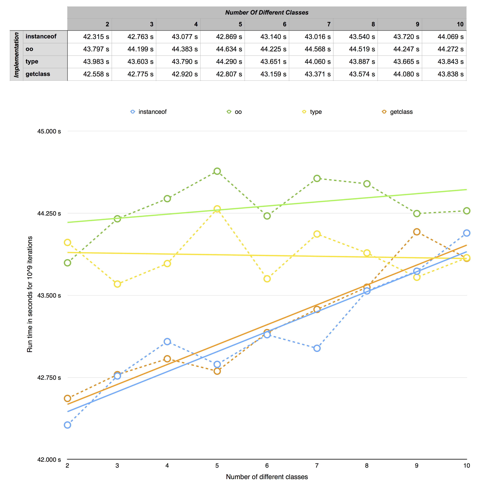 Because all alternatives seems to be not as performant (for less then 9 different classes), instanceof  is a valid and suitable approach for the OpenCL grids and their operators.  The performance advantage of the type-implementation at more then 9 classes is related to the fact, that switch cases can be used, whereas _instanceof_ and _getclass_ require more and more complex if-then-else trees. 

## JOCL

[JOCL from jogamp.org](<http://jogamp.org/jocl/www/> "Opens external link in new window") offers the interface Java/OpenCL. There is [another](<http://www.jocl.org/> "Opens external link in new window") JOCL framwork, but they are developed independently from each other.

### Pre-allocating CLProgram, CLKernel, and CLCommandQueue 

We pre-allocate CLProgram, CLKernel, and CLCommandQueue objects while the kernel is called the first time for a faster computation after the first kernel call. This leads to a longer run time for the first kernel call, but dramatically reduced run time after the first call.  This is done by a Singleton-like instantiation: If there is already an instance in the corresponding hash map, this is returned, otherwise it is created in dependency of device, kernel(name), and/or program.  A performance leak was device.createCommandQueue() which was called in every kernel run. Now we pre-allocate the command queue in the same way as the kernel and program.  This reduces the run time for handling the OpenCL command queue: A pure device.createCommandQueue() call lasts 10822 microseconds on a reference system. The mentioned first call, the preallocation, needs slightly more (11335 microseconds), but all further calls are reduced to a run time of 6 microseconds. 

# OpenCL

## Finding the best work group size by experiment

Each OpenCL kernel has its own optimal (local) work group size. This is determined by experiment during the first kernel call. Besides allocating the magnitudes mentioned in previous section, this leads to an even worse run time for the first kernel call. But the work group size cannot be determined in advance, because it is platform and device dependent.  The approach is similar to the one for kernel, program, and program queue.  **Example:** For the sum-kernel running on a NVIDIA GeForce GT 120 with 512 MB we can find these configuration combinations and the related run time:  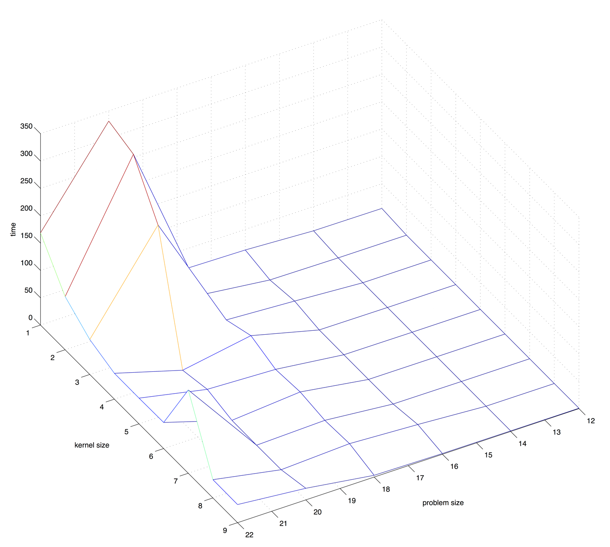 Remark: Please consider the log_2 scale for problem size and kernel size, while the time is on linear scale! 

## Vector Datatypes 

OpenCL offers vector data types like float4, int8, etc. Not only on CPUs, but also on GPUs vectorized data types promise a slightly better performance (see e.g. [here](<http://developer.amd.com/resources/documentation-articles/articles-whitepapers/opencl-optimization-case-study-diagonal-sparse-matrix-vector-multiplication-test/> "Opens external link in new window")). But this is not straight forward, especially it is different for CPUs which have mostly a SIMD instruction set, and GPUs: 

>  _"However, using types wider than the underlying SIMD is somewhat similar to loop-unrolling. This might be performance advantageous in some cases, but also increases register pressure, so some experimenting is required."_ [Reference](<https://software.intel.com/file/37171/> "Opens external link in new window"), Chapter 2.3 and following

Therefore, a more detailed consideration is not interesting, because the expected performance impact is too small with respect to the effort. 

## Local Memory

In the OpenCL architecture local memories offer a better throughput than the global equivalent (see e.g. [here](<http://www.nvidia.com/content/cudazone/CUDABrowser/downloads/papers/NVIDIA_OpenCL_BestPracticesGuide.pdf> "Opens external link in new window"), p. 12). But CPU have (depending on the platform) only a limited work-group size for that specific kernel (reduced to 1), if there is a barrier inside. However, CLK_LOCAL_MEM_FENCE is necessary for implementing computations using local memory (more about this effect can be found [here](<http://stackoverflow.com/questions/26278448/using-a-barrier-causes-a-cl-invalid-work-group-size-error> "Opens external link in new window")).

### Advanced → Statistical Shape Models (Video)

_Source: <https://www5.cs.fau.de/conrad/tutorials/api-tutorials/advanced/statistical-shape-models-video/index.html>_

# Statistical Shape Models (Video)

**Advanced: Statistical Shape Models**
